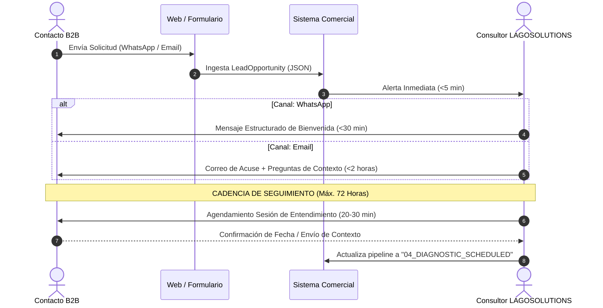

# LAGOSOLUTIONS — ESPECIFICACIÓN TÉCNICA DEL SISTEMA COMERCIAL INTERNO (FASE 1)
`LAGOSOLUTIONS_COMMERCIAL_SYSTEM_SPEC_V1.md`

> **ESTADO DEL DOCUMENTO:** Especificación Técnica de Arquitectura Comercial e Ingesta de Oportunidades.  
> **FECHA DE APROBACIÓN:** 29 de Agosto de 2026  
> **ÁREA:** Operaciones Comerciales, CRM Desacoplado, Ingesta B2B y Protocolo de Conversión.  
> **REGLA FUNDAMENTAL:** No se programa código de backend hasta que esta especificación esté formalmente aprobada. Define la máquina operativa que transforma visitantes y contactos en diagnósticos ejecutados y propuestas justificadas.

---

## 1. OBJETIVO DEL SISTEMA COMERCIAL FASE 1

El frontend de LAGOSOLUTIONS (`v3.1`) ya comunica la propuesta de valor y filtra la audiencia adecuada.  
El objetivo de la **Fase 1 del Sistema Comercial Interno** es construir la infraestructura operativa para que **ningún contacto quede en el aire**, estandarizando el ciclo completo:

$$\text{CAPTACIÓN} \longrightarrow \text{REGISTRO} \longrightarrow \text{CLASIFICACIÓN} \longrightarrow \text{DIAGNÓSTICO} \longrightarrow \text{SEGUIMIENTO} \longrightarrow \text{PROPUESTA}$$

```
┌─────────────────────────────────────────────────────────────────────────────┐
│                   EMBUDO OPERATIVO B2B — LAGOSOLUTIONS                      │
└─────────────────────────────────────────────────────────────────────────────┘

  [ ENTRADA ]           [ PROCESAMIENTO ]               [ ENTREGA ]
  ─────────             ───────────────                 ─────────
  • Formulario Web ──┐
  • WhatsApp Directo─┼─► Ingesta & Registro ──► Clasificación ──► Diagnóstico
  • Outbound / Refer.┘   (Schema B2B)            (Scoring)         (6 Dimensiones)
                                                                         │
                                                                         ▼
                                     Propuesta / Veredicto ◄── Seguimiento
                                     (Optimizar/Construir/     (Cadencia 72h)
                                      No Intervenir)
```

---

## 2. ESQUEMA DE DATOS Y REGISTRO DE LEAD (DATA MODEL)

Cada oportunidad que entra al sistema comercial de LAGOSOLUTIONS se estructura bajo una entidad JSON estricta y tipada para evitar información dispersa.

### 2.1 Esquema de la Entidad `LeadOpportunity`

```typescript
interface LeadOpportunity {
  // Identificadores & Trazabilidad
  id: string;                    // UUID v4 (ej: "lead_b2b_9f83a2...")
  created_at: string;            // Timestamp ISO 8601
  updated_at: string;            // Timestamp ISO 8601
  source_channel: 'WEB_FORM_WHATSAPP' | 'WEB_FORM_EMAIL' | 'DIRECT_WHATSAPP' | 'REFERRAL' | 'OUTBOUND';
  
  // Datos del Contacto y Organización
  contact: {
    full_name: string;
    company_name: string;
    website_url?: string;
    contact_value: string;       // Email corporativo o teléfono internacional (+569...)
    preferred_channel: 'WhatsApp' | 'Email';
  };

  // Contexto y Declaración Inicial del Cliente
  initial_intent: {
    selected_goal: 
      | 'NOT_SURE_NEEDS_DISCOVERY'       // "⭐ No estoy seguro..."
      | 'LEAD_GENERATION_ACQUISITION'     // Captación
      | 'SALES_PIPELINE_FOLLOWUP'         // Ventas & Cotizaciones
      | 'OPERATIONS_MANUAL_OVERHEAD'      // Operación
      | 'DATA_FRAGMENTATION_ANALYTICS'    // Datos
      | 'WEB_PRESENCE_TRANSFORMATION'     // Web
      | 'SYSTEM_INTEGRATION_AUTOMATION';  // Integración
    context_statement: string;            // Descripción libre del problema
  };

  // Estado del Pipeline Comercial
  pipeline_stage: 
    | '01_NEW_INCOMING'          // Registrado sin contacto
    | '02_CONTACT_INITIATED'     // Primera conversación enviada
    | '03_QUALIFIED_DISCOVERY'   // Clasificado con interés real
    | '04_DIAGNOSTIC_SCHEDULED'  // Sesión de diagnóstico agendada
    | '05_DIAGNOSTIC_IN_PROGRESS'// Recolectando evidencia E0-E4
    | '06_DELIVERABLE_PRESENTED' // Informe y propuesta entregada
    | '07_CLOSED_WON'            // Aprobado e iniciado
    | '08_CLOSED_NO_INTERVENTION'// Honestidad: no ameritaba desarrollo
    | '09_CLOSED_LOST';          // Rechazado por presupuesto / prioridad

  // Evaluación y Scoring
  qualification: {
    has_active_operation: boolean;        // ¿Factura / tiene clientes activos?
    decision_maker_access: boolean;       // ¿Hablamos con el dueño / socio / gerente?
    evidence_availability: 'HIGH' | 'MEDIUM' | 'LOW' | 'NONE'; // ¿Hay datos / planillas?
    estimated_opportunity_value: 'LOW' | 'MEDIUM' | 'HIGH' | 'STRATEGIC';
    priority_score: number;               // 1 a 100
  };

  // Auditoría y Registro de Conversación
  activity_log: Array<{
    timestamp: string;
    author: string;
    type: 'WHATSAPP_MESSAGE' | 'EMAIL_SENT' | 'PHONE_CALL' | 'NOTE_INTERNAL';
    summary: string;
  }>;
}
```

---

## 3. PROTOCOLO DE CLASIFICACIÓN Y SCORING (TRIAGE)

No todos los contactos requieren el mismo esfuerzo de indagación. El sistema clasifica el lead dentro de los primeros **15 minutos** tras su recepción.

### Matriz de Cualificación Rápida:

| Factor de Evaluación | Criterio Positivo (Alta Prioridad) | Criterio de Riesgo / Baja Prioridad |
|---|---|---|
| **Operación Activa** | Empresa con clientes, facturación y volumen transaccional continuo. | Idea en papel sin validar o proyecto sin tracción. |
| **Interlocutor** | Dueño, Fundador, Gerente General o Gerente de Operaciones. | Empleado sin potestad de decisión ni presupuesto. |
| **Claridad del Dolor** | Reconoce fricciones en tiempos, ventas, datos o procesos. | Busca "presupuestos genéricos" para comparar agencias baratas. |
| **Disposición a Compartir Contexto** | Dispuesto a explicar cómo funciona su flujo y revisar números. | Exige "precios cerrados" antes de explicar su negocio. |

---

## 4. PROTOCOLO DE CADENCIA Y SEGUIMIENTO (SLA 72 HORAS)

Para evitar la pérdida de oportunidades por falta de seguimiento, se establecen reglas estrictas de tiempo y respuesta.



### Plantillas Estándar de Comunicación:

#### A. Primer Mensaje WhatsApp:
> *"Hola [Nombre], te escribe Israel de LAGOSOLUTIONS. Recibimos tu solicitud para evaluar [Empresa]. Antes de recomendar cualquier tecnología o solución, queremos entender cómo funciona actualmente su operación y qué canal o proceso les interesa revisar. ¿Tendrías 15 minutos esta semana para una llamada breve de contexto?"*

#### B. Primer Correo Electrónico:
> **Asunto:** Solicitud de Diagnóstico — LAGOSOLUTIONS | [Empresa]  
> *"Estimado/a [Nombre]:  
> Agradecemos su contacto. En LAGOSOLUTIONS trabajamos bajo un principio estricto: antes de proponer cualquier desarrollo o inversión, analizamos la realidad operativa del negocio.  
> Con el fin de preparar nuestra primera conversación, ¿podría comentarnos brevemente si actualmente cuentan con registros de ventas/cotizaciones y qué área consideran prioritaria (captación, procesos o datos)?  
> Quedo a su disposición para coordinar una reunión breve.*"

---

## 5. PROTOCOLO DE DIAGNÓSTICO OPERATIVO (6 DIMENSIONES)

Durante la sesión de entendimiento, el consultor no vende software. Aplica la matriz de las 6 áreas definida en la V3.1:

```
┌─────────────────────────────────────────────────────────────────────────────┐
│                   MATRIZ DE INDAGACIÓN DE 6 DIMENSIONES                     │
└─────────────────────────────────────────────────────────────────────────────┘

1. CLIENTES      ──► ¿Quién compra? ¿Frecuencia? ¿Clientes inactivos?
2. CAPTACIÓN     ──► ¿De dónde llegan? ¿Búsquedas reales? ¿Canales activos?
3. VENTAS        ──► ¿Tiempos de respuesta? ¿Seguimiento de cotizaciones?
4. OPERACIÓN     ──► ¿Cuellos de botella manuales? ¿Horas perdidas en rutinas?
5. DATOS         ──► ¿Qué planillas/sistemas tienen? ¿Se usan para decidir?
6. TECNOLOGÍA    ──► ¿El software actual ayuda o aísla la información?
```

---

## 6. GENERACIÓN DEL INFORME DE DIAGNÓSTICO Y PROPUESTA

Al finalizar la investigación, el sistema genera el entregable profesional estructurado en 5 secciones obligatorias:

1. **Estado Actual:** Descripción objetiva del flujo de trabajo y herramientas auditadas.
2. **Hallazgos Relevantes:** Oportunidades demostradas con evidencia observable.
3. **Alternativas Evaluadas:** Opciones descartadas y opciones viables.
4. **Veredicto Metodológico:**
   - **`OPTIMIZAR`:** Mejorar lo existente sin reemplazarlo.
   - **`ADAPTAR`:** Conectar herramientas actuales ante nueva demanda.
   - **`CONSTRUIR`:** Desarrollo a medida justificado por ROI o capacidad.
   - **`NO INTERVENIR`:** Dictamen de honestidad profesional si la inversión no tiene sentido económico.
5. **Propuesta e Inversión:** Alcance técnico, tiempos de entrega y condiciones comerciales (únicamente si el veredicto es Optimizar, Adaptar o Construir).

---

## 7. ARQUITECTURA TÉCNICA RECOMENDADA (FASE 1)

Para evitar sobreingeniería, la Fase 1 se implementará de manera **desacoplada, ligera y sin coste fijo innecesario**:

```
[ Frontend V3.1 ] 
       │
       ▼ (Fetch POST nativo HTTPS)
[ Ingestion Webhook / Serverless API ] (Cloudflare Worker o Supabase Edge)
       │
       ├─► DB Relacional (PostgreSQL / Supabase) -> Tabla `leads_b2b`
       ├─► Notificación Instantánea (Telegram Bot / WhatsApp API / Resend Email)
       └─► Dashboard Operativo Ligero (Gestión de Pipeline & Estados)
```

- **Cero impacto en el Frontend:** El sitio web estático en GitHub Pages sigue cargando a máxima velocidad sin añadir librerías pesadas.
- **Seguridad:** Sanitización de entrada, validación de esquemas (Zod/JSON Schema) y claves API protegidas fuera del cliente.
- **Privacidad:** Cumplimiento de confidencialidad estricta para datos comerciales de los clientes.

---

## 8. MÉTRICAS CLAVE DE CONTROL (KPIs DEL SISTEMA)

| Métrica | Definición | Objetivo Fase 1 |
|---|---|:---:|
| **Tiempo de Primera Respuesta (TTR)** | Minutos transcurridos desde el envío del form hasta el primer mensaje. | **< 30 min** |
| **Tasa de Contacto Cualificado** | % de leads que corresponden a empresas con operación activa. | **> 70%** |
| **Tasa de Conversión a Diagnóstico** | % de contactos que completan la sesión de entendimiento. | **> 40%** |
| **Ratio de Honestidad (No Intervención)** | % de casos donde se recomienda no invertir por falta de justificación. | **Registrado** |
| **Tasa de Cierre de Propuestas** | % de propuestas aceptadas sobre el total de diagnósticos entregados. | **> 30%** |

---

> **SIGUIENTE PASO:** Revisión y aprobación de esta especificación por parte de la dirección antes de iniciar la implementación del pipeline de ingesta y base de datos.
