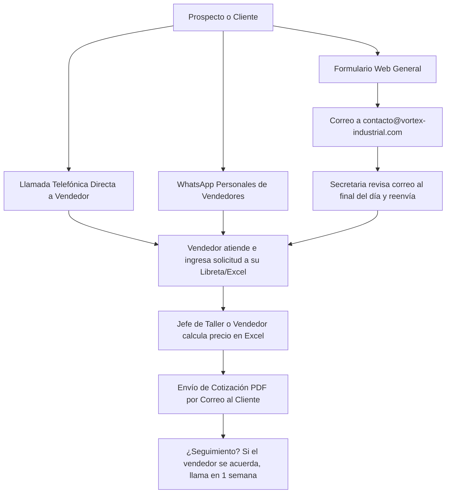

# LAGOSOLUTIONS — BANCO DE PRUEBAS METODOLÓGICO: CRASH TEST 01

> **TIPO DE DOCUMENTO:** Material de Entrada para Prueba de Campo Controlada (Crash Test 01).  
> **FECHA DE CREACIÓN:** 12 de Agosto de 2026  
> **OBJETIVO DEL EXPERIMENTO:** Poner a prueba los protocolos `LAGOSOLUTIONS_DIAGNOSTIC_PROTOCOL_V1.md` y `LAGOSOLUTIONS_DATA_OPPORTUNITY_PROTOCOL_V1.md` utilizando un caso de estudio empresarial ficticio pero de alta fidelidad operativa.  
> **REGLA FUNDAMENTAL DE PRUEBA:** Este documento contiene ÚNICAMENTE el contexto, el perfil del empresario, la información disponible y el dataset de datos brutos. **Se prohíbe explícitamente incluir diagnósticos, conclusiones, oportunidades identificadas o soluciones tecnológicas en este archivo.**

---

## ÍNDICE

1. [REGLAS DEL EXPERIMENTO](#1-reglas-del-experimento)
2. [PERFIL GENERAL DE LA EMPRESA](#2-perfil-general-de-la-empresa)
3. [INFORMACIÓN INICIAL DISPONIBLE (PRIMERA CONVERSACIÓN)](#3-informacion-inicial-disponible-primera-conversacion)
4. [PERFIL DEL EMPRESARIO](#4-perfil-del-empresario)
5. [INFORMACIÓN QUE EL EMPRESARIO PROPORCIONA EN ENTREVISTA PROFUNDA](#5-informacion-que-el-empresario-proporciona-en-entrevista-profunda)
6. [INFORMACIÓN QUE INICIALMENTE DESCONOCE O NO TIENE CALCULADA](#6-informacion-que-inicialmente-desconoce-o-no-tiene-calculada)
7. [CONTEXTO OPERATIVO COMPLETO](#7-contexto-operativo-completo)
8. [CONTEXTO COMERCIAL Y DE CAPTACIÓN](#8-contexto-comercial-y-de-captacion)
9. [CONTEXTO TECNOLÓGICO Y MANEJO DE DATOS](#9-contexto-tecnologico-y-manejo-de-datos)
10. [DATASET BRUTO PREPARADO (FASE DE DATOS)](#10-dataset-bruto-preparado-fase-de-datos)

---

## 1. REGLAS DEL EXPERIMENTO

1. **Investigación Orientada a Preguntas:** El auditor/investigador no debe asumir respuestas que no estén contenidas en este documento o en el dataset.
2. **Sin Soluciones Prematuras:** El investigador tiene prohibido sugerir herramientas, desarrollo de software o rediseño web durante la primera fase de análisis.
3. **Respeto a la Evidencia:** Toda afirmación o hipótesis que el investigador formule durante el ejercicio debe ser etiquetada utilizando el Evidence & Validation Framework (`E0`, `E1`, `E2`, `E3`, `Validación E4`).
4. **Tratamiento del Empresario:** El investigador debe interactuar conceptualmente con la perspectiva del empresario reconociendo su experiencia en el sector y deslindando percepciones (`E2`) de datos comprobables (`E3`).

---

## 2. PERFIL GENERAL DE LA EMPRESA

* **Nombre Ficticio:** `VORTEX Soluciones Industriales & Suministros S.A.`
* **Sector:** Proveedor de equipamiento técnico, repuestos industriales de precisión y servicios de mantenimiento preventivo/correctivo para plantas de producción.
* **Antigüedad:** 11 años de operación continua en el mercado regional industrial.
* **Ubicación:** Parque Industrial Zona Norte (Oficinas administrativas, depósito de repuestos y taller técnico integrado).
* **Tamaño y Personal (18 empleados en total):**
  * 1 Director General / Fundador (*Carlos Mendoza*).
  * 2 Vendedores técnicos de campo (Visitan plantas industriales y gestionan cuentas).
  * 1 Encargada de administración, compras y facturación.
  * 1 Jefe de taller y operaciones técnicas.
  * 7 Técnicos especialistas de mantenimiento y montaje.
  * 6 Operarios de depósito, logística y despacho.
* **Productos y Servicios Principales:**
  1. *Línea Válvulas & Conexiones de Alta Presión:* Venta de componentes y repuestos importados.
  2. *Servicio de Mantenimiento Preventivo Planificado (SMP):* Contratos anuales o semestrales de revisión en planta.
  3. *Reparación Técnica Urgente (RTU):* Servicio de asistencia inmediata ante fallas o paradas de línea de clientes.
  4. *Línea Filtros & Sellos Industriales:* Consumibles de alta rotación.
* **Modelo de Negocio:** Venta directa B2B a plantas industriales, empresas de alimentos, químicas y manufactureras. Cobros habituales con crédito a 30, 60 y 90 días según el cliente.
* **Situación Actual:** Facturación anual estable durante los últimos 2 años, pero con sensación de estancamiento por parte del dueño. Aumento sutil en costos de insumos importados y percepción de mayor competencia en licitaciones privadas.

---

## 3. INFORMACIÓN INICIAL DISPONIBLE (PRIMERA CONVERSACIÓN)

La siguiente es la transcripción del resumen inicial que el empresario proporciona en la primera toma de contacto antes de iniciar cualquier auditoría:

> *"Llevamos 11 años en el mercado industrial. Nos conocen bien por la calidad de nuestros repuestos de alta presión y la rapidez de nuestros técnicos cuando hay una emergencia en planta. Sin embargo, en los últimos dos años sentimos que la facturación se estancó. La competencia ha crecido mucho y vemos que varias empresas nuevas están captando clientes con páginas webs más modernas, catalogos digitales y campañas en Google. Nuestra web actual la hicimos hace 5 años y quedó vieja; casi nadie nos escribe por ahí. Creo que lo que necesitamos en este momento es rediseñar el sitio web, armar un catálogo interactivo de productos y lanzar campañas de publicidad en Google Ads y redes sociales para que más plantas nos conozcan y podamos subir las ventas."*

---

## 4. PERFIL DEL EMPRESARIO

* **Nombre:** Carlos Mendoza (53 años, Ingeniero Mecánico, Fundador y Director General).
* **Tono y Estilo:** Directo, pragmático, muy experimentado en la industria técnica. Valora el cumplimiento, la palabra y la calidad del trabajo de ingeniería.
* **Conocimiento del Negocio:** Conoce al detalle las especificaciones técnicas de los repuestos, las necesidades de las plantas de la zona y los problemas operativos de sus clientes clave.
* **Defensas y Sesgos:**
  * Está convencido de que la razón principal del estancamiento es la falta de visibilidad digital frente a competidores más jóvenes.
  * Defiende fuertemente la atención telefónica y directa de sus vendedores de campo ("En la industria pesada los negocios se hacen cara a cara o por teléfono").
  * Mantiene una postura reservada sobre compartir información de costos o márgenes de ganancia exactos en la primera reunión.
* **Percepciones Iniciales (`E2`):**
  * Cree que reciben "muy pocos prospectos" desde su presencia en internet.
  * Cree que el servicio de *Reparación Urgente* es el más rentable porque se cobra con recargo por emergencia.
  * Considera que los clientes que no vuelven a comprar se deben a que la competencia ofreció precios más bajos.

---

## 5. INFORMACIÓN QUE EL EMPRESARIO PROPORCIONA EN ENTREVISTA PROFUNDA

Si el auditor realiza las preguntas adecuadas siguiendo la secuencia de las 10 dimensiones de `LAGOSOLUTIONS_DIAGNOSTIC_PROTOCOL_V1.md`, el empresario está dispuesto a detallar:

* **Sobre el Proceso Comercial:** 
  * "Tenemos dos vendedores de campo, Roberto y Esteban. Ellos visitan clientes, llevan catálogos impresos y reciben solicitudes por teléfono o WhatsApp. Cuando un cliente pide cotización, ellos arman la propuesta en Excel y se la envían por correo."
* **Sobre los Tiempos de Cotización:** 
  * "Depende de la complejidad. Si son repuestos en stock, se cotiza en el día. Si es una reparación urgente o requiere importar piezas especiales, puede tardar entre 24 y 48 horas porque tenemos que consultar precios a los proveedores externos."
* **Sobre la Atención de la Web:** 
  * "El formulario de la web actual envía un correo a la casilla general `contacto@vortex-industrial.com`. La secretaria, Andrea, revisa ese correo cuando puede entre sus tareas de facturación y se lo reenvía a Roberto o Esteban según la zona."
* **Sobre los Clientes:** 
  * "Tenemos una cartera histórica de unas 140 empresas industriales. Hay unas 20 o 30 que nos compran todos los meses repuestos de alta rotación. Las demás compran esporádicamente cuando se les rompe algo o cuando los vendedores las visitan."

---

## 6. INFORMACIÓN QUE INICIALMENTE DESCONOCE O NO TIENE CALCULADA

El empresario admite que **NO conoce ni tiene calculados los siguientes datos**:

* El porcentaje exacto de cotizaciones enviadas que terminan convirtiéndose en ventas ganadas vs perdidas.
* El tiempo promedio que transcurre desde que un cliente escribe al formulario web o WhatsApp hasta que recibe la primera propuesta comercial.
* El costo exacto de adquisición de un cliente nuevo (CAC).
* El motivo real por el cual los clientes que dejaron de comprar en el último año no volvieron a solicitar cotizaciones (nunca se ha hecho una encuesta de salida).
* El margen neto exacto desembolsado por cada línea de servicio una vez descontadas las horas/hombre del equipo técnico de taller.
* La cantidad de prospectos que abandonan el contacto inicial por no recibir respuesta inmediata en horarios no hábiles.

---

## 7. CONTEXTO OPERATIVO COMPLETO

* **Capacidad del Taller Técnico:** 
  * El taller cuenta con 7 técnicos de campo. En temporadas de alta actividad industrial (Marzo a Junio y Septiembre a Noviembre), el equipo técnico trabaja al 95% de su capacidad en instalaciones y reparaciones en planta.
  * Durante los meses de Enero, Febrero y Julio (recesos industriales), la actividad de reparaciones urgentes cae significativamente y los técnicos realizan tareas de mantenimiento interno de herramientas o tienen días libres acumulados.
* **Cuellos de Botella Operativos:** 
  * Las piezas de repuestos importados especiales dependen de 2 proveedores internacionales. Los tiempos de despacho de importación han variado entre 15 y 45 días en el último año.
  * El Jefe de Taller debe revisar e inspeccionar personalmente cada cotización de *Mantenimiento Preventivo* antes de ser enviada al cliente para calcular las horas/hombre requeridas.

---

## 8. CONTEXTO COMERCIAL Y DE CAPTACIÓN

---

## 9. CONTEXTO TECNOLÓGICO Y MANEJO DE DATOS

* **Sitio Web Actual:** Desarrollado en WordPress estático hace 5 años. Contiene información institucional, fotos de las instalaciones y un formulario simple de contacto HTML. Sin analítica configurada (Google Analytics no está instalado o se perdió el acceso).
* **Gestión de Ventas y Clientes:**
  * **NO utilizan CRM.**
  * Cada vendedor (Roberto y Esteban) lleva su propia lista de contactos y seguimiento de cotizaciones en archivos de Microsoft Excel individuales guardados en sus computadoras portátiles.
  * La administración lleva el registro de facturación oficial en un sistema contable local (PymeFactura) que no se conecta con las computadoras de los vendedores.
* **Canales de Mensajería:**
  * WhatsApp Business instalado en los teléfonos móviles personales de cada vendedor. No existe una cuenta corporativa centralizada ni etiquetas compartidas de seguimiento de prospectos.

---

## 10. DATASET BRUTO PREPARADO (FASE DE DATOS)

A continuación se presentan tres tablas de datos brutos simulados correspondientes a los registros de la empresa durante los años **2024, 2025 y primer semestre de 2026**.

> **NOTA SOBRE LA CALIDAD DE LOS DATOS:** El dataset contiene imperfecciones deliberadas y realistas (nombres de clientes con diferentes escrituras, campos vacíos, nomenclaturas variadas de productos y fechas en formatos mixtos) que el auditor deberá evaluar conforme a `LAGOSOLUTIONS_DATA_OPPORTUNITY_PROTOCOL_V1.md`.

---

### Tabla 1: Registro de Oportunidades y Cotizaciones Comercial (Muestra Representativa 2024 - 2026)

| ID_Cotiz | Fecha_Solicitud | Cliente_Nombre | Canal_Origen | Tipo_Servicio_Solicitado | Monto_Cotizado_USD | Estado_Cotizacion | Fecha_Cierre | Vendedor |
| :--- | :--- | :--- | :--- | :--- | :--- | :--- | :--- | :--- |
| CT-1001 | 15/01/2024 | Alimentos del Norte S.A. | Recomendación | Mantenimiento Preventivo | $4,500 | Ganada | 22/01/2024 | Esteban |
| CT-1002 | 18/01/2024 | Ind. Quimicas del Valle | Web Form | Valvulas & Conexiones | $1,200 | Ganada | 19/01/2024 | Roberto |
| CT-1003 | 02/02/2024 | Metalurgica Zona Norte | Telefono | Reparacion Urgente | $2,800 | Ganada | 02/02/2024 | Esteban |
| CT-1004 | 10/02/2024 | Plasticos Industriales SA | | Filtros & Sellos | $650 | Perdedora | | Roberto |
| CT-1005 | 05/03/2024 | ALIMENTOS DEL NORTE | Directo Vendedor | Maint-Preventivo | $4,500 | Ganada | 12/03/2024 | Esteban |
| CT-1006 | 14/03/2024 | Cerveceria Regional | Web Form | Valvulas Alta Presion | $8,900 | Perdedora | 28/03/2024 | Roberto |
| CT-1007 | 02/04/2024 | Embotelladora Central | Telefono | Reparacion Urgente | $3,100 | Ganada | 03/04/2024 | Esteban |
| CT-1008 | 15/04/2024 | Quimicas del Valle SA | Recomendacion | Mantenimiento | $5,200 | Ganada | 25/04/2024 | Roberto |
| CT-1009 | 03/05/2024 | Agroindustria Pampa | Web Form | Valvulas & Conexiones | $2,400 | Sin Respuesta | | Esteban |
| CT-1010 | 20/05/2024 | Metalurgica Zona Norte | Telefono | Filtros & Sellos | $480 | Ganada | 20/05/2024 | Esteban |
| CT-1011 | 11/06/2024 | Papelera del Litoral | Recomendación | Serv Mantenimiento | $6,000 | Perdedora | 30/06/2024 | Roberto |
| CT-1012 | 08/07/2024 | Alimentos del Norte S.A. | Directo | Valvulas Alta Presion | $1,850 | Ganada | 10/07/2024 | Esteban |
| CT-1013 | 14/08/2024 | Frigorifico San Jose | Web | Reparacion Urgente | $4,200 | Ganada | 15/08/2024 | Roberto |
| CT-1014 | 02/09/2024 | IND QUIMICAS DEL VALLE | Telefono | Valvulas & Conexiones | $3,300 | Ganada | 05/09/2024 | Roberto |
| CT-1015 | 19/09/2024 | Plasticos Ind. S.A. | Web Form | Mantenimiento Preventivo | $5,000 | Perdedora | | Esteban |
| CT-1016 | 05/10/2024 | Cerveceria Regional | Directo Vendedor | Filtros & Sellos | $920 | Ganada | 06/10/2024 | Roberto |
| CT-1017 | 12/11/2024 | Embotelladora Central | Telefono | Reparacion Urgente | $2,900 | Ganada | 12/11/2024 | Esteban |
| CT-1018 | 03/12/2024 | Papelera del Litoral | Web Form | Valvulas Alta Presion | $7,500 | Sin Respuesta | | Roberto |
| CT-2001 | 10/01/2025 | Alimentos del Norte S.A. | Recomendacion | Mantenimiento Preventivo | $4,800 | Ganada | 18/01/2025 | Esteban |
| CT-2002 | 22/01/2025 | Laboratorios Farmaceuticos | Web Form | Valvulas & Conexiones | $3,600 | Perdedora | 10/02/2025 | Roberto |
| CT-2003 | 05/02/2025 | Metalurgica Zona Norte | Telefono | RTU Emergency | $3,400 | Ganada | 05/02/2025 | Esteban |
| CT-2004 | 18/02/2025 | Ind. Quimicas del Valle | Directo | Filtros & Sellos | $1,100 | Ganada | 19/02/2025 | Roberto |
| CT-2005 | 03/03/2025 | Cerveceria Regional | Web Form | Mantenimiento | $6,500 | Perdedora | 25/03/2025 | Roberto |
| CT-2006 | 14/03/2025 | Agroindustria Pampa | Telefono | Valvulas Alta Presion | $2,900 | Ganada | 18/03/2025 | Esteban |
| CT-2007 | 08/04/2025 | Embotelladora Central | Recomendación | Reparacion Urgente | $3,500 | Ganada | 08/04/2025 | Esteban |
| CT-2008 | 20/04/2025 | ALIMENTOS DEL NORTE | Directo | Valvulas & Conexiones | $2,100 | Ganada | 22/04/2025 | Esteban |
| CT-2009 | 05/05/2025 | Textil Sudamericana | Web Form | Serv Mantenimiento | $4,200 | Sin Respuesta | | Roberto |
| CT-2010 | 18/05/2025 | Quimicas del Valle SA | Telefono | Filtros & Sellos | $850 | Ganada | 19/05/2025 | Roberto |
| CT-2011 | 02/06/2025 | Frigorifico San Jose | Web Form | Valvulas Alta Presion | $5,400 | Perdedora | 20/06/2025 | Esteban |
| CT-2012 | 15/07/2025 | Metalurgica Zona Norte | Telefono | Reparacion Urgente | $2,600 | Ganada | 15/07/2025 | Esteban |
| CT-2013 | 04/08/2025 | Plasticos Industriales SA | Directo Vendedor | Maint-Preventivo | $4,800 | Perdedora | | Roberto |
| CT-2014 | 20/08/2025 | Cerveceria Regional | Telefono | Valvulas & Conexiones | $1,400 | Ganada | 21/08/2025 | Roberto |
| CT-2015 | 10/09/2025 | Alimentos del Norte S.A. | Directo | Filtros & Sellos | $720 | Ganada | 11/09/2025 | Esteban |
| CT-2016 | 01/10/2025 | Embotelladora Central | Recomendacion | RTU Emergency | $3,800 | Ganada | 01/10/2025 | Esteban |
| CT-2017 | 15/11/2025 | Ind. Quimicas del Valle | Web Form | Valvulas Alta Presion | $6,200 | Perdedora | 05/12/2025 | Roberto |
| CT-3001 | 12/01/2026 | Alimentos del Norte S.A. | Recomendacion | Mantenimiento Preventivo | $5,000 | Ganada | 20/01/2026 | Esteban |
| CT-3002 | 28/01/2026 | Metalurgica Zona Norte | Telefono | Reparacion Urgente | $3,200 | Ganada | 28/01/2026 | Esteban |
| CT-3003 | 10/02/2026 | Generadora Electrica SA | Web Form | Valvulas Alta Presion | $12,000 | Sin Respuesta | | Roberto |
| CT-3004 | 03/03/2026 | Quimicas del Valle SA | Directo | Valvulas & Conexiones | $2,800 | Ganada | 05/03/2026 | Roberto |
| CT-3005 | 18/03/2026 | Embotelladora Central | Telefono | RTU Emergency | $4,100 | Ganada | 18/03/2026 | Esteban |
| CT-3006 | 05/04/2026 | Cerveceria Regional | Web Form | Mantenimiento | $7,000 | Perdedora | 28/04/2026 | Roberto |
| CT-3007 | 20/04/2026 | Agroindustria Pampa | Recomendacion | Filtros & Sellos | $950 | Ganada | 21/04/2026 | Esteban |
| CT-3008 | 10/05/2026 | ALIMENTOS DEL NORTE | Directo | Valvulas Alta Presion | $3,100 | Ganada | 12/05/2026 | Esteban |
| CT-3009 | 02/06/2026 | Plasticos Ind. S.A. | Web Form | Serv Mantenimiento | $5,500 | Sin Respuesta | | Roberto |

---

### Tabla 2: Resumen Historico de Ventas Facturadas por Linea de Producto (2023 - 2025)

| Anio | Linea_Producto_Servicio | Facturacion_Total_USD | Cantidad_Ordenes_Cerradas | Margen_Bruto_Promedio_Estimado |
| :--- | :--- | :--- | :--- | :--- |
| 2023 | Valvulas & Conexiones Alta Presion | $285,000 | 74 | 38% |
| 2023 | Mantenimiento Preventivo Planificado | $145,000 | 28 | 45% |
| 2023 | Reparacion Tecnica Urgente (RTU) | $110,000 | 35 | 52% |
| 2023 | Filtros & Sellos Industriales | $42,000 | 62 | 25% |
| 2024 | Valvulas & Conexiones Alta Presion | $270,000 | 68 | 36% |
| 2024 | Mantenimiento Preventivo Planificado | $150,000 | 30 | 44% |
| 2024 | Reparacion Tecnica Urgente (RTU) | $125,000 | 38 | 50% |
| 2024 | Filtros & Sellos Industriales | $45,000 | 65 | 24% |
| 2025 | Valvulas & Conexiones Alta Presion | $255,000 | 61 | 35% |
| 2025 | Mantenimiento Preventivo Planificado | $158,000 | 31 | 43% |
| 2025 | Reparacion Tecnica Urgente (RTU) | $132,000 | 41 | 49% |
| 2025 | Filtros & Sellos Industriales | $48,000 | 68 | 23% |

---

### Tabla 3: Registro de Consultas Web Entrantes (Muestra de Consultas en Formulario 2025 - 2026)

| ID_Form | Fecha_Hora_Ingreso | Nombre_Contacto | Empresa_Declarada | Mensaje_Consulta | Remitido_A | Estado_Atencion |
| :--- | :--- | :--- | :--- | :--- | :--- | :--- |
| FB-801 | 14/01/2025 09:15 | Ing. Marcelo Gomez | Cerveceria Regional | Cotizar servicio de mantenimiento preventivo linea 2 | Roberto | Cotizado (Perdida) |
| FB-802 | 22/01/2025 18:40 | Carlos Ruiz | Lab. Farmaceuticos | Necesitamos lista de precios de valvulas inox | Roberto | Cotizado (Perdida) |
| FB-803 | 02/02/2025 21:10 | Guardia de Turno | Metalurgica Zona Norte | URGENTE: Rotura de valvula principal planta | Esteban | Atendido por Tel (Ganada) |
| FB-804 | 02/03/2025 17:30 | Ing. Marcelo Gomez | Cerveceria Regional | Presupuesto anual de mantenimiento de tanques | Roberto | Cotizado (Perdida) |
| FB-805 | 11/04/2025 11:20 | Juan Perez | Frigorifico San Jose | Cotizacion de valvulas de alta presion de 3 pulgadas | Esteban | Cotizado (Perdida) |
| FB-806 | 04/05/2025 19:15 | Pedro Sanchez | Textil Sudamericana | Servicio de mantenimiento para calderas | Roberto | Sin Contactar |
| FB-807 | 14/06/2025 15:45 | Ing. Alicia Torres | Techint Proveedores | Catalogo de filtros industriales | Roberto | Envio Catalogo (Sin Venta) |
| FB-808 | 02/08/2025 10:05 | Jorge Blanco | Plasticos Ind. S.A. | Requerimos propuesta de mantenimiento preventivo | Roberto | Cotizado (Perdida) |
| FB-809 | 15/11/2025 16:50 | Ing. Carlos Ruiz | Ind. Quimicas del Valle | Presupuesto de repuestos importados valvulas | Roberto | Cotizado (Perdida) |
| FB-901 | 10/02/2026 20:05 | Ing. Hector Diaz | Generadora Electrica SA | Licitacion privada valvulas alta presion $12k | Roberto | Sin Contactar / Vencida |
| FB-902 | 04/04/2026 11:30 | Ing. Marcelo Gomez | Cerveceria Regional | Revision de mantenimiento estacional | Roberto | Cotizado (Perdida) |
| FB-903 | 01/06/2026 19:40 | Dario Morales | Plasticos Ind. S.A. | Mantenimiento correctivo para Julio | Roberto | Sin Contactar |

---

**ESTADO DEL ENTREGABLE:** `LAGOSOLUTIONS_CRASH_TEST_01.md` Generado y guardado en la raíz del repositorio. Listo para ser utilizado en el ensayo metodológico de campo.
