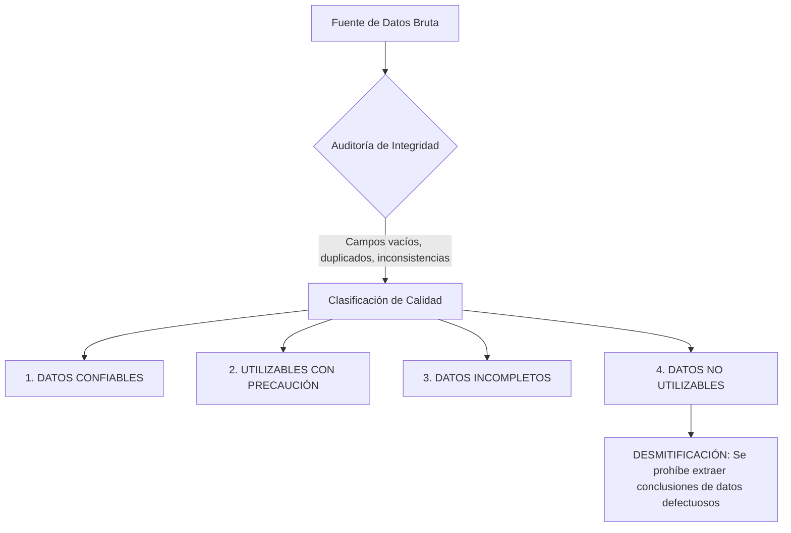
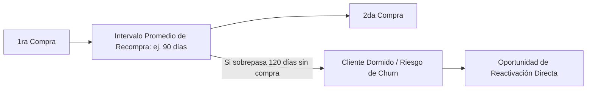
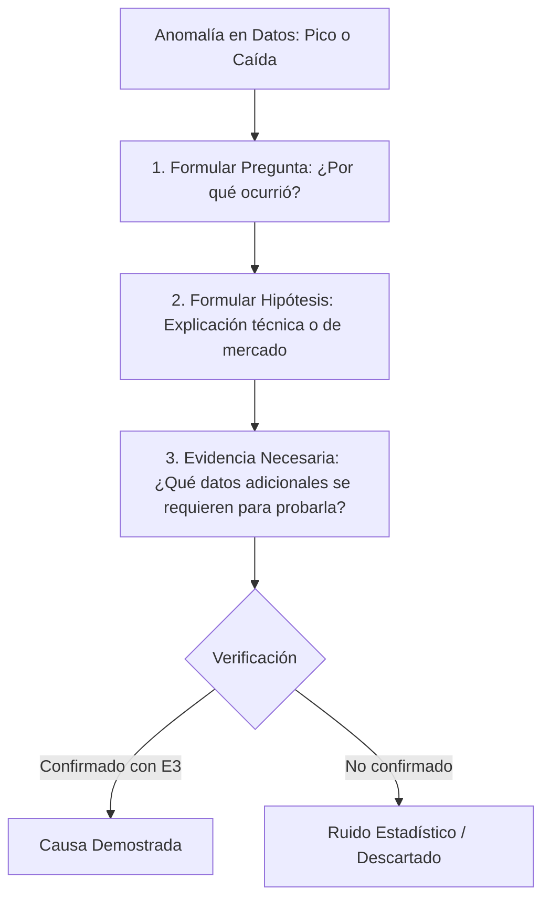

# LAGOSOLUTIONS — PROTOCOLO DE ANÁLISIS DE DATOS Y OPORTUNIDADES DE NEGOCIO (V1)

> **TIPO DE DOCUMENTO:** Manual Interno Metodológico para el Análisis de Datos Empresariales.  
> **FECHA DE CREACIÓN:** 12 de Agosto de 2026  
> **ÁREA:** Inteligencia de Negocios, Análisis Operativo y Estrategia Basada en Evidencia.  
> **PRINCIPIO FUNDAMENTAL:** LAGOSOLUTIONS no convierte datos en gráficos por defecto. LAGOSOLUTIONS convierte datos en preguntas, patrones, hipótesis y decisiones que puedan ser comprobadas mediante experimentos reales.

---

## ÍNDICE

1. [OBJETIVO Y PRINCIPIO FUNDAMENTAL](#1-objetivo-y-principio-fundamental)
2. [LA SECUENCIA METODOLÓGICA DE ANÁLISIS](#2-la-secuencia-metodologica-de-analisis)
3. [INVENTARIO Y FUENTES DE DATOS EMPRESARIALES](#3-inventario-y-fuentes-de-datos-empresariales)
4. [EVALUACIÓN DE CALIDAD DE DATOS](#4-evaluacion-de-calidad-de-datos)
5. [LAS 5 DIMENSIONES DE ANÁLISIS](#5-las-5-dimensiones-de-analisis)
6. [ANÁLISIS HISTÓRICO Y COMPARATIVO](#6-analisis-historico-y-comparativo)
7. [DESMONTAJE DE LA ESTACIONALIDAD](#7-desmontaje-de-la-estacionalidad)
8. [ANÁLISIS MULTIDIMENSIONAL DE PRODUCTOS Y SERVICIOS](#8-analisis-multidimensional-de-productos-y-servicios)
9. [CRUCES CLIENTE → PRODUCTO](#9-cruces-cliente--producto)
10. [ANÁLISIS DE RECURRENCIA Y CLIENTES DORMIDOS](#10-analisis-de-recurrencia-y-clientes-dormidos)
11. [ANÁLISIS DE RENTABILIDAD Y RITMO DE CANALES](#11-analisis-de-rentabilidad-y-ritmo-de-canales)
12. [MATRIZ DE COMBINACIÓN: CLIENTE → CANAL → PRODUCTO](#12-matriz-de-combinacion-cliente--canal--producto)
13. [TRATAMIENTO Y PROTOCOLO DE ANOMALÍAS](#13-tratamiento-y-protocolo-de-anomalias)
14. [CADENA CAUSAL: PATRÓN → HIPÓTESIS → EXPERIMENTO](#14-cadena-causal-patron--hipotesis--experimento)
15. [ESTUDIO DE CASO METODOLÓGICO: VALLES DE DEMANDA](#15-estudio-de-caso-metodologico-valles-de-demanda)
16. [COSTE DE NO UTILIZAR LOS DATOS EXISTENTES](#16-coste-de-no-utilizar-los-datos-existentes)
17. [TAXONOMÍA DE OPORTUNIDADES DERIVADAS DE DATOS](#17-taxonomia-de-oportunidades-derivadas-de-datos)
18. [INTEGRACIÓN DEL EVIDENCE & VALIDATION FRAMEWORK](#18-integracion-del-evidence--validation-framework)
19. [CAUSA VS CORRELACIÓN EN ANÁLISIS ESTADÍSTICO](#19-causa-vs-correlacion-en-analisis-estadistico)
20. [DISEÑO METODOLÓGICO DE EXPERIMENTOS DE NEGOCIO](#20-diseno-metodologico-de-experimentos-de-negocio)
21. [VEREDICTOS DE SALIDA DEL ANÁLISIS (INCLUYENDO "NO INTERVENIR")](#21-veredictos-de-salida-del-analisis-incluyendo-no-intervenir)
22. [EVALUACIÓN ESPECÍFICA DE HOJAS DE CÁLCULO (EXCEL / SHEETS)](#22-evaluacion-especifica-de-hojas-de-calculo-excel--sheets)
23. [EVALUACIÓN ESPECÍFICA DE CANALES DE MENSAJERÍA (WHATSAPP)](#23-evaluacion-especifica-de-canales-de-mensajeria-whatsapp)
24. [ESTRUCTURA DEL DATA OPPORTUNITY REPORT](#24-estructura-del-data-opportunity-report)
25. [REGLA DE SIMPLICIDAD Y AUSENCIA DE BUROCRACIA](#25-regla-de-simplicidad-y-ausencia-de-burocracia)
26. [LIMITACIONES ACTUALES DEL ANÁLISIS DE DATOS](#26-limitaciones-actuales-del-analisis-de-datos)
27. [CONFIRMACIÓN DE CERO PROGRAMACIÓN Y CERO DASHBOARDS](#27-confirmacion-de-cero-programacion-y-cero-dashboards)
28. [CRITERIO FINAL Y CHECKLIST DE VERIFICACIÓN METODOLÓGICA](#28-criterio-final-y-checklist-de-verificacion-metodologica)

---

## 1. OBJETIVO Y PRINCIPIO FUNDAMENTAL

El objetivo de este protocolo es establecer el estándar metodológico con el cual el equipo de LAGOSOLUTIONS analiza la información histórica de una empresa para descubrir patrones operacionales, tendencias de compra, estacionalidades y oportunidades de eficiencia o monetización.

### La Pregunta Central del Análisis

Todo proceso de análisis de datos en LAGOSOLUTIONS debe iniciarse respondiendo de forma estricta a la siguiente pregunta:

> **"¿Qué decisiones empresariales concretas podrían mejorar si entendemos mejor los datos que la empresa ya posee?"**

```
┌─────────────────────────────────────────────────────────────────────────────┐
│                      REGLA DE ORO DE INTELIGENCIA                           │
├─────────────────────────────────────────────────────────────────────────────┤
│ INCORRECTO: "Vamos a conectar la base de datos a un dashboard visual para   │
│             ver qué gráficos bonitos salen."                                │
│                                                                             │
│ CORRECTO:   "Identifiquemos qué decisión de inventario, precios o retención │
│             se toma hoy por intuición y auditemos qué datos la respaldan." │
└─────────────────────────────────────────────────────────────────────────────┘
```

---

## 2. LA SECUENCIA METODOLÓGICA DE ANÁLISIS

LAGOSOLUTIONS rechaza la secuencia tradicional de "Datos → Gráficos → Solución". El protocolo impone una secuencia orientada a decisiones y validación experimental:

```
[SECUENCIA INCORRECTA (VENDEDORA DE HUMO / MARTILLO TECNOLÓGICO)]
DATOS DISPONIBLES ──> GENERACIÓN DE GRÁFICOS ──> "OPORTUNIDAD / SOFTWARE NUEVO"

[SECUENCIA METODOLÓGICA OFICIAL DE LAGOSOLUTIONS]
1. DECISIÓN A MEJORAR
   │
   ▼
2. DATOS NECESARIOS Requeridos para evaluar la decisión
   │
   ▼
3. ANÁLISIS Y LIMPIEZA Auditoría de consistencia de la fuente
   │
   ▼
4. PATRÓN DETECTADO Regularidad estadística identificada
   │
   ▼
5. HIPÓTESIS Explicación tentativa que debe ser probada
   │
   ▼
6. VALIDACIÓN E4 Verificación mediante Evidence Framework
   │
   ▼
7. OPORTUNIDAD Identificación de potencial beneficio
   │
   ▼
8. EXPERIMENTO Intervención pequeña para probar la hipótesis
   │
   ▼
9. MÉTRICA DE ÉXITO Evaluación del resultado real
```

---

## 3. INVENTARIO Y FUENTES DE DATOS EMPRESARIALES

El auditor debe realizar un inventario exhaustivo de todas las fuentes de información donde la empresa registre eventos operativos o financieros:

| Categoria | Fuentes Comunes de Datos | Información Típica Contenida |
| :--- | :--- | :--- |
| **Archivos Planos** | Excel (`.xlsx`), Hojas de cálculo de Google, CSV. | Registros de ventas manuales, listas de precios, inventarios. |
| **Sistemas de Ventas / ERP** | Sistemas de facturación, POS, software de gestión. | Histórico de facturas, clientes, fechas, montos, impuestos. |
| **Comercio Electrónico** | Shopify, WooCommerce, Magento, MercadoPago, Stripe. | Carritos, compras, carritos abandonados, tickets, productos. |
| **Relación con Clientes** | CRM (HubSpot, Salesforce, Zoho), agendas digitales. | Leads, etapas comerciales, motivos de pérdida, contactos. |
| **Tráficos y Búsquedas** | Google Analytics 4, Search Console, Meta Ads. | Visitas, fuentes de tráfico, páginas vistas, términos clave. |
| **Operación y Reservas** | Calendarios, software de citas, sistemas de despacho. | Tiempos de atención, ausentismo, duración de entregas. |
| **Canales de Mensajería** | WhatsApp Business, correo electrónico, chats web. | Consultas entrantes, horas de mensaje, frecuencia de contacto. |

> **REGLA DE REALIDAD:** El auditor no debe asumir que el cliente cuenta con sistemas sofisticados. En la mayoría de las PYMEs consolidadas, el 80% de los datos reside en hojas de Excel y extractos bancarios.

---

## 4. EVALUACIÓN DE CALIDAD DE DATOS

Antes de ejecutar cualquier análisis estadístico, el auditor debe someter las fuentes a la **Auditoría de Integridad de Datos**:



### Factores de Auditoría de Calidad
1. **Completitud:** Porcentaje de registros con campos clave vacíos (ej. ventas sin fecha o sin cliente).
2. **Duplicidad:** Presencia de clientes o ventas registradas múltiples veces con variaciones de nombre.
3. **Inconsistencia de Clasificación:** Un mismo producto registrado como "Servicio A", "Serv-A" y "Servicio Alfa".
4. **Continuidad Histórica:** Cambios en la forma de registrar los datos a lo largo del tiempo que impiden comparaciones directas.

> **REGLA INVIOLABLE:** Un patrón identificado en `DATOS NO UTILIZABLES` o `DATOS INCOMPLETOS` **NUNCA** puede convertirse en una oportunidad de negocio ni fundamentar una recomendación estratégica.

---

## 5. LAS 5 DIMENSIONES DE ANÁLISIS

Todo conjunto de datos se analiza cruzando 5 dimensiones fundamentales:

```
┌─────────────────────────────────────────────────────────────────────────────┐
│                       LAS 5 DIMENSIONES DE ANÁLISIS                         │
├───────────────────┬─────────────────────────────────────────────────────────┤
│ 1. TIEMPO         │ Año, trimestre, mes, semana, día, hora, temporada.      │
│ 2. PRODUCTO       │ Volumen, ingresos, margen, recurrencia, crecimiento.   │
│ 3. CLIENTE        │ Segmento, antigüedad, frecuencia, ticket, LTV.          │
│ 4. CANAL          │ Origen, tasa de conversión, volumen, rentabilidad.      │
│ 5. OPERACIÓN      │ Capacidad consumida, tiempos de entrega, saturación.    │
└───────────────────┴─────────────────────────────────────────────────────────┘
```

---

## 6. ANÁLISIS HISTÓRICO Y COMPARATIVO

El análisis comparativo busca identificar variaciones significativas entre períodos equivalentes:

* **YoY (Year-over-Year):** Comparación del mismo mes o trimestre entre años consecutivos (ej. Julio 2025 vs Julio 2026) para aislar la estacionalidad de las tendencias reales.
* **MoM (Month-over-Month):** Evaluación del ritmo mensual de corto plazo.
* **Comparativas por Segmento:** Rendimiento relativo entre productos, líneas de negocio o tipos de cliente.

> **ADVERTENCIA DE CAUSALIDAD:** Una variación positiva o negativa en los datos (ej. "las ventas subieron un 15% en Marzo") **NO demuestra por sí sola la causa**. Toda variación histórica debe ser tratada inicialmente como una pregunta: *"¿Qué eventos internos o externos explican este comportamiento?"*.

---

## 7. DESMONTAJE DE LA ESTACIONALIDAD

Cuando los datos muestran valles o picos periódicos en la demanda (ej. caídas recurrentes en meses estivales o vacaciones), el protocolo prohíbe prescribir soluciones automáticas de captación:

```
┌─────────────────────────────────────────────────────────────────────────────┐
│                 PROTOCOLO DE ANÁLISIS EN VALLES DE DEMANDA                  │
├─────────────────────────────────────────────────────────────────────────────┤
│ ANOMALÍA: Las ventas caen un 30% en los meses de Julio y Agosto.             │
│                                                                             │
│ REACCIÓN INCORRECTA (VENDEDORA DE HUMO):                                    │
│ "Hay que hacer una campaña masiva de anuncios y descuentos para subir ventas"│
│                                                                             │
│ INVESTIGACIÓN METODOLÓGICA DE LAGOSOLUTIONS:                                │
│ 1. ¿Por qué cae la demanda en esos meses? (¿Clientes de vacaciones?).       │
│ 2. ¿Qué productos o servicios SÍ mantienen demanda activa en ese período?   │
│ 3. ¿Qué segmento específico de clientes continúa comprando?                 │
│ 4. ¿Qué capacidad operativa queda disponible y qué costo tiene tenerla ociosa?│
│ 5. ¿Existe una necesidad complementaria que la empresa pueda atender?      │
└─────────────────────────────────────────────────────────────────────────────┘
```

---

## 8. ANÁLISIS MULTIDIMENSIONAL DE PRODUCTOS Y SERVICIOS

LAGOSOLUTIONS rechaza la simplificación de evaluar productos únicamente por su volumen bruto de ventas (`"El producto que más vende es el mejor"`). Se exige auditar las 6 variables del producto:

$$\text{Valor del Producto} = f\left( \text{Volumen}, \text{Ingresos Brutos}, \text{Margen Neto}, \text{Recurrencia}, \text{Capacidad Consumida}, \text{Valor Estratégico} \right)$$

### Matriz de Clasificación de Productos

| Categoría de Producto | Descripción y Comportamiento en Datos | Acción Metodológica |
| :--- | :--- | :--- |
| **Líderes de Ingreso** | Generan el mayor volumen de facturación bruta. | Proteger el canal de captación y optimizar la entrega. |
| **Alta Rentabilidad** | Margen neto elevado aunque su volumen sea moderado. | Investigar cómo aumentar su visibilidad sin elevar el CAC. |
| **Alto Volumen / Bajo Margen** | Consumen mucha capacidad operativa pero dejan poco margen. | Auditar si subsidian otros servicios o si sobrecargan al equipo. |
| **Bajo Volumen / Alto Margen** | Altamente rentables pero poco conocidos o mal comunicados. | Probar experimentos de comunicación y empaquetamiento. |
| **Puerta de Entrada (Gancho)** | Productos de primer contacto que conducen a recompras de alto valor. | Optimizar el proceso de conversión secundaria. |

---

## 9. CRUCES CLIENTE → PRODUCTO

El auditor debe buscar combinaciones específicas cruzando el perfil de comprador con la categoría consumida:

$$\text{Patrón de Compra} = \text{Segmento de Cliente} + \text{Producto Específico} + \text{Canal de Origen} + \text{Estacionalidad}$$

* **Objetivo:** Descubrir si los clientes de mayor valor (ticket alto y baja morosidad) compran un producto específico que los clientes de bajo valor no consumen.
* **Advertencia:** Identificar que el "Grupo A compra el Producto Y" es un **hallazgo observacional**, no una causa probada. Requiere formulación de hipótesis.

---

## 10. ANÁLISIS DE RECURRENCIA Y CLIENTES DORMIDOS

El análisis de datos debe medir el intervalo de tiempo promedio entre compras de un mismo cliente para identificar la ventana de reactivación:



> **PREVENCIÓN DE DESCUENTOS AUTOMÁTICOS:** El protocolo establece que la solución a la inactividad de clientes **NO es lanzar cupones de descuento masivos por defecto**. Primero debe investigarse si el cliente no ha recomprado por falta de necesidad, olvido, mala experiencia previa o por haber migrado a un competidor.

---

## 11. ANÁLISIS DE RENTABILIDAD Y RITMO DE CANALES

Al analizar los canales de captación (SEO, Ads, referidos, vendedores, alianzas), el auditor no debe dejarse deslumbrar por el volumen de prospectos entrantes:

```
┌─────────────────────────────────────────────────────────────────────────────┐
│                    EVALUACIÓN MULTIDIMENSIONAL DE CANALES                   │
├──────────────┬───────────────┬────────────────┬────────────────┬────────────┤
│ CANAL        │ LEADS (VOL)   │ TASA CONVERSIÓN│ TICKET PROMEDIO│ MARGEN NETO│
├──────────────┼───────────────┼────────────────┼────────────────┼────────────┤
│ Canal A (Ads)│ High Volume   │ Low (2%)       │ Low            │ Margen Bajo│
│ Canal B (Ref)│ Low Volume    │ High (35%)     │ High           │ Margen Alto│
└──────────────┴───────────────┴────────────────┴────────────────┴────────────┘
```

> **CONCLUSIÓN:** El Canal B es comercialmente más valioso para la rentabilidad del negocio que el Canal A, a pesar de generar un volumen de leads significativamente menor.

---

## 12. MATRIZ DE COMBINACIÓN: CLIENTE → CANAL → PRODUCTO

El análisis concluye con la identificación de combinaciones de alto rendimiento:

$$\text{Combinación Ganadora} = \text{Canal X} \longrightarrow \text{Cliente Tipo Y} \longrightarrow \text{Producto Z} \longrightarrow \text{Mayor Recurrencia y Margen}$$

* **Clasificación:** Todo cruce exitoso descubierto en los datos se etiqueta estrictamente como **`[HALLAZGO]`**.
* **Tránsito a Oportunidad:** Un `[HALLAZGO]` solo se convierte en **`Oportunidad Validada (E4)`** si demuestra viabilidad operativa y económica para ser escalado.

---

## 13. TRATAMIENTO Y PROTOCOLO DE ANOMALÍAS

Cuando los datos muestran un evento atípico (un pico inesperado de ventas en una semana o una caída drástica en un canal), el auditor ejecuta el **Protocolo de Anomalías**:



---

## 14. CADENA CAUSAL: PATRÓN → HIPÓTESIS → EXPERIMENTO

El protocolo prohíbe terminantemente saltar directamente de la observación de un gráfico a la prescripción de una solución tecnológica:

$$\text{PATRÓN ESTADÍSTICO} \longrightarrow \text{INTERPRETACÍÓN} \longrightarrow \text{HIPÓTESIS} \longrightarrow \text{OPORTUNIDAD} \longrightarrow \text{EXPERIMENTO} \longrightarrow \text{MÉTRICA}$$

| Etapa | Definición Metodológica | Ejemplo |
| :--- | :--- | :--- |
| **1. Patrón** | Regularidad estadística verificada en datos E3. | El 70% de las ventas del Producto X se realizan los días lunes. |
| **2. Interpretación** | Lo que el equipo cree que el patrón significa. | Los clientes corporativos planifican sus compras al inicio de semana. |
| **3. Hipótesis** | Explicación tentativa que puede ser probada. | Enviar un recordatorio por correo el viernes elevará las conversiones del lunes. |
| **4. Oportunidad** | Beneficio potencial respaldado si la hipótesis es cierta.| Incrementar un 15% las ventas del Producto X sin aumentar costo publicitario. |
| **5. Experimento** | Intervención controlada y pequeña para probar la hipótesis.| Enviar correo de prueba a un segmento del 20% de la base el viernes. |
| **6. Métrica** | Indicador objetivo de éxito o invalidación. | Tasa de apertura el viernes y conversión comparada el lunes. |

---

## 15. ESTUDIO DE CASO METODOLÓGICO: VALLES DE DEMANDA

Para guiar al auditor en la aplicación del protocolo, se presenta la secuencia de razonamiento ante un problema de estacionalidad:

```
┌─────────────────────────────────────────────────────────────────────────────┐
│                      ESTUDIO DE CASO: VALLE DE DEMANDA                      │
├─────────────────────────────────────────────────────────────────────────────┤
│ 1. PATRÓN: Caída del 40% en facturación durante el mes de Enero.            │
│ 2. INVESTIGACIÓN:                                                           │
│    • ¿Qué clientes continúan comprando en Enero? (Segmento B2B Industrial). │
│    • ¿Qué productos mantienen ventas? (Servicios de mantenimiento anual).   │
│    • ¿Qué capacidad operativa queda libre? (Técnicos de campo disponibles). │
│ 3. HIPÓTESIS DE NEGOCIO:                                                    │
│    "Las empresas industriales prefieren realizar mantenimientos preventivos  │
│     en Enero aprovechando que sus plantas operan a menor capacidad."        │
│ 4. OPORTUNIDAD:                                                             │
│    Diseñar un paquete específico de mantenimiento anual para el sector      │
│    industrial durante el mes de Enero.                                      │
│ 5. EXPERIMENTO RECOMENDADO:                                                 │
│    Contactar directamente a 15 clientes industriales en Noviembre ofreciendo│
│    reserva anticipada para la ventana de Enero.                             │
└─────────────────────────────────────────────────────────────────────────────┘
```

---

## 16. COSTE DE NO UTILIZAR LOS DATOS EXISTENTES

El protocolo evalúa cualitativamente los perjuicios que sufre la empresa al ignorar su información histórica:

* **Decisiones por intuición:** Inversiones en stock o publicidad basadas en corazonadas del gerente que terminan en pérdidas de caja.
* **Asignación incorrecta de recursos:** Vendedores dedicando tiempo a prospectos de baja rentabilidad mientras desatienden clientes de alto valor.
* **Oportunidades estacionales perdidas:** Valles de demanda que se sufren pasivamente sin preparar ofertas para la capacidad ociosa.
* **Desgaste por churn no detectado:** Clientes recurrentes que dejan de comprar sin que la empresa lo note hasta meses después.

---

## 17. TAXONOMÍA DE OPORTUNIDADES DERIVADAS DE DATOS

Las oportunidades identificadas a partir del análisis de datos se encuadran en las siguientes **7 Categorías Núcleo**:

1. **Captación:** Reasignación de presupuesto hacia los canales de mayor rentabilidad y conversión real.
2. **Conversión:** Remoción de pasos innecesarios en el proceso de venta según puntos de abandono en datos.
3. **Eficiencia Operativa:** Eliminación de tareas repetitivas detectadas por acumulación de tiempos.
4. **Retención:** Creación de alertas de inactividad para clientes en riesgo de abandono.
5. **Monetización Secundaria:** Diseño de paquetes cross-selling basados en combinaciones de compra frecuentes.
6. **Optimización de Márgenes:** Ajustes de precios o enfoque comercial en productos de alto margen neto.
7. **Capacidad / Escalabilidad:** Suavizamiento de picos y valles para estabilizar el uso de la infraestructura.

*(Categorías adicionales propuestas por el equipo se etiquetarán como `[PROPUESTA]` y requerirán validación metodológica).*

---

## 18. INTEGRACIÓN DEL EVIDENCE & VALIDATION FRAMEWORK

El análisis de datos se rige por el sistema de evidencia definido en `LAGOSOLUTIONS_DIAGNOSTIC_PROTOCOL_V1.md`:

$$\text{Patrón Estadístico (E3)} \neq \text{Oportunidad Validada (E4)}$$

> **REGLA DE CONSOLIDACIÓN:** La identificación de una correlación o patrón en los datos (nivel `E3`) **NO otorga automáticamente el estado de `Validación E4`**. Para alcanzar `E4`, el patrón debe superar el análisis de causa demostrada, demostrar viabilidad técnica/operativa/económica en el cliente y ser confirmado por un experimento inicial.

---

## 19. CAUSA VS CORRELACIÓN EN ANÁLISIS ESTADÍSTICO

El auditor debe prevenir activamente las lecturas engañosas de los datos:

```
┌─────────────────────────────────────────────────────────────────────────────┐
│                    EJEMPLO DE CAUSA VS CORRELACIÓN EN DATOS                 │
├─────────────────────────────────────────────────────────────────────────────┤
│ OBSERVACIÓN EN DATOS: Las ventas aumentaron un 25% en el mes de Noviembre   │
│ coincidiendo con el lanzamiento de un nuevo sitio web.                      │
│                                                                             │
│ INFERENCIA INCORRECTA: "La nueva web causó el aumento del 25% en ventas."   │
│                                                                             │
│ EXPLICACIONES ALTERNATIVAS A AUDITAR ANTES DE AFIRMAR CAUSALIDAD:           │
│ • Estacionalidad histórica del mercado (Noviembre siempre sube por Black   │
│   Friday / temporada navideña).                                            │
│ • Incremento simultáneo en el presupuesto de publicidad pagada.             │
│ • Lanzamiento de un descuento agresivo que redujo el margen neto.           │
│ • Acciones comerciales directas del equipo de ventas fuera de la web.       │
└─────────────────────────────────────────────────────────────────────────────┘
```

---

## 20. DISEÑO METODOLÓGICO DE EXPERIMENTOS DE NEGOCIO

Toda propuesta derivada del análisis de datos debe formularse como una plantilla de **Experimento de Negocio**:

```
┌─────────────────────────────────────────────────────────────────────────────┐
│                     ESTRUCTURA DE EXPERIMENTO DE NEGOCIO                    │
├─────────────────────────────────────────────────────────────────────────────┤
│ 1. Hipótesis a probar: (Declaración clara de causa y efecto).              │
│ 2. Acción táctica: (Intervención pequeña y controlada a ejecutar).          │
│ 3. Segmento objetivo: (Muestra reducida de clientes o tráfico).             │
│ 4. Período de prueba: (Tiempo delimitado de ejecución).                     │
│ 5. Métrica primaria de éxito: (KPI principal que confirmará la hipótesis). │
│ 6. Métricas secundarias: (Indicadores de control de margen o calidad).      │
│ 7. Resultado esperado: (Criterio cuantitativo de éxito).                   │
│ 8. Resultado de invalidación: (Criterio que demuestra que la hipótesis falló)│
└─────────────────────────────────────────────────────────────────────────────┘
```

> **SIN BENCHMARKS ARBITRARIOS:** El experimento no debe incluir porcentajes de éxito inventados por defecto. Los criterios de éxito se definen en función de los costos y márgenes reales del cliente.

---

## 21. VEREDICTOS DE SALIDA DEL ANÁLISIS (INCLUYENDO "NO INTERVENIR")

Tras auditar los datos y diseñar posibles experimentos, el análisis de LAGOSOLUTIONS debe emitir uno de los siguientes veredictos de salida:

* **Actuar / Ejecutar Experimento:** Existe evidencia E3 clara e impacto justificado para probar una intervención.
* **Investigar Más:** Los datos son insuficientes (`E1`/`E2`) y se requiere recolectar más información antes de concluir.
* **Optimizar / Adaptar / Reconstruir:** Recomendaciones sobre los procesos o infraestructura existentes.
* **NO INTERVENIR:** Veredicto profesional de máxima integridad cuando los datos demuestran que la operación actual funciona correctamente o que el costo/riesgo de cualquier intervención supera el beneficio potencial.

---

## 22. EVALUACIÓN ESPECÍFICA DE HOJAS DE CÁLCULO (EXCEL / SHEETS)

El protocolo establece una posición neutra sobre el uso de hojas de cálculo:

```
┌─────────────────────────────────────────────────────────────────────────────┐
│                    EVALUACIÓN DE HOJAS DE CÁLCULO (EXCEL)                   │
├─────────────────────────────────────────────────────────────────────────────┤
│ REGLA METODOLÓGICA: Excel NO es un problema tecnológico por defecto.        │
│                                                                             │
│ SI EXCEL PERMITE:                                                           │
│ • Registrar datos de forma ordenada.                                        │
│ • Filtrar, segmentar y analizar información sin errores graves.             │
│ • Tomar decisiones oportunas con un costo operativo bajo.                   │
│ ENTONCES: NO EXISTE OBLIGACIÓN NI JUSTIFICACIÓN PARA SUSTITUIRLO POR UN SOFTWARE│
│                                                                             │
│ SOLO SE PROPONE MIGRACIÓN O SOFTWARE SI SE DEMUESTRA (E3):                  │
│ • Pérdida frecuente de información por corrupción de archivos.              │
│ • Horas/hombre excesivas desperdiciadas en consolidación manual repetitiva. │
│ • Errores graves de tipeo que impactan la facturación o la entrega.        │
│ • Cuellos de botella donde solo una persona entiende la estructura del Excel│
└─────────────────────────────────────────────────────────────────────────────┘
```

---

## 23. EVALUACIÓN ESPECÍFICA DE CANALES DE MENSAJERÍA (WHATSAPP)

Al auditar la atención por WhatsApp u otros canales de mensajería, el protocolo prohíbe prescribir automatizaciones o chatbots de forma precipitada:

1. **Analizar primero los datos de atención:** Volumen diario de chats, porcentaje de preguntas repetitivas, tiempo de primera respuesta y tasa de conversión de chat a venta.
2. **Priorizar la privacidad y simplicidad:** No es necesario almacenar ni procesar conversaciones completas ni violar la privacidad de los usuarios. Se auditan únicamente **métricas operativas mínimas** (horas de entrada, tiempos de respuesta, estados del prospecto).
3. **Evaluar alternativas no tecnológicas:** Si el problema es de desorden, establecer un protocolo de etiquetas o respuestas rápidas nativas antes de evaluar la integración de APIs de pago.

---

## 24. ESTRUCTURA DEL DATA OPPORTUNITY REPORT

El informe final entregado al cliente tras el análisis de datos se estructura en 15 secciones:

1. **Datos Disponibles y Fuentes Auditadas**
2. **Evaluación de Calidad de Datos (Integridad y Filtros)**
3. **Hallazgos Principales**
4. **Patrones Detectados (Tiempo, Producto, Cliente, Canal)**
5. **Análisis de Anomalías e Historias de Fondo**
6. **Segmentación y Comportamiento de Clientes**
7. **Tendencias y Comportamiento de Productos/Servicios**
8. **Hipótesis de Negocio Formuladas**
9. **Oportunidades Potenciales Identificadas**
10. **Evidencia y Calificación E Framework**
11. **Coste de No Utilizar los Datos (Inacción)**
12. **Alternativas Evaluadas**
13. **Matriz de Priorización**
14. **Experimentos Recomendados (Diseño Táctico)**
15. **Lo que NO Recomendamos Hacer (Falsación y Descartes)**

---

## 25. REGLA DE SIMPLICIDAD Y AUSENCIA DE BUROCRACIA

El manual de análisis debe mantenerse como una herramienta ágil y ejecutable por un equipo pequeño:

* **Sin tecnicismos innecesarios:** Evitar jerga académica o modelos estadísticos complejos si una simple tabla comparativa revela el patrón.
* **Profundidad sin burocracia:** Centrar el esfuerzo en descubrir verdades operativas comprobables, no en redactar informes extensos que nadie lee.

---

## 26. LIMITACIONES ACTUALES DEL ANÁLISIS DE DATOS

Reconocimiento transparente de los límites metodológicos de esta versión:

* **Dependencia de la Veracidad del Cliente:** Si la empresa entrega archivos con datos manipulados o incompletos, la calidad de los patrones disminuye.
* **Falta de Modelos de Atribución Multicanal Complejos:** No se asume atribución algorítmica sofisticada sin herramientas de medición maduras en el cliente.
* **Riesgo de Sesgo de Superviviente:** Analizar únicamente a los clientes actuales ignorando a los prospectos que abandonaron el proceso sin dejar rastro.

---

## 27. CONFIRMACIÓN DE CERO PROGRAMACIÓN Y CERO DASHBOARDS

* **CONFIRMACIÓN:** **Este protocolo no implica la construcción de software, tableros interactivos BI, bases de datos ni aplicaciones.** 
* **ESTADO:** Se mantiene 100% como metodología interna de análisis y consultoría basada en evidencia.

---

## 28. CRITERIO FINAL Y CHECKLIST DE VERIFICACIÓN METODOLÓGICA

Antes de dar por concluida la elaboración de este manual, se han verificado positivamente las 13 preguntas de control metodológico:

- [x] **1. ¿Permite encontrar oportunidades sin inventarlas?** **SÍ.** (Sección 14 exige pasar de datos E3 a hipótesis y experimentos).
- [x] **2. ¿Permite descubrir patrones estacionales?** **SÍ.** (Sección 7 analiza valles de demanda sin prescribir Ads automáticos).
- [x] **3. ¿Permite analizar clientes?** **SÍ.** (Sección 9 audita el cruce cliente-producto y la recurrencia).
- [x] **4. ¿Permite analizar productos?** **SÍ.** (Sección 8 evalúa margen, capacidad y valor estratégico, no solo volumen).
- [x] **5. ¿Permite analizar canales?** **SÍ.** (Sección 11 mide rentabilidad, conversión y ticket por canal).
- [x] **6. ¿Permite detectar productos rentables aunque no sean los más vendidos?** **SÍ.** (Sección 8 categoriza productos de bajo volumen y alto margen).
- [x] **7. ¿Permite detectar períodos de baja demanda y sus causas?** **SÍ.** (Sección 7 y 15 estudian la capacidad disponible en valles).
- [x] **8. ¿Permite descubrir oportunidades de recurrencia?** **SÍ.** (Sección 10 audita intervalos entre compras y clientes dormidos).
- [x] **9. ¿Permite distinguir patrón de causalidad?** **SÍ.** (Sección 19 previene inferencias falsas en correlaciones).
- [x] **10. ¿Permite decidir que no vale la pena intervenir?** **SÍ.** (Sección 21 normatiza el veredicto "NO INTERVENIR").
- [x] **11. ¿Permite convertir un hallazgo en un experimento?** **SÍ.** (Sección 20 define la plantilla de experimentos con métricas).
- [x] **12. ¿Evita crear tecnología solamente porque los datos existen?** **SÍ.** (Sección 1 rechaza dashboards de vanidad).
- [x] **13. ¿Evita sustituir Excel o WhatsApp sin demostrar que existe un problema?** **SÍ.** (Secciones 22 y 23 defienden el uso eficiente de Excel y WhatsApp nativo).

**ESTADO FINAL DEL ENTREGABLE:** `LAGOSOLUTIONS_DATA_OPPORTUNITY_PROTOCOL_V1.md` Creado y consolidado en la raíz del repositorio.
