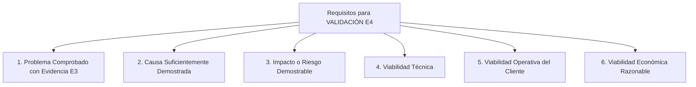
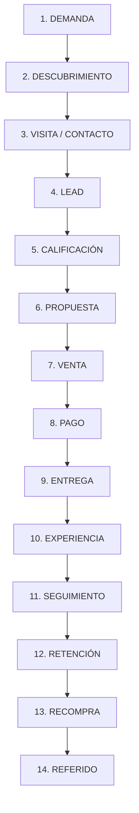
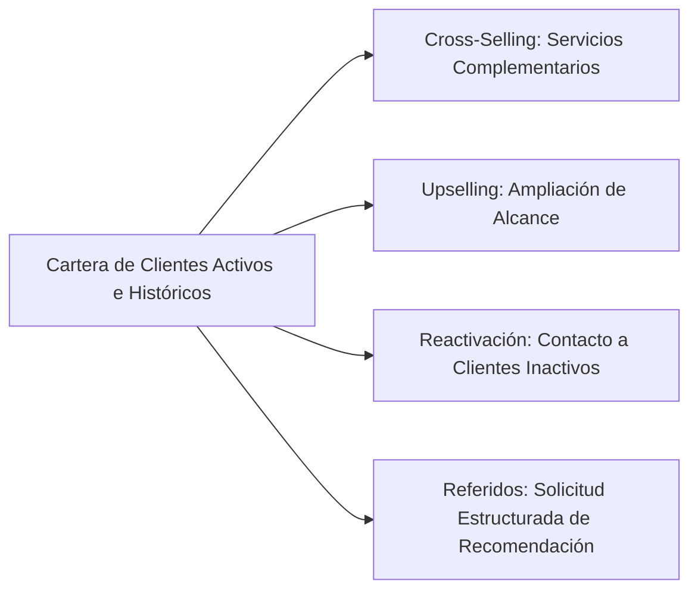
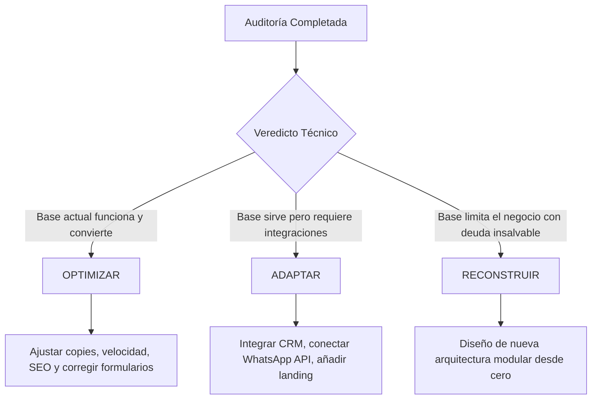

# LAGOSOLUTIONS — PROTOCOLO DE DIAGNÓSTICO Y EVALUACIÓN EMPRESARIAL (V1)

> **TIPO DE DOCUMENTO:** Manual Interno Metodológico y Guía de Campo para Investigación de Empresas.  
> **FECHA DE REVISIÓN Y AUDITORÍA DE CALIDAD:** 12 de Agosto de 2026  
> **ÁREA:** Consultoría Estratégica, Análisis Operativo y Arquitectura Digital.  
> **REGLA FUNDAMENTAL:** Este manual está diseñado para ser ejecutado por auditores del equipo de LAGOSOLUTIONS. Prohíbe categóricamente iniciar conversaciones comerciales ofreciendo herramientas, sitios web o software sin antes haber auditado la realidad operativa del negocio.

---

## ÍNDICE

1. [PROPÓSITO Y PRINCIPIO FUNDAMENTAL](#1-proposito-y-principio-fundamental)
2. [EVIDENCE & VALIDATION FRAMEWORK (E0 A E4)](#2-evidence--validation-framework-e0-a-e4)
3. [LAS 10 DIMENSIONES DEL NEGOCIO](#3-las-10-dimensiones-del-negocio)
   - [3.1 Modelo de Negocio](#31-modelo-de-negocio)
   - [3.2 Clientes y Segmentación](#32-clientes-y-segmentacion)
   - [3.3 Captación y Adquisición](#33-captacion-y-adquisicion)
   - [3.4 Conversión y Ventas](#34-conversion-y-ventas)
   - [3.5 Operación y Entrega](#35-operacion-y-entrega)
   - [3.6 Gestión y Postventa](#36-gestion-y-postventa)
   - [3.7 Datos y Analítica](#37-datos-y-analitica)
   - [3.8 Tecnología e Infraestructura](#38-tecnologia-e-infraestructura)
   - [3.9 Recursos y Capacidad Empresarial](#39-recursos-y-capacidad-empresarial)
   - [3.10 Economía y Márgenes](#310-economia-y-margenes)
4. [MAPA DEL FLUJO EMPRESARIAL (PIPELINE CONTINUO)](#4-mapa-del-flujo-empresarial-pipeline-continuo)
5. [EL GAP DE PERCEPCIÓN EN CONVERSIÓN Y CAPTACIÓN](#5-el-gap-de-percepcion-en-conversion-y-captacion)
6. [POSTVENTA, RETENCIÓN Y MONETIZACIÓN SECUNDARIA](#6-postventa-retencion-y-monetizacion-secundaria)
7. [DATOS, ANALÍTICA Y BRECHA DE UTILIDAD](#7-datos-analitica-y-brecha-de-utilidad)
8. [AUDITORÍA TECNOLÓGICA Y DIAGNÓSTICO DIGITAL DESACOPLADO](#8-auditoria-tecnologica-y-diagnostico-digital-desacoplado)
9. [COMPETENCIA Y MERCADO (OBSERVACIÓN VS INTERPRETACÍÓN)](#9-competencia-y-mercado-observacion-vs-interpretacion)
10. [CAUSA VS CORRELACIÓN (ANTI-MARTILLO TECNOLÓGICO)](#10-causa-vs-correlacion-anti-martillo-tecnologico)
11. [LA CADENA CAUSAL RIGUROSA DE 9 ESLABONES](#11-la-cadena-causal-rigurosa-de-9-eslabones)
12. [TAXONOMÍA DE OPORTUNIDADES Y REGLA DE SEPARACIÓN](#12-taxonomia-de-oportunidades-y-regla-de-separacion)
13. [COSTE DE NO ACTUAR (EVALUACIÓN DE INACCIÓN)](#13-coste-de-no-actuar-evaluacion-de-inaccion)
14. [MATRIZ DE PRIORIZACIÓN DE ALTERNATIVAS](#14-matriz-de-priorizacion-de-alternativas)
15. [PRINCIPIO DE DESTRUCCIÓN DE HIPÓTESIS (FALSACIÓN)](#15-principio-de-destruccion-de-hipotesis-falsacion)
16. [VEREDICTO TRIPARTITO (OPTIMIZAR / ADAPTAR / RECONSTRUIR)](#16-veredicto-tripartito-optimizar--adaptar--reconstruir)
17. [EVALUACIÓN DE CAPACIDAD DE SOLUCIÓN ORGANIZACIONAL](#17-evaluacion-de-capacidad-de-solucion-organizacional)
18. [USO PROFESIONAL Y ESTRUCTURAL DE "NO HACER NADA"](#18-uso-profesional-y-estructural-de-no-hacer-nada)
19. [ESTRUCTURA CONCEPTUAL DEL FUTURO CATÁLOGO MODULAR `[HIPÓTESIS]`](#19-estructura-conceptual-del-futuro-catalogo-modular-hipotesis)
20. [ESTRUCTURA DEL INFORME FINAL DE DIAGNÓSTICO](#20-estructura-del-informe-final-de-diagnostico)
21. [DECÁLOGO INVIOLABLE ANTI-HUMO](#21-decalogo-inviolable-anti-humo)
22. [LIMITACIONES ACTUALES DEL PROTOCOLO](#22-limitaciones-actuales-del-protocolo)
23. [PRÓXIMA FASE: CRASH TEST DE LA METODOLOGÍA](#23-proxima-fase-crash-test-de-la-metodologia)
24. [CRITERIO FINAL Y VERIFICACIÓN METODOLÓGICA](#24-criterio-final-y-verificacion-metodologica)

---

## 1. PROPÓSITO Y PRINCIPIO FUNDAMENTAL

El propósito de este protocolo es proporcionar al equipo de LAGOSOLUTIONS una metodología estandarizada, neutra y científica para auditar empresas consolidadas.

### El Principio de Secuencia Operativa

Todo análisis debe responder de forma estricta a la siguiente secuencia metodológica:

$$\text{ENTENDER} \longrightarrow \text{OPTIMIZAR} \longrightarrow \text{ADAPTAR} \longrightarrow \text{CONSTRUIR} \longrightarrow \text{MEDIR} \longrightarrow \text{EVOLUCIONAR}$$

```
┌─────────────────────────────────────────────────────────────────────────────┐
│                      PREGUNTA INICIAL DEL AUDITOR                           │
├─────────────────────────────────────────────────────────────────────────────┤
│ INCORRECTO: "¿Qué producto o servicio digital le podemos vender?"          │
│ CORRECTO:   "¿Cómo funciona realmente esta empresa y cómo gana dinero?"    │
└─────────────────────────────────────────────────────────────────────────────┘
```

> **REGLA DE ORO:** Un auditor de LAGOSOLUTIONS no es un vendedor de tecnología. Es un investigador de operaciones y negocios. Su trabajo es descubrir la verdad operativa del cliente, identificar limitaciones reales y proponer únicamente intervenciones justificadas por evidencia verificable.

---

## 2. EVIDENCE & VALIDATION FRAMEWORK (E0 A E4)

Para evitar que las recomendaciones se fundamenten en impresiones subjetivas, sesgos comerciales o corazonadas del cliente, todo dato y propuesta dentro de un diagnóstico debe clasificarse con el **Evidence & Validation Framework**:

```
[NIVELES DE EVIDENCIA PURA]
E0 (Suposición) ──> E1 (Indicio) ──> E2 (Evidencia Declarada) ──> E3 (Evidencia Verificable)
                                                                       │
                                                                       ▼
                                                           [FASE DE CONCLUSIÓN]
                                                          VALIDACIÓN E4 (Oportunidad Validada)
```

### Escala de Calificación de Evidencia (E0 a E3)

1. **`E0` — Suposición:** Prejuicio, intuición o hipótesis sin respaldo empírico alguno.
   * *Ejemplo:* "Creemos que los clientes no nos compran porque la web se ve antigua."
2. **`E1` — Indicio:** Anomalía cualitativa o cuantitativa aislada observada por el auditor.
   * *Ejemplo:* Se observa una tasa de rebote elevada en una página específica en un test puntual `[EXAMPLE — NO BENCHMARK]`.
3. **`E2` — Evidencia Declarada:** Afirmación explícita realizada verbalmente por el cliente, su gerente o su equipo comercial en entrevista.
   * *Ejemplo:* El director comercial afirma que reciben una cantidad de leads pero cierran un porcentaje muy bajo `[EXAMPLE — NO BENCHMARK]`.
4. **`E3` — Evidencia Verificable:** Información respaldada por datos duros, CRM, Analytics, Search Console, facturación, contratos o registros de chat.
   * *Ejemplo:* Exportación oficial del CRM que confirma el volumen exacto de leads entrantes y conversiones reales.

---

### Estado de Validación E4 (Oportunidad Validada)

**`E4` NO es simplemente un nivel más de evidencia pura.** Es el **Estado de Validación de una Oportunidad**.

Para clasificar una oportunidad como **`Validación E4`**, se debe demostrar obligatoriamente la presencia conjunta de los siguientes 6 requisitos:



> **REGLA ESTRICTA DE CLASIFICACIÓN:** Si alguno de estos 6 criterios carece de respaldo o demostración, la oportunidad **NO** se puede clasificar como **`E4`**. Debe mantenerse como hipótesis preliminar.

---

## 3. LAS 10 DIMENSIONES DEL NEGOCIO

El auditor debe investigar minuciosamente las 10 dimensiones de la empresa antes de formular cualquier hipótesis de intervención.

---

### 3.1 Modelo de Negocio

#### Objetivo de investigación
Descubrir exactamente de dónde proviene el dinero, cuál es la propuesta de valor real percibida por el mercado y dónde existen fugas financieras.

#### Preguntas principales
* "¿Cuáles son los productos o servicios que generan la mayor parte de la facturación de la empresa?"
* "¿Cómo está estructurado el esquema de cobro (pago único, suscripción, hitos, retención)?"
* "¿Cuál es el ticket promedio estimado por cliente?"

#### Preguntas secundarias
* "¿Existe concentración de ingresos en un solo cliente o contrato relevante?"
* "¿Cómo han evolucionado los márgenes de los productos principales en el tiempo?"

#### Evidencia a solicitar (E3)
* Reporte de facturación por línea de producto/servicio de los últimos períodos.
* Lista de precios y márgenes estimados por categoría.

#### Señales de alerta
* **Limitación:** La facturación depende de un solo servicio con margen decreciente.
* **Riesgo:** Alta concentración de ingresos en un único cliente corporativo.

#### Hipótesis posibles
* El negocio podría estar subsidiando servicios secundarios deficitarios con el margen de su producto principal.

#### Lo que NO se puede concluir todavía
* No se puede concluir que un producto poco vendido deba ser eliminado sin auditar si actúa como gancho de adquisición para el producto principal.

---

### 3.2 Clientes y Segmentación

#### Objetivo de investigación
Identificar el perfil del comprador real, su comportamiento de compra y la recurrencia.

#### Preguntas principales
* "¿Quién es la persona o cargo que autoriza la compra?"
* "¿Qué problema o necesidad específica busca resolver cuando contrata?"
* "¿Con qué frecuencia vuelve a comprar un mismo cliente?"

#### Preguntas secundarias
* "¿Por qué motivo los clientes que cotizan deciden irse con alternativas del mercado?"
* "¿Tienen identificados a sus clientes más rentables vs los que generan mayor costo operativo?"

#### Evidencia a solicitar (E3)
* Historial de compras por cliente en CRM o sistema contable.
* Registros de motivos de pérdida en cotizaciones fallidas.

#### Señales de alerta
* **Ineficiencia:** El equipo comercial dedica gran parte del tiempo a atender prospectos sin capacidad adquisitiva.
* **Oportunidad:** Clientes satisfechos nunca han sido contactados para una compra recurrente.

#### Hipótesis posibles
* Puede existir un descalce entre la propuesta comunicada y el segmento de clientes de mayor valor.

#### Lo que NO se puede concluir todavía
* No se puede asumir que la falta de ventas se deba al precio sin auditar la percepción de valor del cliente.

---

### 3.3 Captación y Adquisición

#### Objetivo de investigación
Mapear todas las fuentes de prospectos, auditando la rentabilidad y estabilidad de cada canal.

#### Preguntas principales
* "¿A través de qué canales exactos (boca a boca, Google, Ads, eventos, vendedores) llegan hoy los clientes?"
* "¿Cuál de estos canales genera los clientes de mayor valor comercial?"
* "¿Tienen estimado el costo de adquisición de prospectos por canal?"

#### Preguntas secundarias
* "¿Qué ocurriría con el flujo de clientes si el canal principal se detiene por completo?"
* "¿Tienen activas campañas de publicidad pagada y cómo miden su retorno?"

#### Evidencia a solicitar (E3)
* Acceso a Google Analytics 4, Search Console, plataformas de publicidad o registro de origen de leads en CRM.

#### Señales de alerta
* **Dependencia:** La captación depende de relaciones personales o de una única plataforma externa.
* **Riesgo:** Inversión publicitaria sin etiquetado de conversiones ni seguimiento de ROI.

#### Hipótesis posibles
* El negocio podría carecer de un sistema predecible y diverso de adquisición de prospectos.

#### Lo que NO se puede concluir todavía
* No se puede concluir que se deba invertir en SEO o publicidad pagada sin verificar la tasa de conversión interna del equipo comercial.

---

### 3.4 Conversión y Ventas

#### Objetivo de investigación
Auditar el trayecto que recorre un prospecto desde que muestra interés hasta que paga, midiendo la fricción y la velocidad de respuesta.

#### Preguntas principales
* "¿Cuánto tiempo transcurre desde que un interesado escribe hasta que recibe la primera respuesta humana?"
* "¿Cuál es el protocolo de seguimiento cuando se envía una propuesta comercial?"
* "¿Qué porcentaje de las propuestas enviadas se convierten en ventas cerradas?"

#### Preguntas secundarias
* "¿En qué etapa exacta del proceso comercial se detiene la mayoría de las conversaciones?"
* "¿Se utilizan estructuras estandarizadas para cotizar o cada propuesta se redacta de cero?"

#### Evidencia a solicitar (E3)
* Tiempos de respuesta registrados en sistemas de mensajería, correo o CRM.
* Muestra de propuestas y cotizaciones enviadas recientemente.

#### Señales de alerta
* **Ineficiencia:** Tiempos prolongados de primera respuesta comercial.
* **Fuga:** Cotizaciones enviadas por correo sin seguimiento estructurado posterior.

#### Hipótesis posibles
* Se podrían estar perdiendo ventas debido a lentitud o desorden en el seguimiento comercial.

#### Lo que NO se puede concluir todavía
* No se puede concluir que la propuesta comercial sea inadecuada si el tiempo de respuesta inicial desgasta la intención de compra.

---

### 3.5 Operación y Entrega

#### Objetivo de investigación
Evaluar cómo se ejecuta y entrega el servicio o producto, detectando cuellos de botella manuales o retrasos en la entrega.

#### Preguntas principales
* "¿Cuáles son los pasos operativos desde que el cliente paga hasta que recibe su producto/servicio?"
* "¿Qué tareas del proceso de entrega son manuales y repetitivas?"
* "¿En qué etapa de la operación se generan los mayores retrasos o reclamos?"

#### Preguntas secundarias
* "¿Qué herramientas o software utiliza el equipo operativo para coordinar el trabajo diario?"
* "¿Cuál es la capacidad máxima de entregas antes de que el servicio pierda calidad?"

#### Evidencia a solicitar (E3)
* Diagrama de procesos internos, manuales de procedimiento o registros de tiempos de entrega.

#### Señales de alerta
* **Limitación:** Un director o fundador debe supervisar y aprobar manualmente cada entrega.
* **Riesgo:** Errores en pedidos por re-tipeo manual de datos entre herramientas.

#### Hipótesis posibles
* La operación actual podría no soportar un incremento significativo en el volumen de clientes sin colapsar.

#### Lo que NO se puede concluir todavía
* No se puede afirmar que se necesite un software de gestión complejo sin auditar la disciplina de uso de las herramientas actuales.

---

### 3.6 Gestión y Postventa

#### Objetivo de investigación
Analizar la relación con el cliente posterior a la compra, midiendo la satisfacción, la retención y la generación de referidos.

#### Preguntas principales
* "¿Qué contacto o seguimiento se realiza con el cliente una vez completada la entrega?"
* "¿Existe un proceso estructurado para solicitar testimonios, reseñas o referidos?"
* "¿Qué proporción de los clientes actuales realiza compras repetidas?"

#### Preguntas secundarias
* "¿Cómo se gestionan los reclamos o clientes insatisfechos?"
* "¿Existen ofertas de servicios complementarios diseñadas para clientes activos?"

#### Evidencia a solicitar (E3)
* Registro de reclamos, encuestas de satisfacción o historial de recompras en sistema.

#### Señales de alerta
* **Ineficiencia:** Cero contacto con el cliente una vez cobrada la factura.
* **Oportunidad desaprovechada:** Base de clientes antiguos inactiva sin campañas de reactivación.

#### Hipótesis posibles
* El negocio podría estar invirtiendo recursos en captar clientes nuevos mientras descuida la cartera existente.

#### Lo que NO se puede concluir todavía
* No se puede atribuir la falta de recompras a insatisfacción del cliente sin antes auditar si simplemente no hay contacto posterior.

---

### 3.7 Datos y Analítica

#### Objetivo de investigación
Determinar qué información cuantitativa recoge la empresa, qué calidad tienen los datos y cómo se utilizan para tomar decisiones.

#### Preguntas principales
* "¿Cuáles son los indicadores clave que la dirección revisa periódicamente?"
* "¿Tienen certidumbre sobre la rentabilidad neta por producto o canal?"
* "¿Qué datos se están recolectando hoy pero nadie analiza ni utiliza?"

#### Preguntas secundarias
* "¿Los datos de ventas, web y marketing están integrados o viven en archivos separados?"
* "¿Con qué frecuencia se toman decisiones basadas en intuición vs reportes numéricos?"

#### Evidencia a solicitar (E3)
* Reportes de gestión actuales, tableros de control o archivos de seguimiento.

#### Señales de alerta
* **Ceguera:** La empresa no conoce sus métricas básicas de tráfico web o conversión de prospectos.
* **Sobredosis de datos:** Reportes extensos llenos de métricas secundarias pero sin datos de conversión ni margen.

#### Hipótesis posibles
* La dirección podría estar tomando decisiones de inversión con visibilidad limitada por dispersión de datos.

#### Lo que NO se puede concluir todavía
* No se puede proponer una herramienta avanzada de analítica si la empresa no tiene el hábito de registrar datos básicos.

---

### 3.8 Tecnología e Infraestructura

#### Objetivo de investigación
Auditar el ecosistema de herramientas digitales, software, servidores y conexiones existentes, evaluando su utilidad real y coste.

#### Preguntas principales
* "¿Qué software, herramientas y licencias paga actualmente la empresa?"
* "¿Qué sistemas están integrados entre sí y cuáles funcionan aislados?"
* "¿Qué problemas técnicos o caídas han experimentado en sus herramientas clave?"

#### Preguntas secundarias
* "¿Quién es el propietario legal y técnico de los dominios, hosting, bases de datos y accesos?"
* "¿Qué nivel de uso real tiene el CRM o sistema de gestión entre los empleados?"

#### Evidencia a solicitar (E3)
* Inventario de software y suscripciones, accesos de administración a servicios web y diagrama de integraciones.

#### Señales de alerta
* **Tecnología subutilizada:** Se pagan licencias de software que el equipo no utiliza.
* **Riesgo técnico:** Dominio o hosting a nombre personal de un proveedor externo o ex-empleado.

#### Hipótesis posibles
* Podrían existir costos recurrentes en licencias subutilizadas que pueden simplificarse.

#### Lo que NO se puede concluir todavía
* **REGLA METODOLÓGICA:** No se puede concluir que una tecnología sea "inadecuada" o deba sustituirse únicamente por ser antigua. Si cumple su función operativa con estabilidad y costo razonable, se evalúa su continuidad.

---

### 3.9 Recursos y Capacidad Empresarial `[REGLA DE SATURACIÓN]`

#### Objetivo de investigación
Evaluar la capacidad humana, operativa e infraestructura disponible para gestionar cambios o absorber nuevo volumen de negocio.

```
┌─────────────────────────────────────────────────────────────────────────────┐
│                       REGLA DE CAPACIDAD OPERATIVA                          │
├─────────────────────────────────────────────────────────────────────────────┤
│   MÁS CLIENTES ≠ NECESARIAMENTE UN MEJOR RESULTADO PARA EL NEGOCIO          │
│                                                                             │
│ Si la operación está al límite de su capacidad, aumentar la captación de   │
│ prospectos destruirá la calidad de servicio, saturará al equipo y          │
│ generará clientes insatisfechos. En este escenario, la captación se DESCARTA│
│ como prioridad inicial.                                                     │
└─────────────────────────────────────────────────────────────────────────────┘
```

#### Preguntas principales
* "¿Cuál es la capacidad máxima de producción o entrega del equipo actual?"
* "¿Quién se encargaría internamente de operar o dar seguimiento a las nuevas herramientas digitales?"
* "¿Cuál es la disponibilidad horaria real del personal para capacitarse en nuevos procesos?"

#### Preguntas secundarias
* "¿Qué ocurre en las temporadas de alta demanda con los tiempos de entrega y la atención al cliente?"
* "¿Existen cuellos de botella centrados en personas clave que no puedan delegar?"

#### Evidencia a solicitar (E3)
* Carga horaria operativa, organigrama de roles y capacidad máxima documentada de servicio.

#### Señales de alerta
* **Saturación:** El equipo trabaja al límite de su capacidad horaria en tareas rutinarias.
* **Dependencia crítica:** Toda la entrega técnica depende exclusivamente de una o dos personas.

#### Hipótesis posibles
* Recomendar campañas de captación o incremento de demanda agravará los problemas operativos si la capacidad está colapsada.

#### Lo que NO se puede concluir todavía
* No se debe asumir que la solución sea contratar personal sin auditar si la automatización de tareas repetitivas libera tiempo del equipo actual.

---

### 3.10 Economía y Márgenes

#### Objetivo de investigación
Comprender la salud financiera del negocio, flujos de caja, márgenes y margen de maniobra presupuestario.

#### Preguntas principales
* "¿Cuál es la estructura estimada de márgenes de beneficio del negocio?"
* "¿Cómo afecta el ciclo de cobro a la liquidez de la empresa?"
* "¿Qué retorno de inversión (ROI) o plazo de recuperación espera la empresa para proyectos estratégicos?"

#### Preguntas secundarias
* "¿Tienen identificados los costos fijos vs variables involucrados en la entrega?"
* "¿Existe flexibilidad financiera para absorber la curva de aprendizaje de nuevas iniciativas?"

#### Evidencia a solicitar (E3)
* Estado de resultados condensado, estructura de costos por servicio o reporte de flujo de caja.

#### Señales de alerta
* **Tensión de caja:** Cobros diferidos con pagos inmediatos a proveedores, generando iliquidez pese a facturar.
* **Margen estrecho:** Servicios con margen tan reducido que pequeñas ineficiencias generan pérdidas.

#### Hipótesis posibles
* El problema principal podría ser de estructura de precios y margen, no de volumen de ventas.

#### Lo que NO se puede concluir todavía
* No se pueden proponer promociones o descuentos sin auditar previamente el impacto en el margen neto.

---

## 4. MAPA DEL FLUJO EMPRESARIAL (PIPELINE CONTINUO)

El auditor debe mapear la trayectoria continua del cliente y de los datos a través del siguiente modelo de 14 etapas `[MODELO DE INVESTIGACIÓN]`:



### Protocolo de Análisis por Etapa
Para cada etapa, el auditor indaga:
1. **¿Qué ocurre?** (Evento exacto).
2. **¿Quién lo ejecuta?** (Persona, rol o sistema).
3. **¿Con qué herramienta?** (Canal, soporte o software).
4. **¿Cuánto tarda?** (Tiempo transcurrido).
5. **¿Qué datos genera y dónde se almacenan?**
6. **¿Dónde existen fricciones, pérdidas de información o trabajo manual repetitivo?**

---

## 5. EL GAP DE PERCEPCIÓN EN CONVERSIÓN Y CAPTACIÓN

El **GAP de Percepción** es el descalce entre la visión interna del cliente y los datos duros observados. Debe manejarse de forma **consultiva y no confrontacional**:

```
┌─────────────────────────────────────────────────────────────────────────────┐
│                     ANÁLISIS DE GAP DE PERCEPCIÓN                           │
├───────────────────────────────┬───────────────────────────────┬─────────────┤
│ PERCEPCIÓN DEL CLIENTE (E2)   │ EVIDENCIA OBSERVADA (E3)      │ INTERPRETAC.│
├───────────────────────────────┼───────────────────────────────┼─────────────┤
│ "La web no genera clientes    │ En el CRM ingresan prospectos │ El problema │
│  porque el diseño no gusta."  │ calificados, pero la respuesta│ es el tiempo│
│                               │ demora varios días.           │ de atención.│
└───────────────────────────────┴───────────────────────────────┴─────────────┘
```

### Protocolo Consultivo de Presentación del GAP
* **No confrontar:** El objetivo NO es demostrar que el cliente se equivoca.
* **Exponer la evidencia:** Presentar los datos `E3` como una oportunidad de optimización de recursos.

---

## 6. POSTVENTA, RETENCIÓN Y MONETIZACIÓN SECUNDARIA

El auditor buscará oportunidades en la cartera actual que no requieran gasto en captar clientes nuevos:



---

## 7. DATOS, ANALÍTICA Y BRECHA DE UTILIDAD

Evaluación de la madurez analítica cruzando tres dimensiones en la **Matriz de Brecha de Utilidad**:

| DATOS EXISTENTES | DATOS UTILIZADOS | DATOS NECESARIOS | ACCIÓN METODOLÓGICA |
| :--- | :--- | :--- | :--- |
| Se registran datos de visitas en analítica web. | No se revisan periódicamente. | Tasa de conversión de lead a cliente y costo por prospecto. | **Simplificar:** Crear un reporte sencillo enfocado en indicadores clave. |
| Se guardan datos de ventas en archivos locales. | Se usan para contabilidad básica. | Historial de consumo por cliente para detectar riesgo de fuga. | **Estructurar:** Organizar datos en un sistema accesible para ventas. |

---

## 8. AUDITORÍA TECNOLÓGICA Y DIAGNÓSTICO DIGITAL DESACOPLADO

Evaluación neutra e independiente de cada dimensión digital desacoplada:

```
┌─────────────────────────────────────────────────────────────────────────────┐
│                    MATRIZ DE EVALUACIÓN DIGITAL DESACOPLADA                 │
├─────────────────┬───────────────────────────────────────────────────────────┤
│ 1. WEB          │ Estructura semántica, velocidad, estabilidad, copy.       │
│ 2. SEO          │ Indexación, intención de búsqueda, arquitectura.         │
│ 3. UX / UI      │ Jerarquía visual, claridad de lectura, usabilidad.        │
│ 4. CONVERSIÓN   │ Claridad de llamados a la acción, fricción de contacto.   │
│ 5. ANALÍTICA    │ Medición de eventos clave y conversiones.                │
│ 6. CAPTACIÓN    │ Integración con campañas y landings específicas.          │
│ 7. AUTOMATIZACIÓN│ Notificaciones, integraciones y flujos de correo.        │
│ 8. TECNOLOGÍA   │ Hosting, seguridad, mantenibilidad, costos.              │
└─────────────────┴───────────────────────────────────────────────────────────┘
```

---

## 9. COMPETENCIA Y MERCADO (OBSERVACIÓN VS INTERPRETACÍÓN)

Separación estricta entre datos verificables e hipótesis al analizar competidores:

* **OBSERVACIÓN (Dato comprobable):** "El competidor publica contenidos semanales y su formulario solicita 3 campos."
* **INTERPRETACÍÓN (Análisis técnico):** "Su estructura de contenidos atiende búsquedas de intención comercial."
* **HIPÓTESIS (Por comprobar):** "Es posible que estén captando prospectos de mayor ticket a través de ese canal."

---

## 10. CAUSA VS CORRELACIÓN (ANTI-MARTILLO TECNOLÓGICO)

El protocolo establece una advertencia explícita sobre las explicaciones simplistas:

$$\text{Problema Observado} \neq \text{Causa Demostrada}$$

```
┌─────────────────────────────────────────────────────────────────────────────┐
│                     EJEMPLO DE CAUSA VS CORRELACIÓN                         │
├─────────────────────────────────────────────────────────────────────────────┤
│ PROBLEMA OBSERVADO: Disminución del 20% en las ventas de la empresa.        │
│                                                                             │
│ INFERENCIA INCORRECTA (MARTILLO TECNOLÓGICO):                               │
│ "Las ventas cayeron, por lo tanto necesitamos rediseñar la web."            │
│                                                                             │
│ CAUSAS ALTERNATIVAS A INVESTIGAR ANTES DE AFIRMAR CAUSALIDAD:               │
│ • Cambio en precios o promociones de la competencia.                        │
│ • Problemas de calidad o entrega en el producto/servicio.                   │
│ • Desempeño o rotación en el equipo comercial.                              │
│ • Contracción general de la demanda o estacionalidad del mercado.           │
│ • Deterioro en la reputación o atención al cliente.                         │
│ • Fallos en los canales de adquisición o incremento en costos publicitarios. │
└─────────────────────────────────────────────────────────────────────────────┘
```

> **EVIDENCIA REQUERIDA PARA AFIRMAR CAUSALIDAD:** No se puede culpar a la web o a la tecnología sin presentar evidencia `E3` que demuestre que el tráfico calificado llega a la web y abandona en el punto de conversión por fallos específicos de la plataforma.

---

## 11. LA CADENA CAUSAL RIGUROSA DE 9 ESLABONES

El protocolo exige seguir ordenadamente los 9 eslabones de razonamiento antes de prescribir cualquier intervención:

$$\text{1. EVIDENCIA (E3)} \rightarrow \text{2. PROBLEMA} \rightarrow \text{3. CAUSA PROBABLE} \rightarrow \mathbf{\text{4. CAUSA SUFICIENTEMENTE DEMOSTRADA}}$$

$$\Downarrow$$

$$\text{5. OPORTUNIDAD} \rightarrow \text{6. ALTERNATIVAS} \rightarrow \text{7. PRIORIZACIÓN} \rightarrow \text{8. SOLUCIÓN} \rightarrow \text{9. MÉTRICA}$$

> **REGLA:** Si la causa se encuentra en la etapa de "Causa Probable" y no ha sido "Suficientemente Demostrada" con datos `E3`, la solución propuesta debe mantenerse como hipótesis de estudio y no como proyecto de desarrollo.

---

## 12. TAXONOMÍA DE OPORTUNIDADES Y REGLA DE SEPARACIÓN

Toda oportunidad identificada se clasifica estrictamente en una de las **7 Categorías Núcleo**:

1. **Captación:** Optimización de canales de adquisición activos o prueba de nuevos canales.
2. **Conversión:** Reducción de fricción en la atención comercial y clarificación de propuestas.
3. **Eficiencia Operativa:** Automatización de tareas repetitivas manuales y mejora de procesos.
4. **Retención:** Programas de contacto y fidelización para la cartera de clientes.
5. **Monetización Secundaria:** Estrategias de cross-selling y upselling a clientes activos.
6. **Optimización de Márgenes:** Ajustes en la estructura de costos o revisión de precios.
7. **Capacidad / Escalabilidad:** Eliminación de cuellos de botella operativos.

*(Opciones adicionales propuestas por el equipo se etiquetarán como `[PROPUESTA]` y requerirán validación metodológica).*

---

## 13. COSTE DE NO ACTUAR (EVALUACIÓN DE INACCIÓN)

Para cada oportunidad potencial, el auditor analizará cualitativamente o cuantitativamente (cuando exista evidencia `E3`) el impacto de mantener la situación actual:

```
┌─────────────────────────────────────────────────────────────────────────────┐
│                         MATRIZ: COSTE DE NO ACTUAR                          │
├───────────────────────┬─────────────────────────────────────────────────────┤
│ 1. COSTE ECONÓMICO    │ Pérdida estimada de ingresos por prospectos no      │
│                       │ atendidos o ineficiencias directas.                 │
│ 2. COSTE OPERATIVO    │ Horas/hombre desperdiciadas en tareas manuales.     │
│ 3. COSTE OPORTUNIDAD  │ Negocio no capturado que aprovecha la competencia.  │
│ 4. RIESGO ACUMULADO   │ Vulnerabilidad por dependencia de un solo canal.    │
│ 5. COSTE INTERVENCIÓN │ Inversión requerida para corregir el problema.      │
└───────────────────────┴─────────────────────────────────────────────────────┘
```

> **OBJETIVO:** Permitir la comparación objetiva entre **NO ACTUAR** vs **ACTUAR**, evitando realizar proyectos cuyo coste de intervención sea mayor que el problema que resuelven.

---

## 14. MATRIZ DE PRIORIZACIÓN DE ALTERNATIVAS

La evaluación de alternativas se realiza utilizando los 10 Criterios Conceptuales de Evaluación:

### Criterios Conceptuales de Evaluación
1. **Impacto:** Magnitud del beneficio en el negocio.
2. **Evidencia:** Grado de certeza del problema (E0-E3).
3. **Coste:** Inversión financiera requerida.
4. **Tiempo:** Plazo de implementación.
5. **Riesgo:** Probabilidad y severidad de fallos.
6. **Complejidad:** Dificultad técnica y operacional.
7. **Sinergia:** Potenciación de otros activos del cliente.
8. **Capacidad:** Disponibilidad del equipo para absorber el cambio.
9. **Urgencia:** Necesidad de resolución en el tiempo.
10. **Consecuencia de No Actuar:** Gravedad de mantener el statu quo.

### Fórmula Metodológica de Ponderación `[HIPÓTESIS METODOLÓGICA — NO VALIDADA]`

$$\text{Score} = \frac{\text{Impacto (1-5)} \times \text{Evidencia (1-4)}}{\text{Coste (1-5)} + \text{Tiempo (1-5)} + \text{Riesgo (1-5)}}$$

> **NOTA DE PRECAUCIÓN:** La fórmula anterior es un modelo conceptual en desarrollo (`[HIPÓTESIS METODOLÓGICA — NO VALIDADA]`). **NO debe utilizarse como único criterio para decisiones financieras reales.** Las decisiones deben basarse en el análisis cualitativo y cuantitativo fundamentado de los 10 criterios.

---

## 15. PRINCIPIO DE DESTRUCCIÓN DE HIPÓTESIS (FALSACIÓN)

Check-list de falsación de 9 preguntas para auditar toda propuesta antes de presentarla:

1. *¿Qué evidencia E3 respalda esta recomendación?*
2. *¿Qué datos demostrarían que la propuesta es errónea?*
3. *¿Existe una alternativa organizativa o más sencilla que resuelva el problema?*
4. *¿Cuál es el costo total de implementación y mantenimiento?*
5. *¿Qué tiempo semanal exige del personal del cliente?*
6. *¿Qué riesgo existe si la solución no es adoptada por el equipo?*
7. *¿Qué ocurre exactamente si se decide NO hacer nada hoy?*
8. *¿Qué prueba piloto de bajo costo podría evaluar la hipótesis primero?*
9. *¿Recomendaríamos esta inversión si el dinero fuera propio?*

---

## 16. VEREDICTO TRIPARTITO (OPTIMIZAR / ADAPTAR / RECONSTRUIR)

Veredictos objetivos sobre la infraestructura tecnológica del cliente:



---

## 17. EVALUACIÓN DE CAPACIDAD DE SOLUCIÓN ORGANIZACIONAL

Verificación de la capacidad de absorción del cliente antes de prescribir software:

- [ ] **Capacidad de Uso:** El personal comprende el funcionamiento de la herramienta.
- [ ] **Responsable Asignado:** Existe un encargado interno para supervisar el sistema.
- [ ] **Presupuesto Mantenedor:** El flujo de caja soporta los costos recurrentes de licencias.
- [ ] **Tiempo de Gestión:** El equipo dispone de horas disponibles para operar el sistema.

---

## 18. USO PROFESIONAL Y ESTRUCTURAL DE "NO HACER NADA"

La recomendación de **"NO HACER NADA EN ESTE MOMENTO"** forma parte estructural de la metodología de LAGOSOLUTIONS:

```
┌─────────────────────────────────────────────────────────────────────────────┐
│                DEFINICIÓN DE "NO HACER NADA EN ESTE MOMENTO"                │
├─────────────────────────────────────────────────────────────────────────────┤
│ "Decisión profesional de no ejecutar intervenciones ni gastos de desarrollo │
│  en la fase actual, debido a que la evidencia disponible (E0-E2) no justifica│
│  el coste, riesgo, complejidad o prioridad de la solución."                 │
└─────────────────────────────────────────────────────────────────────────────┘
```

### Significado Operativo de "NO Hacer Nada"
No implica abandonar la consultoría. Puede significar:
* Recolectar datos adicionales mediante herramientas básicas.
* Observar la evolución de una métrica durante un período determinado.
* Probar una alternativa pequeña no tecnológica.
* Priorizar una oportunidad operativa más urgente.

---

## 19. ESTRUCTURA CONCEPTUAL DEL FUTURO CATÁLOGO MODULAR `[HIPÓTESIS]`

Formato conceptual de las fichas de justificación para futuros módulos `[HIPÓTESIS]`:

1. **Qué hace:** Definición funcional técnica.
2. **Para quién sirve:** Perfil de empresa calificada.
3. **Qué problema resuelve:** Ineficiencia concreta que elimina.
4. **Cómo afecta al sistema:** Integraciones con otros módulos activos.
5. **Dependencias necesarias:** APIs, licencias o datos requeridos.
6. **Coste estimado:** Inversión de desarrollo y costos recurrentes de terceros.
7. **Métricas de evaluación:** KPI con el que se medirá su éxito.
8. **Impacto potencial:** Beneficio estimado en la operación.
9. **Cuándo RECOMENDARLO:** Escenarios con evidencia `E3` clara.
10. **Cuándo NO RECOMENDARLO:** Escenarios donde representa un gasto innecesario.

---

## 20. ESTRUCTURA DEL INFORME FINAL DE DIAGNÓSTICO

Estructura estándar del entregable final en 12 secciones:

1. **Reconocimiento y Contexto Operativo**
2. **Estado Actual de la Infraestructura**
3. **Cómo Funciona Realmente el Negocio**
4. **Problemas y Limitaciones Demostradas**
5. **Evidencias Colectadas (E3)**
6. **El GAP de Percepción**
7. **Oportunidades Identificadas**
8. **Alternativas Evaluadas**
9. **Matriz de Priorización**
10. **Recomendación Estratégica**
11. **Qué NO Recomendamos Hacer**
12. **Próximos Pasos y Plan de Medición**

---

## 21. DECÁLOGO INVIOLABLE ANTI-HUMO

1. **NUNCA** vender una solución web o software sin completar la auditoría de 10 dimensiones.
2. **NUNCA** asumir que una declaración verbal (`E2`) es una verdad verificada (`E3`).
3. **NUNCA** utilizar la tecnología como un martillo para intentar reparar problemas comerciales, de margen o de producto.
4. **NUNCA** inventar métricas, benchmarks, porcentajes de éxito o testimonios ficticios.
5. **NUNCA** recomendar la reconstrucción de un sitio web basándose únicamente en criterios estéticos.
6. **NUNCA** prescribir herramientas digitales que la estructura operativa del cliente no pueda mantener.
7. **NUNCA** omitir la recomendación de "NO hacer nada" cuando los datos no justifiquen el gasto.
8. **NUNCA** prometer resultados numéricos de facturación sin controlar las variables operativas del cliente.
9. **NUNCA** retener credenciales, dominios o activos de la infraestructura del cliente.
10. **SIEMPRE** priorizar la transparencia sobre el beneficio comercial inmediato de la agencia.

---

## 22. LIMITACIONES ACTUALES DEL PROTOCOLO

Reconocimiento transparente de los límites de esta versión del manual `[HIPÓTESIS EN EVOLUCIÓN]`:

* **Ausencia de Benchmarks Propietarios:** El protocolo no cuenta aún con una base de datos histórica de benchmarks por sector; los análisis dependen de datos del cliente o fuentes públicas verificables.
* **Fórmula de Priorización No Validada:** La fórmula matemática de priorización es una hipótesis metodológica que requiere calibración con casos reales.
* **Dependencia de la Disposición del Cliente:** El protocolo requiere acceso a datos `E3`; si el cliente no proporciona acceso a métricas o sistemas, el alcance del diagnóstico se limita a nivel `E2`.
* **Curva de Aprendizaje Operativa:** La calidad del diagnóstico depende de la capacidad crítica del auditor para hacer preguntas de seguimiento y no aceptar respuestas superficiales.

---

## 23. PRÓXIMA FASE: CRASH TEST DE LA METODOLOGÍA

La siguiente fase de trabajo sobre este protocolo **NO consistirá en desarrollo de código ni construcción de software**.

```
┌─────────────────────────────────────────────────────────────────────────────┐
│                 PRÓXIMO PASO: CRASH TEST METODOLÓGICO                       │
├─────────────────────────────────────────────────────────────────────────────┤
│ Se someterá este protocolo a pruebas de simulación con casos de empresas    │
│ ficticias realistas para auditar:                                           │
│ • Preguntas inútiles o ausentes en las 10 dimensiones.                      │
│ • Detección de conclusiones apresuradas o sesgos del auditor.               │
│ • Evaluación de la claridad en la presentación del GAP de percepción.       │
│ • Calibración de los criterios de priorización y falsación.                 │
└─────────────────────────────────────────────────────────────────────────────┘
```

> **NOTA:** Los casos simulados para el Crash Test se construirán en la siguiente fase de trabajo. No deben ser creados en esta revisión.

---

## 24. CRITERIO FINAL Y VERIFICACIÓN METODOLÓGICA

Se han verificado positivamente las 11 preguntas de control antes de guardar el documento:

- [x] **1. ¿El protocolo permite investigar antes de vender?** **SÍ.** (Sección 1 exige entender el negocio antes de hablar de productos).
- [x] **2. ¿Distingue evidencia de hipótesis?** **SÍ.** (Sección 2 clasifica E0-E3 y reserva E4 como Estado de Validación).
- [x] **3. ¿Distingue síntoma de causa?** **SÍ.** (Sección 10 exige evaluar causas alternativas ante caídas o problemas).
- [x] **4. ¿Permite detectar problemas fuera de la web?** **SÍ.** (Sección 3 audita 10 dimensiones operativas y financieras).
- [x] **5. ¿Descubre que "más clientes" puede ser una mala recomendación?** **SÍ.** (Sección 3.9 establece la Regla de Saturación).
- [x] **6. ¿Describe el Coste de No Actuar sin inventar cifras?** **SÍ.** (Sección 13 analiza cualitativa o cuantitativamente la inacción).
- [x] **7. ¿Establece "NO intervenir" como recomendación profesional?** **SÍ.** (Sección 18 normatiza la opción "NO hacer nada").
- [x] **8. ¿Permite comparar soluciones?** **SÍ.** (Sección 14 evalúa alternativas mediante 10 criterios conceptuales).
- [x] **9. ¿Evita convertir SEO, web o tecnología en la respuesta automática?** **SÍ.** (Sección 10 y 11 previenen el martillo tecnológico).
- [x] **10. ¿Explica por qué una solución fue recomendada?** **SÍ.** (Sección 15 aplica el Test de Falsación de 9 preguntas).
- [x] **11. ¿Permite medir posteriormente el resultado?** **SÍ.** (Sección 11 y 19 vinculan métricas de evaluación objetivas).

**ESTADO FINAL DEL ENTREGABLE:** `LAGOSOLUTIONS_DIAGNOSTIC_PROTOCOL_V1.md` Revisado, corregido y consolidado en la raíz del repositorio.
