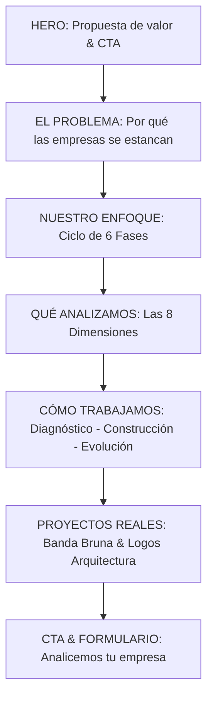

# LAGOSOLUTIONS — AUDITORÍA Y ESPECIFICACIÓN PARA LANZAMIENTO COMERCIAL V1

> **ESTADO DEL DOCUMENTO:** Auditoría Técnica y Especificación de Lanzamiento Comercial (V1).  
> **FECHA DE REVISIÓN:** 12 de Agosto de 2026  
> **OBJETIVO DE FASE:** Preparar la infraestructura web y la propuesta comercial de LAGOSOLUTIONS para recibir sus primeros prospectos reales con la máxima credibilidad, velocidad y sobriedad técnica.  
> **REGLA FUNDAMENTAL:** Ninguna afirmación en la web debe superar la capacidad demostrable o los proyectos reales existentes. Se prohíbe el lenguaje publicitario trillado de agencias.

---

## ÍNDICE

1. [ESTADO ACTUAL DEL REPOSITORIO Y RECURSOS](#1-estado-actual-del-repositorio-y-recursos)
2. [PROBLEMAS CRÍTICOS IDENTIFICADOS](#2-problemas-criticos-identificados)
3. [ELEMENTOS QUE DEBEN MANTENERSE](#3-elementos-que-deben-mantenerse)
4. [ELEMENTOS QUE DEBEN ELIMINARSE](#4-elementos-que-deben-eliminarse)
5. [ELEMENTOS QUE DEBEN MODIFICARSE](#5-elementos-que-deben-modificarse)
6. [PORTFOLIO REAL DISPONIBLE (`[REAL]`)](#6-portfolio-real-disponible-real)
7. [CLAIMS COMERCIALES PERMITIDOS](#7-claims-comerciales-permitidos)
8. [CLAIMS COMERCIALES PROHIBIDOS](#8-claims-comerciales-prohibidos)
9. [ARQUITECTURA PROPUESTA PARA LA WEB V1](#9-arquitectura-propuesta-para-la-web-v1)
10. [COPY RECOMENDADO POR SECCIÓN](#10-copy-recomendado-por-seccion)
11. [ESTRATEGIA DE LLAMADAS A LA ACCIÓN (CTAS)](#11-estrategia-de-llamadas-a-la-accion-ctas)
12. [DISEÑO Y FLUJO DEL FORMULARIO INICIAL](#12-diseno-y-flujo-del-formulario-inicial)
13. [RECOMENDACIONES UX/UI SOBRIAS](#13-recomendaciones-uxui-sobrias)
14. [SEO TÉCNICO INICIAL](#14-seo-tecnico-inicial)
15. [RENDIMIENTO Y OPTIMIZACIÓN DE ASSETS](#15-rendimiento-y-optimizacion-de-assets)
16. [DISEÑO RESPONSIVE Y NAVEGACIÓN MÓVIL](#16-diseno-responsive-y-navegacion-movil)
17. [ACCESIBILIDAD EMPRESARIAL](#17-accesibilidad-empresarial)
18. [MATRIZ DE PRIORIZACIÓN DE CAMBIOS V1](#18-matriz-de-priorizacion-de-cambios-v1)
19. [ROADMAP DIFERIDO PARA V2](#19-roadmap-diferido-para-v2)
20. [CHECKLIST FINAL PRE-LANZAMIENTO](#20-checklist-final-pre-lanzamiento)

---

## 1. ESTADO ACTUAL DEL REPOSITORIO Y RECURSOS

Se ha realizado un diagnóstico integral de la codebase actual en `/Users/teomusicrecords/Documents/WEB/LAGOSOLUTIONS`:

* **Stack Técnico Presente:** Vanilla HTML5 (330 líneas), Vanilla CSS3 (876 líneas), Vanilla JS ES6+ (165 líneas).
* **Control de Versiones y Despliegue:** Repositorio Git en rama `vista-alternativa`. CI/CD operativo en `.github/workflows/deploy.yml` configurado para GitHub Pages en rama `main`.
* **Assets Visuales:** `businessman_city_sunrise.png` (680 KB, en Hero), `dashboard_conversion_mockup.png` (449 KB, sin uso), 2 imágenes huérfanas de ChatGPT (1.8 MB y 1.6 MB).
* **Sistema de Diseño:** Paleta cromática Deep Navy (`#060f22`), Acento Verde Esmeralda (`#137752`), tipografías Lora (Serif) y Outfit (Sans-serif).

---

## 2. PROBLEMAS CRÍTICOS IDENTIFICADOS

Los siguientes fallos deben resolverse de forma prioritaria antes de abrir la web al tráfico comercial:

1. **Formulario Falso / Pérdida de Leads (`[CRÍTICO]`):** El formulario dentro del modal nativo `<dialog>` simula el envío con un `setTimeout` en `script.js#L127`, pero **los datos se descartan**. Ningún lead llega a un correo, WhatsApp o webhook real.
2. **Navegación Móvil Inexistente (`[CRÍTICO]`):** En pantallas `<992px`, la lista de menú `.nav-menu` tiene `display: none`. No existe un botón ni cajón de menú hamburguesa. Un visitante desde smartphone no puede navegar.
3. **Botón Hérfano en Hero (`[ALTO]`):** El botón `#how-we-work-btn` ("CÓMO TRABAJAMOS") en `index.html#L92` carece de listener en `script.js`. Al hacer click no realiza ninguna acción.
4. **Schema.org Erróneo (`[ALTO]`):** La propiedad `"url"` en el JSON-LD de `index.html#L32` apunta a `https://github.com/israelandreslagosrocha-jpg/LAGOSOLUTIONS` (el repositorio de código) en lugar de la URL final de producción.
5. **Assets Pesados e Incompletos (`[MEDIO]`):** La imagen `businessman_city_sunrise.png` (680 KB) carece de compresión WebP y atributos explícitos `width`/`height`, lo que afecta métricas de rendimiento y genera desplazamiento visual (CLS).
6. **Coordenadas Inconexas (`[BAJO]`):** El texto `[ COORDS: 40.7128° N, 74.0060° W ]` en el footer pertenece a Nueva York y genera ruido conceptual con la operación real.

---

## 3. ELEMENTOS QUE DEBEN MANTENERSE

* **Simplicidad del Stack Técnico:** Mantener Vanilla HTML/CSS/JS nativo. Otorga cargas instantáneas sin sobrecarga de frameworks heavy para la versión V1.
* **Identidad Gráfica y Tipográfica:** Conservar la combinación de Deep Navy (`#060f22`) y Verde Esmeralda (`#137752`), así como la pareja tipográfica Lora Serif (titulares) y Outfit Sans-serif (UI/Cuerpo). Transmite sobriedad B2B.
* **Componente Modal Nativo:** Conservar el elemento `<dialog>` HTML5 accesible con sanitización XSS (`sanitizeInput`).
* **Workflow de Despliegue Automatizado:** Mantener `.github/workflows/deploy.yml` para despliegues continuos a GitHub Pages.

---

## 4. ELEMENTOS QUE DEBEN ELIMINARSE

* **Simulación Visual Falsa del Formulario:** Eliminar las etapas de texto ficticio (`"Conectando rastreador corporativo..."`) en `script.js`. La captura debe ser transparente y real.
* **Archivos Huérfanos de la Raíz:** Eliminar los archivos PNG pesados de ChatGPT (1.8 MB y 1.6 MB) que ensucian el repositorio.
* **Texto de Coordenadas de NYC:** Sustituir o remover las coordenadas desvinculadas del footer.

---

## 5. ELEMENTOS QUE DEBEN MODIFICARSE

* **Integración Real del Formulario:** Conectar el formulario a un servicio real de recepción de correos (ej. Resend / Formspree) o redirigir a un mensaje formateado a WhatsApp Business.
* **Menú Hamburgesa Responsive:** Implementar el botón y el cajón desplegable móvil para pantallas pequeñas en `.navbar`.
* **Vinculación de `#how-we-work-btn`:** Asignar scroll suave hacia la sección `#como-trabajamos` o apertura del modal de diagnóstico.
* **Estructura Semántica `<main>`:** Envolver las secciones principales entre `<header>` y `<footer>` con la etiqueta semántica `<main>`.

---

## 6. PORTFOLIO REAL DISPONIBLE (`[REAL]`)

LAGOSOLUTIONS cuenta con dos proyectos reales desarrollados en producción que formarán la sección de proyectos:

```
┌─────────────────────────────────────────────────────────────────────────────┐
│                        PORTFOLIO REAL COMPROBABLE                           │
├──────────────────────────────────────┬──────────────────────────────────────┤
│ 1. BANDA BRUNA (bandabruna.cl)       │ 2. LOGOS ARQUITECTURA (logosarquitect│
│ • Orquesta de música tropical        │ • Firma de arquitectura educacional  │
│ • Stack: Astro + Tailwind + Supabase │ • Stack: Landing B2B + Tailwind + GTM│
│ • Estado: [REAL]                     │ • Estado: [REAL]                     │
└──────────────────────────────────────┴──────────────────────────────────────┘
```

### Ficha Técnica de Proyectos Reales

#### A. Proyecto: Banda Bruna (`https://www.bandabruna.cl/`)
* **Estado:** `[REAL]`
* **Contexto:** Orquesta oficial de cumbia tropical y música en vivo para eventos y festivales (La Araucanía, Chile).
* **Necesidad:** Plataforma institucional de alta velocidad con capacidad de difusión de fechas, sencillos musicales y cotizaciones directas.
* **Solución Implementada:**
  * Arquitectura en Astro SSG con Tailwind CSS.
  * Banner interactivo de eventos y campañas (Fiestas Patrias).
  * Sincronización en tiempo real con Supabase API para estrenos musicales y contador de lanzamiento.
  * Optimización de medios CDN Cloudinary (imágenes WebP y video player).
  * Marcado Schema.org especializado de tipo `MusicGroup`.
  * Integración directa de cotización comercial a WhatsApp.
* **Resultado Verificado:** `[RESULTADO VERIFICADO]` en infraestructura web, SEO técnico y velocidad de carga. `[NO MEDIDO]` en facturación interna de la banda.

#### B. Proyecto: Logos Arquitectura (`https://www.logosarquitectura.cl/`)
* **Estado:** `[REAL]`
* **Contexto:** Consultoría especializada en infraestructura educacional y cumplimiento normativo MINEDUC (Chile).
* **Necesidad:** Captura de prospectos cualificados B2B (sostenedores de colegios y jardines) reduciendo el ciclo de venta.
* **Solución Implementada:**
  * Landing page enfocada en la aprobación de Solicitudes ante el Reconocimiento Oficial de la Seremi de Educación.
  * Integración con Google Tag Manager y Google Ads (`GTM` / `AW-18053973183`).
  * Formulario de factibilidad normativa canalizado a WhatsApp.
  * Optimización de recursos gráficos en Cloudinary CDN.
* **Resultado Verificado:** `[RESULTADO VERIFICADO]` en canalización de prospectos calificados B2B. `[NO MEDIDO]` en tasa de cierre final de contratos.

---

## 7. CLAIMS COMERCIALES PERMITIDOS

La comunicación de LAGOSOLUTIONS se limitará estrictamente a afirmaciones respaldadas por capacidad comprobada:

- [x] *"Diseñamos e implementamos infraestructura web y sistemas digitales adaptados a la operación real de cada empresa."*
- [x] *"Analizamos cómo funciona tu negocio antes de proponer cualquier solución o línea de código."*
- [x] *"Desarrollamos en tecnologías modernas (Astro, Vanilla HTML/CSS/JS, Supabase, Tailwind, Cloudinary) priorizando velocidad y conversión."*
- [x] *"Proyectos reales entregados y en operación continua (Banda Bruna, Logos Arquitectura)."*

---

## 8. CLAIMS COMERCIALES PROHIBIDOS

Queda expresamente prohibido publicar en la web V1 cualquiera de las siguientes declaraciones deshonestas:

- [ ] *"Llevamos tu negocio al siguiente nivel"* (Frase genérica vacía).
- [ ] *"Hemos ayudado a más de 100 empresas a triplicar sus ventas"* (Métrica falsa).
- [ ] *"Somos la agencia líder en transformación digital de la región"* (Falsa autoridad).
- [ ] Testimonios o citas textuales de clientes que no hayan sido firmados o autorizados de forma explícita.
- [ ] Porcentajes de crecimiento o ROI inventados.

---

## 9. ARQUITECTURA PROPUESTA PARA LA WEB V1

La landing page comercial V1 mantendrá la simplicidad de una Single Page Application organizada en 7 secciones claras:



---

## 10. COPY RECOMENDADO POR SECCIÓN

### 10.1 Hero Section
* **Titular Principal (H1):**  
  *Su empresa ya construyó una posición en el mercado.*  
  <span class="accent-green">*La pregunta es si está aprovechando todo su potencial.*</span>
* **Subtítulo:**  
  No vendemos páginas webs por catálogo ni soluciones prefabricadas. Analizamos la operación real de su empresa para detectar ineficiencias, automatizar procesos y construir los sistemas digitales que realmente necesita.
* **Botones:**  
  * [ ANALIZAR MI EMPRESA ] (CTA Primario)  
  * [ CÓMO TRABAJAMOS ] (Scroll suave a `#como-trabajamos`)

### 10.2 Sección "El Problema"
* **Pre-título:** LAS EMPRESAS CONSOLIDADAS RARA VEZ TIENEN PROBLEMAS VISIBLES.
* **Titular (H2):** Tienen <span class="accent-green">oportunidades invisibles</span> y cuellos de botella no detectados.
* **Párrafo:**  
  La mayoría de las empresas pierden clientes y margen no por falta de producto, sino por procesos comerciales lentos, falta de seguimiento, datos dispersos en hojas de cálculo y tecnología desintegrada.

### 10.3 Sección "Nuestro Enfoque"
* **Titular (H2):** Metodología basada en evidencia.
* **Ciclo Visible:**  
  $$\text{Entender} \longrightarrow \text{Optimizar} \longrightarrow \text{Adaptar} \longrightarrow \text{Construir} \longrightarrow \text{Medir} \longrightarrow \text{Evolucionar}$$
* **Principios:**
  1. Primero entendemos cómo funciona el negocio.
  2. Después auditamos la infraestructura existente.
  3. Luego construimos únicamente lo necesario.

### 10.4 Sección "Qué Analizamos" (Grid de Dimensiones)
1. **Modelo y Operación:** Cómo gana dinero la empresa y dónde se generan los cuellos de botella.
2. **Conversión Comercial:** Velocidad de respuesta, seguimiento de cotizaciones y tasa de cierre real.
3. **Presencia Digital:** SEO técnico, velocidad de carga, experiencia de usuario y mensaje comercial.
4. **Datos e Integraciones:** Calidad de la información y comunicación entre herramientas.

### 10.5 Sección "Cómo Trabajamos" (3 Niveles)
* **Nivel 1: DIAGNÓSTICO ESTRATÉGICO** — Investigación profunda de procesos, datos y canales.
* **Nivel 2: CONSTRUCCIÓN ADAPTADA** — Desarrollo de la infraestructura justificada (web, landings, integraciones, automatizaciones).
* **Nivel 3: EVOLUCIÓN CONTINUA** — Mantenimiento técnico, optimización de conversión y medición de impacto.

### 10.6 Sección "Proyectos Reales"
* **Titular (H2):** Infraestructura real en producción.
* **Tarjeta 1: Banda Bruna** — *Plataforma web para orquesta oficial. Desarrollo en Astro, sincronización con Supabase API, CDN Cloudinary y canalización de contrataciones.*
* **Tarjeta 2: Logos Arquitectura** — *Landing B2B de arquitectura educacional. Enfoque en aprobación Mineduc, integración con Google Ads (GTM) y evaluación normativa a WhatsApp.*

---

## 11. ESTRATEGIA DE LLAMADAS A LA ACCIÓN (CTAS)

El CTA principal de la web se unificará bajo un concepto coherente con el posicionamiento de consultoría:

$$\text{CTA Primario:} \quad \mathbf{\text{ANALIZAR MI EMPRESA}}$$

$$\text{CTA Secundario en Footer/Nav:} \quad \mathbf{\text{SOLICITAR DIAGNÓSTICO}}$$

> **REGLA:** Evitar CTAs genéricos de agencias como *"Compra tu web"* o *"Pide tu presupuesto"*. El objetivo del CTA es iniciar una conversación de descubrimiento técnico y comercial.

---

## 12. DISEÑO Y FLUJO DEL FORMULARIO INICIAL

El formulario dentro del modal `<dialog>` recogerá la información justa para preparar una primera reunión eficiente sin abrumar al visitante:

```
┌─────────────────────────────────────────────────────────────────────────────┐
│                    CAMPOS DEL FORMULARIO INICIAL V1                         │
├─────────────────────────────────────────────────────────────────────────────┤
│ 1. Nombre Completo (Requerido)                                              │
│ 2. Correo Corporativo (Requerido)                                           │
│ 3. Teléfono / WhatsApp (Requerido)                                          │
│ 4. Empresa y Sitio Web Actual (Opcional)                                    │
│ 5. Sector de la Empresa (Desplegable Select)                                │
│ 6. ¿Cuál es la principal dificultad o meta actual? (Textarea corto)         │
└─────────────────────────────────────────────────────────────────────────────┘
```

* **Destino del Formulario V1:** Envío directo de la solicitud formateada al correo oficial de contacto o redirección a un mensaje estructurado en WhatsApp Business.

---

## 13. RECOMENDACIONES UX/UI SOBRIAS

* **Metáfora Visual:** Transmitir exploración, sistemas y precisión sin caer en gráficos infantiles de planetas o videojuegos.
* **Tarjetas de Proyecto:** Mostrar capturas reales de los sitios `bandabruna.cl` y `logosarquitectura.cl` con enlaces externos salientes (`target="_blank" rel="noopener"`).
* **Contraste y Lectura:** Mantener el fondo blanco en secciones de lectura extensa y reservar el Deep Navy para el Hero, Navbar y Footer.

---

## 14. SEO TÉCNICO INICIAL

Para garantizar la correcta indexación de la web V1 se implementarán las siguientes adiciones:

* **Meta Title Definitivo:** `<title>LAGOSOLUTIONS | Diagnóstico y Desarrollo de Sistemas Digitales</title>`
* **Meta Description:** `Analizamos la operación y canales de tu empresa para construir la infraestructura digital y sistemas que realmente necesitas.`
* **Etiqueta Semántica `<main>`:** Envolvente para el contenido principal.
* **Archivo `robots.txt` en Raíz:** Permitiendo rastreo completo e indicando ubicación de sitemap.
* **Archivo `sitemap.xml` en Raíz:** Mapa del sitio estático básico.
* **Corrección de JSON-LD Schema.org:** Apuntar la propiedad `"url"` al dominio de producción final.
* **Declaración de Favicon:** `<link rel="icon" type="image/png" href="favicon.png">`.

---

## 15. RENDIMIENTO Y OPTIMIZACIÓN DE ASSETS

* **Conversión de Imagen Hero:** Convertir `businessman_city_sunrise.png` (680 KB) a formato **WebP** (~85 KB) manteniendo alta fidelidad visual.
* **Atributos de Dimensión:** Especificar `width="600"` y `height="400"` en el elemento `` del Hero para evitar desmaquetado visual (CLS).
* **Eliminación de Assets Inútiles:** Eliminar de la raíz las imágenes borradores no utilizadas.

---

## 16. DISEÑO RESPONSIVE Y NAVEGACIÓN MÓVIL

* **Implementación del Menú Hamburguesa:**
  * Crear botón de menú en `.navbar` visible solo en pantallas `<992px`.
  * Desarrollar el cajón de navegación desplegable lateral o modal para dispositivos móviles en `script.js` y `style.css`.
* **Adaptación de Tarjetas:** Ajustar el grid de proyectos y de oportunidades a 1 columna en pantallas de smartphones.

---

## 17. ACCESIBILIDAD EMPRESARIAL

* **Navegación por Teclado:** Garantizar que el modal nativo `<dialog>` se pueda cerrar con la tecla `Escape` y que el foco se mantenga atrapado dentro del formulario.
* **Atributos ARIA:** Incluir `aria-label="Cerrar modal"`, `aria-expanded="false"` en el botón de navegación móvil y `alt` descriptivos en todas las imágenes.

---

## 18. MATRIZ DE PRIORIZACIÓN DE CAMBIOS V1

Los cambios técnicos requeridos se ordenan según su criticidad para el lanzamiento:

| Prioridad | Elemento / Tarea | Razón Metodológica |
| :--- | :--- | :--- |
| **`CRÍTICO`** | Conectar Formulario Modal a Email/WhatsApp real. | Evita la pérdida de prospectos interesados. |
| **`CRÍTICO`** | Desarrollar Menú Hamburguesa para Móviles. | Permite la navegación al 60%+ del tráfico desde teléfonos. |
| **`ALTO`** | Integrar Sección de Portfolio Real (Banda Bruna / Logos). | Aporta la evidencia de capacidad técnica real. |
| **`ALTO`** | Asignar evento al botón `#how-we-work-btn`. | Elimina elementos interactivos muertos en la landing. |
| **`ALTO`** | Actualizar Copy sin Buzzwords de Agencias. | Transmite el posicionamiento serio y consultivo. |
| **`MEDIO`** | Corregir Schema.org, Sitemap, Robots.txt y Favicon. | Garantiza el SEO técnico y la indexación inicial. |
| **`MEDIO`** | Comprimir `businessman_city_sunrise.png` a WebP. | Optimiza el tiempo de carga del Hero. |
| **`BAJO`** | Remover coordenadas ficticias del footer. | Limpia incoherencias de ubicación. |

---

## 19. ROADMAP DIFERIDO PARA V2

Las siguientes funcionalidades conceptuales **NO se construirán en la versión V1** y quedan archivadas para fases futuras:

- [ ] Portal privado para clientes.
- [ ] Dashboard de analítica en tiempo real.
- [ ] Carrito de compra modular o cotizador automático.
- [ ] Sistema de cuotas o pasarela de pagos integrada.
- [ ] Herramienta de IA para diagnóstico automático de empresas.

---

## 20. CHECKLIST FINAL PRE-LANZAMIENTO

Antes de publicar el sitio a producción, el equipo deberá marcar este checklist:

- [ ] El formulario envía leads reales a un correo/WhatsApp activo.
- [ ] La navegación móvil funciona de forma fluida mediante botón hamburguesa.
- [ ] Todos los botones de la página tienen una acción asociada y funcional.
- [ ] La sección de portfolio muestra los proyectos reales *Banda Bruna* y *Logos Arquitectura* con enlaces correctos.
- [ ] No existen promesas falsas, métricas inventadas ni buzzwords de agencias en el copy.
- [ ] La imagen del Hero está comprimida en WebP con dimensiones explicitadas.
- [ ] El SEO técnico básico (sitemap, robots.txt, Schema.org URL, favicons) está verificado.
- [ ] La página carga en menos de 1.5 segundos en pruebas de velocidad.

**ESTADO FINAL DEL ENTREGABLE:** `LAGOSOLUTIONS_LAUNCH_AUDIT_V1.md` Generado y guardado en la raíz del repositorio. Listo para revisión y aprobación humana previo a la fase de implementación.
