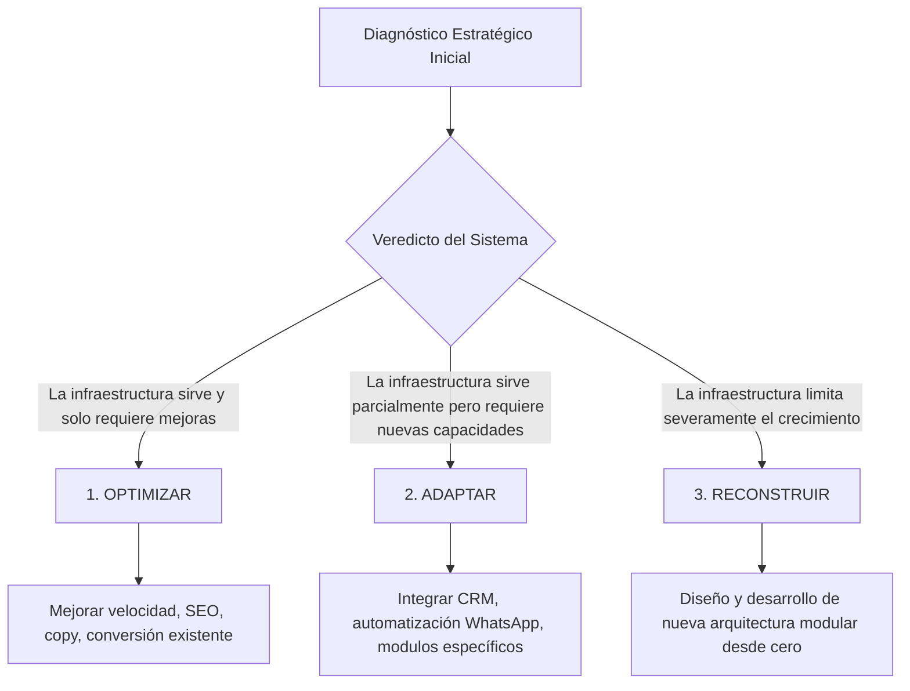

# LAGOSOLUTIONS — DOCUMENTO MAESTRO DE CONTINUIDAD TÉCNICA Y ESTRATÉGICA

> **ESTADO DEL DOCUMENTO:** Documento maestro de arquitectura, inventario técnico y marco estratégico de continuidad para desarrollo guiado por IA.  
> **FECHA DE AUDITORÍA Y CREACIÓN:** 12 de Agosto de 2026  
> **REPOSICIONAMIENTO:** `LAGOSOLUTIONS Strategic Expansion™`  
> **ESTADO GLOBAL DEL PROYECTO:** `[EXISTENTE / FASE DE VALIDACIÓN]`

---

## ÍNDICE

1. [ESTADO ACTUAL DEL PROYECTO](#1-estado-actual-del-proyecto)
2. [INVENTARIO VISUAL](#2-inventario-visual)
3. [COPY ACTUAL (TRANSCRIPCIÓN EXACTA)](#3-copy-actual-transcripcion-exacta)
4. [ARQUITECTURA ACTUAL](#4-arquitectura-actual)
5. [TECNOLOGÍA E INFRAESTRUCTURA](#5-tecnologia-e-infraestructura)
6. [SEO ACTUAL](#6-seo-actual)
7. [UX / UI ACTUAL](#7-ux--ui-actual)
8. [CONTEXTO ESTRATÉGICO ACTUAL](#8-contexto-estrategico-actual)
9. [POSICIONAMIENTO DE MARCA](#9-posicionamiento-de-marca)
10. [FILOSOFÍA DE TRABAJO (METODOLOGÍA)](#10-filosofia-de-trabajo-metodologia)
11. [PRINCIPIO FUNDAMENTAL DE DIAGNÓSTICO](#11-principio-fundamental-de-diagnostico)
12. [SISTEMA DE DIAGNÓSTICO DIGITAL](#12-sistema-de-diagnostico-digital)
13. [PRINCIPIO DE RECOMENDACIÓN DE MÓDULOS](#13-principio-de-recomendacion-de-modulos)
14. [MODELO MODULAR CONCEPTUAL](#14-modelo-modular-conceptual)
15. [MODELO DE PAGO EN ESTUDIO](#15-modelo-de-pago-en-estudio)
16. [CUENTA DEL CLIENTE (PORTAL FUTURO)](#16-cuenta-del-cliente-portal-futuro)
17. [EVOLUCIÓN Y PARTNERSHIP](#17-evolucion-y-partnership)
18. [PRINCIPIO ANTI-HUMO Y CREDIBILIDAD](#18-principio-anti-humo-y-credibilidad)
19. [PERFIL DEL FUNDADOR Y MATRIZ DE FILTRADO](#19-perfil-del-fundador-y-matriz-de-filtrado)
20. [PRINCIPIO ESTRATÉGICO DE ANÁLISIS](#20-principio-estrategico-de-analisis)
21. [FUTURO POSICIONAMIENTO (VISIÓN)](#21-futuro-posicionamiento-vision)
22. [REGLAS INVIOLABLES PARA IA (ANTIGRAVITY)](#22-reglas-inviolables-para-ia-antigravity)
23. [OBJETIVO DEL DOCUMENTO MAESTRO](#23-objetivo-del-documento-maestro)
24. [CONVENCIONES Y MATRIZ DE ETIQUETADO](#24-convenciones-y-matriz-de-etiquetado)
25. [CURRENT STATE SUMMARY (RESUMEN EJECUTIVO FINAL)](#25-current-state-summary-resumen-ejecutivo-final)

---

## 1. ESTADO ACTUAL DEL PROYECTO

### 1.1 Estructura de Archivos y Directorios `[EXISTENTE]`

```
/Users/teomusicrecords/Documents/WEB/LAGOSOLUTIONS
├── .git/                                    # Control de versiones Git (Rama activa: vista-alternativa)
├── .github/
│   └── workflows/
│       └── deploy.yml                       # Deployment automatizado a GitHub Pages (en push a main)
├── index.html                               # Landing page principal (Single Page Application, 330 líneas)
├── script.js                                # Lógica de interacción frontend y simulación B2B (165 líneas)
├── style.css                                # Sistema de diseño, variables CSS y estilos (876 líneas)
├── businessman_city_sunrise.png             # Asset visual del Hero (680 KB, en uso)
├── dashboard_conversion_mockup.png          # Asset visual de mockup (449 KB, provisional / sin uso directo)
├── ChatGPT Image 26 may 2026, 12_35_20 p.m..png  # Asset visual borrador (1.8 MB, sin seguimiento git)
└── ChatGPT Image 31 may 2026, 01_02_58 p.m..png  # Asset visual borrador (1.6 MB, sin seguimiento git)
```

### 1.2 Auditoría Detallada de Componentes y Recursos

| Elemento / Archivo | Ubicación | De qué depende | Estado | Veredicto |
| :--- | :--- | :--- | :--- | :--- |
| **`index.html`** | `file:///Users/teomusicrecords/Documents/WEB/LAGOSOLUTIONS/index.html` | HTML5, SVG inline, `style.css`, `script.js` | `[EXISTENTE]` / Completo | **CONSERVAR**: Estructura principal semántica. |
| **`style.css`** | `file:///Users/teomusicrecords/Documents/WEB/LAGOSOLUTIONS/style.css` | CSS3, Google Fonts (Lora, Outfit) | `[EXISTENTE]` / Completo | **CONSERVAR**: Design system sólido en Vanilla CSS. |
| **`script.js`** | `file:///Users/teomusicrecords/Documents/WEB/LAGOSOLUTIONS/script.js` | JavaScript ES6+, DOM API, IntersectionObserver | `[EXISTENTE]` / Incompleto | **REVISAR**: El envío de formulario es 100% simulado (sin backend real). |
| **Navbar (`.navbar`)** | `index.html#L40-L66` | CSS Flexbox, Glassmorphism, SVG Logo | `[EXISTENTE]` / Completo (Desktop) | **REVISAR**: En mobile oculta menú (`display: none`) sin menú hamburguesa. |
| **Hero Section** | `index.html#L69-L107` | CSS Grid, `businessman_city_sunrise.png` | `[EXISTENTE]` / Completo | **CONSERVAR**: Copy y estética ejecutiva bien logrados. |
| **Boton `#how-we-work-btn`** | `index.html#L92-L98` | CSS, Event listener en JS | `[EXISTENTE]` / Incompleto | **REVISAR**: Carece de listener JS; al hacer click no ejecuta nada. |
| **Sección Enfoque** | `index.html#L110-L171` | CSS Grid 4 columnas, SVGs Lucide | `[EXISTENTE]` / Completo | **CONSERVAR**: Tarjetas de oportunidades invisibles bien estructuradas. |
| **Sección Impacto** | `index.html#L174-L203` | CSS Grid 2 columnas, Modal Trigger | `[EXISTENTE]` / Completo | **CONSERVAR**: Buena tensión de conversión ("¿Cuánto cuesta no hacer nada?"). |
| **Footer Banner** | `index.html#L206-L284` | CSS Grid, Coordinates HTML | `[EXISTENTE]` / Completo | **REVISAR**: Coordenadas harcodeadas de NYC (`40.7128° N, 74.0060° W`). |
| **Modal (`<dialog>`)** | `index.html#L287-L325` | Native HTML Dialog, JS Polyfill backdrop | `[EXISTENTE]` / Completo | **CONSERVAR**: Implementación moderna top-layer dialog. |
| **Formulario Lead** | `index.html#L295-L323` | Native HTML Form, JS `sanitizeInput` | `[EXISTENTE]` / Simulado | **REVISAR**: Sin endpoint de almacenamiento ni webhook de email. |
| **`deploy.yml`** | `file:///Users/teomusicrecords/Documents/WEB/LAGOSOLUTIONS/.github/workflows/deploy.yml` | GitHub Actions, GitHub Pages | `[EXISTENTE]` / Completo | **CONSERVAR**: Despliegue automático activo en rama `main`. |
| **`businessman_city_sunrise.png`** | Raíz del proyecto | `` tag en Hero | `[EXISTENTE]` / No optimizado | **REVISAR**: Pesa 680 KB. Conviene convertir a WebP/AVIF y definir `width/height`. |
| **Imágenes ChatGPT / Mockup** | Raíz del proyecto | Ninguna (Archivos sueltos) | `[PROVISIONAL]` / Hérfanos | **REVISAR**: Decidir si eliminar o integrar en el portfolio. |

---

## 2. INVENTARIO VISUAL

### 2.1 Elementos Gráficos y Tokens `[EXISTENTE]`

* **Logo Corporativo**: Icono SVG compuesto por un marco cuadrado con bordes redondeados (`rx="6"`, trazo `#060f22` de 3.5px) y una flecha diagonal ascendente en verde esmeralda (`#137752`). Accompañado del texto `LAGOSOLUTIONS` (Sans-serif bold) y el subtítulo `STRATEGIC EXPANSION™`.
* **Paleta de Colores (`:root`)**:
  * **Deep Navy (Principal / Fondos oscuros)**: `#060f22`
  * **Emerald Green (Acento primario / Identidad)**: `#137752`
  * **Emerald Green Light (Fondos sutiles)**: `#e8f4f0`
  * **Emerald Green High Contrast (Dark Footer Acento)**: `#10b981`
  * **Off-White Light (Fondo general)**: `#fafbfc`
  * **Pure White (Fondo tarjetas/modales)**: `#ffffff`
  * **Text Muted Slate (Texto secundario)**: `#5c6d8c`
  * **Border Light (Líneas de división sutiles)**: `rgba(6, 15, 34, 0.08)`
* **Tipografías**:
  * **Titulares (`h1`, `h2`, `h3`, `h4`, `hero-subtitle`)**: `'Lora', Georgia, serif` (Peso 400 a 700). Aporta tono institucional, de consultoría de negocios de alto nivel y seriedad ejecutiva.
  * **Cuerpo, UI, Botones, Menú**: `'Outfit', sans-serif` (Peso 300 a 900). Aporta claridad técnica contemporánea y limpieza visual.
* **Tarjetas y Superficies**:
  * `.opportunity-card`: Tarjeta minimalista limpia con bordes divisorios verticales de 1px en desktop, efecto hover con desplazamiento vertical (`translateY(-3px)`) e iluminación en verde claro en el icono.
  * `.impact-card`: Tarjeta contenedor amplia con fondo blanco puro, borde sutil de 1px y sombra suave (`box-shadow: 0 8px 30px rgba(6, 15, 34, 0.03)`).
  * `dialog#diagnostic-modal`: Modal flotante centrado con bordes redondeados (12px), backdrop con desenfoque de fondo (`backdrop-filter: blur(4px)`), animación de entrada CSS `@starting-style`.
* **Botones**:
  * `.btn-pill-navy`: Botón tipo píldora, navy oscuro, texto en mayúsculas sans-serif bold, sombra elegante, hover elevatorio (`translateY(-2px)`).
  * `.btn-text-play`: Botón de enlace textual transparente con icono de reproducción circular.
* **Iconografía**: SVG vectorial inline nativo (estilo Lucide). Incluye iconos de gráficos ascendentes, globo terráqueo, engranajes/configuración, diamante/valor, ojo/visión, reloj de arena/resultados, escudo/confidencialidad, usuarios/equipo senior, y flechas de acción.
* **Fotografía**: Imagen fotorrealista `businessman_city_sunrise.png` (Ejecutivo de espaldas observando un rascacielos al amanecer). Transmite visión estratégica, liderazgo y escala corporativa. Integrada con un degradado de desvanecimiento CSS sutil hacia el texto.

### 2.2 Sensación Visual Transmitida

> **DIAGNÓSTICO ESTÉTICO:** El diseño actual transmite **Autoridad Ejecutiva, Sobriedad B2B, Consultoría Institucional y Elegancia Corporativa**. Evita completamente la estética barata de "agencia de marketing de redes" o "plantilla saturada de color neón". Transmite la serenidad y firmeza de una firma de Private Equity, banca de inversión o consultoría estratégica como McKinsey / BCG.

---

## 3. COPY ACTUAL (TRANSCRIPCIÓN EXACTA)

Esta sección contiene la transcripción literal del texto visible en la web sin modificar ni corregir una sola palabra `[EXISTENTE]`.

```
================================================================================
NAVBAR
================================================================================
[Logo Icon: Square Arrow]
LAGOSOLUTIONS
STRATEGIC EXPANSION™

ENFOQUE | RECURSOS | NOSOTROS
[ Botón CTA: SOLICITAR EVALUACIÓN ]

================================================================================
HERO SECTION
================================================================================
Titular (H1):
Su empresa ya logró algo que la mayoría nunca consigue.
Construyó una posición en el mercado.

[ Separador verde ]

Subtítulo:
La pregunta es:
¿Está aprovechando todo su potencial?

Botones Hero:
[ Botón CTA: SOLICITAR EVALUACIÓN ESTRATÉGICA  -> ]
[ Botón Play: CÓMO TRABAJAMOS ]

Imagen Alt: "Ejecutivo mirando la ciudad al amanecer"

================================================================================
OPPORTUNITIES SECTION (id="enfoque")
================================================================================
Pre-título:
LAS EMPRESAS CONSOLIDADAS NO SUELEN TENER PROBLEMAS VISIBLES.

Titular (H2):
Tienen oportunidades invisibles.

Tarjetas:
1. Expansión digital
   Canales y audiencias que podrían generar más negocio del que hoy alcanza.

2. Nuevos mercados
   Segmentos y ubicaciones con demanda activa que aún no está aprovechando.

3. Optimización comercial
   Procesos, recursos y mensajes que podrían ser más eficientes y rentables.

4. Ventajas competitivas
   Diferenciadores que puede comunicar mejor para liderar su categoría.

================================================================================
IMPACT SECTION (id="recursos")
================================================================================
Titular Izquierda (H2):
¿Cuánto cuesta no hacer nada?

[ Separador verde ]

Texto Izquierda:
Cada mes que pasa, la brecha entre su posición actual y su potencial se hace más grande.

Texto Derecha:
La diferencia entre mantener su posición o expandirla puede definir el futuro de su empresa.

[ Botón CTA: SOLICITAR EVALUACIÓN ESTRATÉGICA  -> ]

================================================================================
FOOTER BANNER (id="nosotros")
================================================================================
Declaración Superior Izquierda:
No somos una agencia.
Somos su aliado estratégico para expandir su potencial.

Valores Derecha:
- VISIÓN ESTRATÉGICA: Detectamos lo que otros no ven.
- ENFOQUE EN RESULTADOS: Cada acción está alineada con crecimiento real.
- CONFIDENCIALIDAD TOTAL: Su información, su estrategia, nuestro compromiso.
- EQUIPO SENIOR: Experiencia empresarial y visión multidisciplinaria.

Barra Inferior Footer:
[Logo SVG] LAGOSOLUTIONS
[ COORDS: 40.7128° N, 74.0060° W ]
Links: Inicio | Enfoque | Recursos | Nosotros
Copyright: © 2026 Lagosolutions Strategic Expansion. Todos los derechos reservados.

================================================================================
NATIVE MODAL DIALOG (id="diagnostic-modal")
================================================================================
Badge: [ PROTOCOLO DE EXPANSIÓN ]
Título (H2): Solicitar Evaluación
Párrafo: Estructura tu diagnóstico estratégico. Evaluaremos las oportunidades invisibles y canales de expansión digital de tu empresa.

Formulario Inputs:
- Input Texto: "Nombre completo" (required)
- Input Email: "Correo electrónico corporativo" (required)
- Input URL: "URL de tu sitio web (opcional)"
- Select Sector: "Selecciona tu sector"
  * Estudio Jurídico / Legal
  * Clínica / Salud / Medicina
  * Constructora / Inmobiliaria
  * Consultoría / Servicios B2B
  * Industrial / Proveedor Técnico
  * Comercio / Empresa Consolidada
- Botón Submit: "INICIAR ANÁLISIS ESTRATÉGICO"
- Nota Pie Modal: "✓ Análisis de expansión externo e inofensivo."
```

---

## 4. ARQUITECTURA ACTUAL

### 4.1 Diagrama de Estructura de la Web `[EXISTENTE]`

```mermaid
graph TD
    A[Landing Page Root: index.html] --> B[Navbar Fixed - .navbar]
    A --> C[Hero Section - .hero-section]
    A --> D[Opportunities Section - #enfoque]
    A --> E[Impact Section - #recursos]
    A --> F[Footer Banner - #nosotros]
    A --> G[Top-Layer Native Dialog - #diagnostic-modal]

    B --> B1[Brand: Logo SVG + LAGOSOLUTIONS + Subtitle]
    B --> B2[Nav Menu: Anchor Links]
    B --> B3[CTA Trigger Button: #nav-cta-btn]

    C --> C1[H1 Title + Accent Green]
    C --> C2[Serif Subtitle]
    C --> C3[CTA Trigger Button: #hero-cta-btn]
    C --> C4[Text Play Button: #how-we-work-btn]
    C --> C5[Visual Image: businessman_city_sunrise.png]

    D --> D1[Header Pretitle & H2]
    D --> D2[Grid 4 Opportunity Cards]

    E --> E1[Left: Title & Urgency Copy]
    E --> E2[Right: Consequence & CTA Trigger: #impact-cta-btn]

    F --> F1[Top Left: Statement H2]
    F --> F2[Top Right: 4 Value Columns]
    F --> F3[Bottom Meta: Coords & Links]

    G --> G1[Close Button & Header Badge]
    G --> G2[B2B Lead Form: Name, Email, Website, Sector]
    G --> G3[JS Form Simulation & Feedback]
```



### 4.2 Inventario de Componentes Reutilizables `[EXISTENTE]`

1. **`btn-pill-navy`**: Botón de llamada a la acción primario estilizado como píldora azul marino con sombra y microanimación.
2. **`opportunity-card`**: Tarjeta de grid reutilizable para la presentación modular de oportunidades y diagnósticos.
3. **`opp-icon-wrapper`**: Contenedor circular de icono con estado interactivo `:hover` en verde esmeralda.
4. **`lead-form`**: Formulario estándar de captura B2B sanitizado mediante JS.
5. **`dialog#diagnostic-modal`**: Modal de primera capa accesible con soporte para animaciones de entrada (`@starting-style`).

---

## 5. TECNOLOGÍA E INFRAESTRUCTURA

Auditoría técnica rigurosa de la pila tecnológica existente `[EXISTENTE]`:

* **Framework Web**: `Ninguno` (HTML5 nativo sin React, Vue, Angular o Svelte).
* **Lenguaje**: `JavaScript ES6+` puro (Vanilla JS), `HTML5`, `CSS3`.
* **Gestor de Paquetes**: `Ninguno` (No existen `package.json`, `package-lock.json` ni `node_modules`).
* **Librerías / CDNs Externos**:
  * Google Fonts CDN: Se importan las familias `Lora` (weights 400..700) y `Outfit` (weights 300..900) vía `@import` CSS.
* **Arquitectura de Software**: SPA estática de archivos planos (Single Page Application orientada a archivos sueltos).
* **Hosting**: `GitHub Pages`.
* **Despliegue CI/CD**: Workflow de GitHub Actions en `.github/workflows/deploy.yml` configurado para ejecutarse automáticamente en cada `push` a la rama `main`.
* **Control de Versiones**: Git local y remoto.
  * Repo Remoto: `https://github.com/israelandreslagosrocha-jpg/LAGOSOLUTIONS.git`
  * Rama Actual Local: `vista-alternativa` (Sincronizada con `origin/vista-alternativa`).
* **APIs / Backend**: `NO DETERMINADO` (Actualmente no existe backend. Los datos del formulario no se envían a ningún servidor ni servicio de correo; el envío es una simulación visual frontend mediante `setTimeout` en `script.js`).
* **Base de Datos**: `NO DETERMINADO` (No existe base de datos conectada).
* **Autenticación**: `NO DETERMINADO` (Inexistente).
* **Servicios Externos Integrados**: `NO DETERMINADO` (Ninguno).

---

## 6. SEO ACTUAL

### 6.1 EXISTENTE `[EXISTENTE]`

* Meta Title básico: `<title>Lagosolutions | Strategic Expansion</title>`
* Meta Description: Presente y redactada para B2B (`Ayudamos a empresas ya consolidadas...`).
* Meta Keywords: Presente (`posicionamiento digital, expansión empresarial...`).
* Robots Tag: `<meta name="robots" content="index, follow">`.
* Schema.org basico: Bloque JSON-LD de tipo `ProfessionalService`.
* Tags Open Graph primarios: `og:title`, `og:description`, `og:type`.
* Encabezados semánticos: `<h1>` único en Hero, `<h2>` en secciones secundarias, `<h3>` en tarjetas.

### 6.2 AUSENTE `[AUSENTE]`

* `sitemap.xml`: No existe archivo de mapa del sitio.
* `robots.txt`: No existe archivo de directivas para robots de búsqueda en la raíz.
* Canonical Tag: Ausencia de `<link rel="canonical" href="...">`.
* Favicon / Touch Icons: No hay declaración de `<link rel="icon">` ni asset de favicon en el proyecto.
* Meta Open Graph completos: Faltan `og:image`, `og:url`, `og:site_name`, `og:locale`.
* Twitter Cards: Faltan tags `twitter:card`, `twitter:title`, `twitter:image`.
* Etiqueta Semántica `<main>`: El contenido entre `<header>` y `<footer>` no está envuelto en un elemento `<main>`.
* Estructura Multi-idioma: Ausencia de atributos `hreflang`.

### 6.3 DEFICIENTE `[DEFICIENTE]`

* **URL en Schema.org Errónea**: La propiedad `"url"` en el JSON-LD de Schema.org apunta al repositorio fuente de GitHub (`https://github.com/israelandreslagosrocha-jpg/LAGOSOLUTIONS`) en lugar del dominio final desplegado.
* **Pesos y Dimensiones de Imágenes**: `businessman_city_sunrise.png` tiene un peso de 680 KB en formato PNG original sin compresión WebP y carece de atributos explicitados `width` y `height`, lo que impacta negativamente el LCP (Largest Contentful Paint) y puede generar recálculos de layout (CLS).
* **Enlazado Interno Redundante**: Los enlaces de navegación del footer (`#enfoque`, `#recursos`, `#nosotros`) apuntan exactamente a las mismas anclas internas de la página principal sin estructura de navegación hacia páginas secundarias.

---

## 7. UX / UI ACTUAL

### 7.1 Qué Funciona `[EXISTENTE]`

* **Jerarquía Visual y Contraste**: Excelente balance cromático entre el Navy corporativo (`#060f22`), el blanco y los acentos verdes esmeralda (`#137752`). La combinación tipográfica entre Lora (Serif) y Outfit (Sans-serif) le otorga elegancia premium.
* **Diálogo Modal Accesible**: El modal usa el elemento nativo `<dialog>` de HTML5 con soporte de escape por teclado, atrapado de foco nativo y fallback JS para cierre por backdrop.
* **Simulación de Carga B2B**: La simulación de envío de formulario proporciona retroalimentación paso a paso ("Conectando rastreador corporativo...", etc.), lo que genera percepción de análisis avanzado.
* **Animaciones al Scroll**: Las transiciones discretas `.reveal` mediante `IntersectionObserver` funcionan de manera fluida y suave.

### 7.2 Qué Parece Débil / Deficiente `[DEFICIENTE]`

* **Navegación Mobile Incompleta**: La lista de enlaces del menú `.nav-menu` tiene un `display: none` en pantallas menores a 992px, pero no existe un menú desplegable (hamburguesa) para móviles. Un usuario en smartphone no tiene acceso a los enlaces del menú.
* **Botón Hérfano (`#how-we-work-btn`)**: El botón "CÓMO TRABAJAMOS" en el Hero es un elemento clickeable visualmente impecable, pero carece de acción asociada en `script.js`. Al hacer click no ocurre nada.
* **Formulario Falso / Fricción de Expectativa**: El usuario llena un formulario corporativo detallado pero la información se descarta en el cliente. No se almacena ni notifica.
* **Coordenadas Desconectadas**: En el footer se incluye `[ COORDS: 40.7128° N, 74.0060° W ]` (coordenadas geográficas de la ciudad de Nueva York). Resultan inconexas si la operación no está basada físicamente en Manhattan.

---

## 8. CONTEXTO ESTRATÉGICO ACTUAL

```
MARCA PRINCIPAL:          LAGOSOLUTIONS
CONCEPTO ESTRATÉGICO:      Strategic Expansion™
ESTADO DE DESARROLLO:      FASE DE VALIDACIÓN CONCEPTUAL Y CONSTRUCCIÓN DE METODOLOGÍA
```

> **DIRECTRIZ FUNDAMENTAL:** NO debemos presentar todavía a LAGOSOLUTIONS como una multinacional gigantesca con sedes internacionales ni inventar casos de éxito ficticios. Actualmente estamos estructurando la metodología, validando el modelo comercial y construyendo las bases de infraestructura.

---

## 9. POSICIONAMIENTO DE MARCA

LAGOSOLUTIONS **NO** es ni debe reducirse a:

* Una agencia de posicionamiento SEO.
* Una agencia de desarrollo web por catálogo.
* Una agencia de gestión de campañas de Ads.
* Una agencia de manejo de redes sociales o contenidos.

### La Idea Central `[HIPÓTESIS DE POSICIONAMIENTO]`

> **"Entender cómo funciona realmente cada negocio, detectar limitaciones operativas y oportunidades invisibles, y construir o adaptar sistemas digitales según las necesidades reales de cada empresa."**

La página web, el SEO, los CRMs, los tableros de analítica, las automatizaciones de procesos y WhatsApp **son herramientas tácticas**. No constituyen el producto principal de LAGOSOLUTIONS. El producto principal es la **Expansión Estratégica**.

---

## 10. FILOSOFÍA DE TRABAJO (METODOLOGÍA)

La metodología conceptual definida para LAGOSOLUTIONS es:

$$\text{Entender} \longrightarrow \text{Optimizar} \longrightarrow \text{Adaptar} \longrightarrow \text{Construir} \longrightarrow \text{Medir} \longrightarrow \text{Evolucionar}$$

### Secuencia Operativa de 10 Pasos `[PROPUESTA]`

1. **Entender** a fondo la naturaleza y modelo financiero del negocio.
2. **Comprender** cómo opera y trabaja el equipo en el día a día.
3. **Detectar** los activos y canales que ya están funcionando.
4. **Detectar** limitaciones técnicas, cuellos de botella y fugas de conversión.
5. **Encontrar** oportunidades invisibles y demanda no capturada.
6. **Priorizar** intervenciones según la relación Impacto / Coste / Riesgo.
7. **Recomendar** la ruta de acción estratégica.
8. **Construir** única y exclusivamente los módulos necesarios.
9. **Medir** el impacto real en las métricas de negocio.
10. **Evolucionar** el sistema cuando surja una oportunidad validada.

> **REGLA METODOLÓGICA:** No debemos vender o implementar funcionalidades digitales simplemente porque técnicamente podamos construirlas.

---

## 11. PRINCIPIO FUNDAMENTAL DE DIAGNÓSTICO

LAGOSOLUTIONS **NUNCA** debe asumir a priori:
> *"El cliente necesita una web nueva."*

Cada proyecto debe ser sometido a un diagnóstico riguroso previo. Tras el análisis, la recomendación se clasificará estrictamente en uno de estos tres caminos:



---

## 12. SISTEMA DE DIAGNÓSTICO DIGITAL

Para cada empresa evaluada, el proceso de descubrimiento explora 7 dimensiones estratégicas `[PROPUESTA]`:

### 12.1 Matriz de Descubrimiento

1. **NEGOCIO**: Qué vende, cuál es el margen, cómo gana dinero, qué productos/servicios son clave, cómo opera el modelo comercial.
2. **CLIENTES**: Quién es el comprador real, cómo descubre la empresa, por qué canal contacta, cómo toma la decisión, qué ocurre en el post-venta.
3. **CAPTACIÓN**: Desglose de canales (Google, SEO, tráfico directo, redes sociales, boca a boca, publicidad pagada, alianzas, vendedores directos).
4. **OPERACIÓN**: Cómo se gestionan los prospectos, cómo se registran las ventas, sistemas de reserva, seguimiento manual vs automatizado.
5. **DATOS**: Métricas que miden vs métricas que ignoran, estacionalidad del negocio, tasas de conversión reales, recurrencia de compra.
6. **TECNOLOGÍA**: Estado actual de la web, correo corporativo, CRM, integración de WhatsApp, automatizaciones, APIs y herramientas internas.
7. **OPORTUNIDADES**: Nuevos canales no explotados, optimizaciones de conversión, automatización de tareas repetitivas, alianzas digitales.

---

## 13. PRINCIPIO DE RECOMENDACIÓN DE MÓDULOS

Ninguna solución o componente técnico se recomendará sin estar justificado por la **Matriz de Justificación Modular**:

$$\text{Módulo Propuesto} \Longrightarrow \begin{cases} 1. \text{Qué hace} \\ 2. \text{Para quién sirve} \\ 3. \text{Qué problema resuelve} \\ 4. \text{Impacto en el sistema} \\ 5. \text{Requisitos de funcionamiento} \\ 6. \text{Coste financiero/operativo} \\ 7. \text{Cuándo NO se recomienda} \end{cases}$$

> **OBJETIVO:** Educar al cliente para que comprenda exactamente qué está construyendo y por qué. Evitar convertir la web en una "tienda de funcionalidades arbitrarias".

---

## 14. MODELO MODULAR CONCEPTUAL

Ejemplos conceptuales de infraestructura modular que un cliente podría integrar progresivamente `[HIPÓTESIS / NO IMPLEMENTAR AÚN]`:

### 14.1 Bloques de Infraestructura

* **WEB MODULAR**: Landings de conversión, páginas institucionales, catálogo de servicios, arquitectura de blog, secciones de casos, formularios inteligentes.
* **CAPTACIÓN**: Integración directa con WhatsApp Business API, formularios diagnósticos, motores de reserva, captación de prospectos cualificados.
* **OPERACIÓN**: CRM adaptado, canalización de prospectos, tableros de control operativo, automatizaciones de correo y tareas repetitivas.
* **SEO & POSICIONAMIENTO**: Investigación de palabras clave con intención comercial, arquitectura de contenidos, optimización técnica y autoridad.
* **ANALÍTICA**: Medición de conversiones de negocio, mapas de interacción, analítica de productos más rentables, atribución de canales.
* **INTEGRACIONES**: Conexiones vía API, pasarelas de pago, servicios de mapas, mailing masivo y conexión con sistemas internos.

---

## 15. MODELO DE PAGO EN ESTUDIO

Se está explorando un modelo comercial flexible para reducir las barreras de entrada B2B `[HIPÓTESIS EN VALIDACIÓN]`:

### 15.1 Estructura Financiera Conceptual

* **Financiación del Desarrollo**: Una implementación (ejemplo conceptual: \$400.000 COP/USD) podría ser diferida mediante una cuota mínima mensual, permitiendo al cliente realizar abonos extraordinarios.
* **Costes Externos Directos (NO Financiables)**: Los costes que LAGOSOLUTIONS deba pagar inmediatamente a terceros **NUNCA** se financian. El cliente debe cubrirlos directamente o por adelantado:
  * Dominios web.
  * Hosting / Servidores (Vercel, AWS, etc.).
  * Infraestructura de Base de Datos (Supabase, Firebase, PostgreSQL).
  * Consumo de APIs externas (OpenAI, WhatsApp Business API, Twilio, Resend).
  * Licencias de software de terceros.

> **REGLA COMERCIAL:** Lo único que se somete a estudio de pago diferido es el trabajo de arquitectura y desarrollo propio de LAGOSOLUTIONS.

---

## 16. CUENTA DEL CLIENTE (PORTAL FUTURO)

Concepto de plataforma privada para clientes `[HIPÓTESIS / NO IMPLEMENTAR AÚN]`:

Un portal donde cada cliente pueda acceder y visualizar:
* Estado de su infraestructura digital en tiempo real.
* Módulos activos y módulos recomendados pendientes.
* Historial de inversión, saldo restante y estado de cuotas.
* Solicitud de nuevas capacidades o mantenimiento.
* Métricas de evolución y diagnósticos periódicos.

---

## 17. EVOLUCIÓN Y PARTNERSHIP

La relación con el cliente posterior a la construcción inicial se divide estrictamente en dos niveles `[PROPUESTA]`:

```
┌─────────────────────────────────────────────────────────────────────────┐
│                          RELACIÓN POST-DESARROLLO                       │
├────────────────────────────────────┬────────────────────────────────────┤
│           MAINTENANCE              │        STRATEGIC PARTNERSHIP       │
├────────────────────────────────────┼────────────────────────────────────┤
│ • Mantenimiento técnico base.      │ • Innovación continua de procesos. │
│ • Backups y copias de seguridad.   │ • Desarrollo de nuevos canales.    │
│ • Actualizaciones de seguridad.    │ • Expansión SEO y contenidos.      │
│ • Monitorización de servidores.    │ • Optimización de conversiones.    │
│ • Resolución de incidencias.       │ • Automatización y nuevos mercados.│
└────────────────────────────────────┴────────────────────────────────────┘
```

---

## 18. PRINCIPIO ANTI-HUMO Y CREDIBILIDAD

> **REGLA INVIOLABLE:** LAGOSOLUTIONS **NO** inventará casos de éxito, porcentajes de crecimiento falsos, logotipos de clientes no trabajados, testimonios ficticios ni experiencia inexistente.

La credibilidad de la marca debe construirse exclusivamente mediante:
1. Profundidad técnica y rigurosidad en los diagnósticos.
2. Calidad visual e ingenieril de la infraestructura construida.
3. Transparencia total sobre la etapa actual del proyecto.
4. Resultados reales medibles obtenidos en proyectos validados.

---

## 19. PERFIL DEL FUNDADOR Y MATRIZ DE FILTRADO

El fundador posee una marcada orientación hacia la innovación, el pensamiento sistémico y la experimentación de procesos. Para evitar el riesgo de "enamorarse de una idea" sin validación comercial, toda propuesta técnica o estratégica deberá ser auditada por la **Matriz de Filtrado de 7 Criterios**:

$$\text{Filtro de Innovación} = \text{Evaluación}\left( \text{Impacto}, \text{Coste}, \text{Dificultad}, \text{Riesgo}, \text{Tiempo}, \text{Sinergia}, \text{Evidencia} \right)$$

1. **IMPACTO**: ¿Genera un cambio significativo en los ingresos o eficiencia del negocio?
2. **COSTE**: ¿Requiere inversión económica o de horas hombre desproporcionada?
3. **DIFICULTAD**: ¿Qué tan compleja es su implementación y mantenimiento?
4. **RIESGO**: ¿Qué pasa si falla o no es adoptado por el cliente/usuario?
5. **TIEMPO**: ¿Cuánto tarda en estar operativo y entregar los primeros resultados?
6. **SINERGIA**: ¿Potencia los otros módulos y activos existentes?
7. **EVIDENCIA**: ¿Hay indicios de demanda o necesidad real, o es solo una hipótesis?

---

## 20. PRINCIPIO ESTRATÉGICO DE ANÁLISIS

Cualquier consultoría o interacción de desarrollo con un cliente debe comenzar con la siguiente secuencia de preguntas:

$$\text{Incorrecto: "¿Qué servicio podemos vender?"} \quad \mathbf{\times}$$

$$\text{Correcto: "¿Cómo funciona esta empresa?"} \quad \mathbf{\checkmark}$$

$$\Downarrow$$

1. *"¿Qué está funcionando actualmente en su operación?"*
2. *"¿Qué está limitando su crecimiento hoy?"*
3. *"¿Qué oportunidades no están siendo capturadas?"*
4. *"¿Qué vale la pena cambiar o implementar en este momento?"*
5. *"¿Qué solución ofrece la mayor relación entre Impacto, Coste y Riesgo?"*

---

## 21. FUTURO POSICIONAMIENTO (VISIÓN)

El concepto **LAGOSOLUTIONS Strategic Expansion™** guiará el norte estratégico de la marca. No se utilizará para proyectar una falsa autoridad multinacional hoy, sino que se consolidará progresivamente a medida que se acumulen datos, metodologías validadas y casos de éxito reales con clientes.

---

## 22. REGLAS INVIOLABLES PARA IA (ANTIGRAVITY)

Las siguientes 11 directrices rigen todo el desarrollo futuro en este repositorio:

1. **NO Borrar Funcionalidades**: No eliminar código ni elementos UI existentes sin documentarlos y justificar la razón.
2. **NO Alterar Branding Arbitrariamente**: Respetar los colores corporativos (`#060f22`, `#137752`), las tipografías (Lora y Outfit) y el tono ejecutivo B2B.
3. **NO Inventar Contenido ni Métricas**: No agregar porcentajes inventados (ej. "Aumentamos 300% las ventas") ni clientes ficticios.
4. **NO Implementar Módulos Futuros Sin Autorización**: No construir portales de usuario, CRMs o integraciones complejas hasta que el usuario lo solicite explícitamente.
5. **NO Convertir la Web en Catálogo de Servicios**: Preservar el enfoque estratégico e institucional de diagnósticos.
6. **NO Asumir Soluciones Únicas**: Toda sugerencia debe considerar las opciones de `OPTIMIZAR`, `ADAPTAR` o `RECONSTRUIR`.
7. **NO Usar Cifras o Casos Ficticios**: Mantener el Principio Anti-Humo en todo el copy de la web.
8. **NO Sacrificar Rendimiento por Efectos Visuales**: Toda mejora visual debe ser liviana y mantener tiempos de carga óptimos.
9. **NO Introducir Dependencias Innecesarias**: Priorizar Vanilla JS/CSS puro salvo que se acuerde una migración de framework (ej. Next.js / Vite).
10. **NO Modificar Archivos sin Verificación**: Comprobar siempre la sintaxis y ejecutar validaciones locales tras editar código.
11. **NO Romper el Sistema de Diseño**: Todo nuevo componente debe utilizar las variables de `:root` de `style.css`.

---

## 23. OBJETIVO DEL DOCUMENTO MAESTRO

Este archivo (`LAGOSOLUTIONS_MASTER_STATE.md`) actúa como el **manual de continuidad técnica y estratégica definitivo**. Permitirá que cualquier agente de IA o desarrollador humano que se incorpore a una nueva sesión comprenda instantáneamente:
* Qué código existe y cómo está construido.
* Qué está validado y qué es todavía hipótesis.
* Qué reglas no deben violarse bajo ningún concepto.
* Cuál es el punto exacto en el que se encuentra el proyecto hoy.

---

## 24. CONVENCIONES Y MATRIZ DE ETIQUETADO

Para mantener la claridad entre hechos presentes e ideas futuras, se utiliza el siguiente sistema de etiquetas:

* `[EXISTENTE]`: Funcionalidad, archivo o asset presente en la codebase actual.
* `[INCOMPLETO]`: Elemento existente que requiere corrección o desarrollo adicional.
* `[DEFICIENTE]`: Elemento existente con problemas de rendimiento, SEO o accesibilidad.
* `[PROPUESTA]`: Metodología o arquitectura diseñada para futura implementación.
* `[HIPÓTESIS]`: Modelo estratégico o comercial en fase de estudio y validación.
* `[PENDIENTE]`: Tarea técnica o estratégica identificada pero aún no iniciada.
* `[NO IMPLEMENTAR AÚN]`: Módulo o idea que NO debe ser programada todavía.

---

## 25. CURRENT STATE SUMMARY (RESUMEN EJECUTIVO FINAL)

### 25.1 Qué Tenemos Hoy `[EXISTENTE]`

* Una landing page estática de alta calidad estética B2B construida en Vanilla HTML5, CSS3 y JS ES6+.
* Un sistema de diseño refinado en `style.css` usando Google Fonts (`Lora` Serif + `Outfit` Sans-serif), paleta Deep Navy (`#060f22`) y Acento Esmeralda (`#137752`).
* Un modal accesible de primera capa (`<dialog>`) con simulación visual de análisis estratégico B2B.
* Un repositorio Git con despliegue automatizado a GitHub Pages vía GitHub Actions (`deploy.yml`).

### 25.2 Qué Funciona `[EXISTENTE]`

* La estética ejecutiva e institucional transmite autoridad B2B de alto nivel.
* El rendimiento de renderizado en desktop es veloz por ser código nativo sin paquetes pesados.
* Las animaciones al scroll (`IntersectionObserver`) y las animaciones de diálogo (`@starting-style`) son fluidas.
* Las etiquetas meta básicas y la estructura Schema.org inicial están operativas.

### 25.3 Qué Falta `[PENDIENTE]` / `[DEFICIENTE]`

* **Backend Real de Captura**: El formulario modal no envía ni almacena datos (carece de Webhook, Formspree, Resend o backend).
* **Menú Mobile Responsive**: En dispositivos móviles no hay acceso al menú de navegación por falta de botón hamburguesa.
* **Acción en Botón Hero**: El botón `#how-we-work-btn` ("CÓMO TRABAJAMOS") no tiene evento ni comportamiento asignado.
* **Archivos SEO Críticos**: Faltan `sitemap.xml`, `robots.txt`, favicon y etiquetas Open Graph/Twitter completas.
* **Optimización de Assets**: La imagen principal `businessman_city_sunrise.png` pesa 680 KB y necesita formato WebP.
* **Corrección de URL Schema**: El JSON-LD apunta al repo de GitHub en lugar del dominio definitivo.

### 25.4 Qué Sabemos `[EVIDENCIA]`

* El posicionamiento de agencia tradicional (SEO/Ads/Web por catálogo) está saturado y desacreditado.
* Las empresas consolidadas responden mejor a un discurso de "diagnóstico estratégico de oportunidades invisibles" que a la venta de sitios web genéricos.
* La simplicidad técnica de Vanilla Web permite iterar rápido sin complejidad de dependencias.

### 25.5 Qué Estamos Validando `[HIPÓTESIS]`

* El modelo conceptual **Strategic Expansion™** como marco de servicio.
* La viabilidad del modelo comercial de cuotas flexibles para financiar el desarrollo propio de LAGOSOLUTIONS.
* La estructura del diagnóstico de 7 dimensiones para prospectos B2B.

### 25.6 Qué NO Sabemos Todavía `[HIPÓTESIS POR VALIDAR]`

* La tasa de conversión real que tendrá la landing page ante tráfico B2B calificado.
* La disposición a pagar de los clientes bajo el modelo comercial diferido.
* El volumen exacto de clientes que requerirán `OPTIMIZAR`, `ADAPTAR` o `RECONSTRUIR`.

### 25.7 Próxima Prioridad Estratégica `[PROPUESTA]`

* Validar el copy del diagnóstico y definir el flujo comercial exacto para responder a las solicitudes de evaluación que entren por la web.

### 25.8 Próxima Prioridad Técnica `[PENDIENTE]`

1. Crear menú hamburguesa funcional para dispositivos móviles.
2. Asignar acción al botón `#how-we-work-btn` (scroll suave hacia `#enfoque` o apertura de modal).
3. Conectar el formulario modal a un servicio real de envío de correos (ej. Resend / Formspree) o webhook.
4. Generar `sitemap.xml`, `robots.txt`, favicon y corregir Schema.org URL.
5. Optimizar `businessman_city_sunrise.png` a WebP y agregar dimensiones `width`/`height`.

### 25.9 Riesgos Actuales `[RIESGOS]`

* **Pérdida de Prospectos**: Si un usuario completa el formulario modal actualmente, el mensaje se pierde porque la acción es 100% simulada.
* **Experiencia Mobile**: Usuarios navegando desde smartphones no disponen de menú de navegación superior.
* **Falta de Tracking**: Sin analítica configurada (Google Analytics / Plausible), es imposible saber cuántos visitantes ingresan.

### 25.10 Decisiones que Requieren Validación Humana `[VALIDACIÓN REQUERIDA]`

* Definir la integración final para la recepción de leads (Email por API vs Webhook a CRM / WhatsApp).
* Definir si las coordenadas del footer (`40.7128° N, 74.0060° W`) se conservan por estilo visual o se reemplazan por la ubicación real.
* Confirmar si el proyecto se mantendrá en HTML/CSS/JS nativo o si en el futuro migrará a un framework tipo Next.js / Vite.

---
