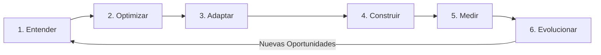
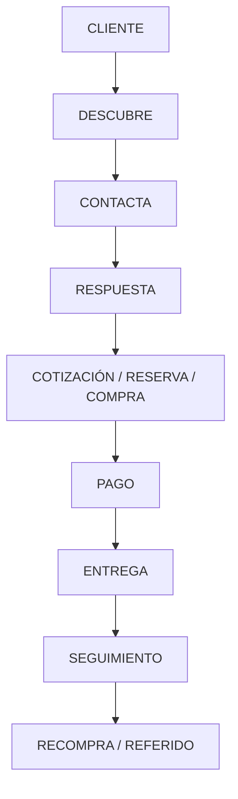
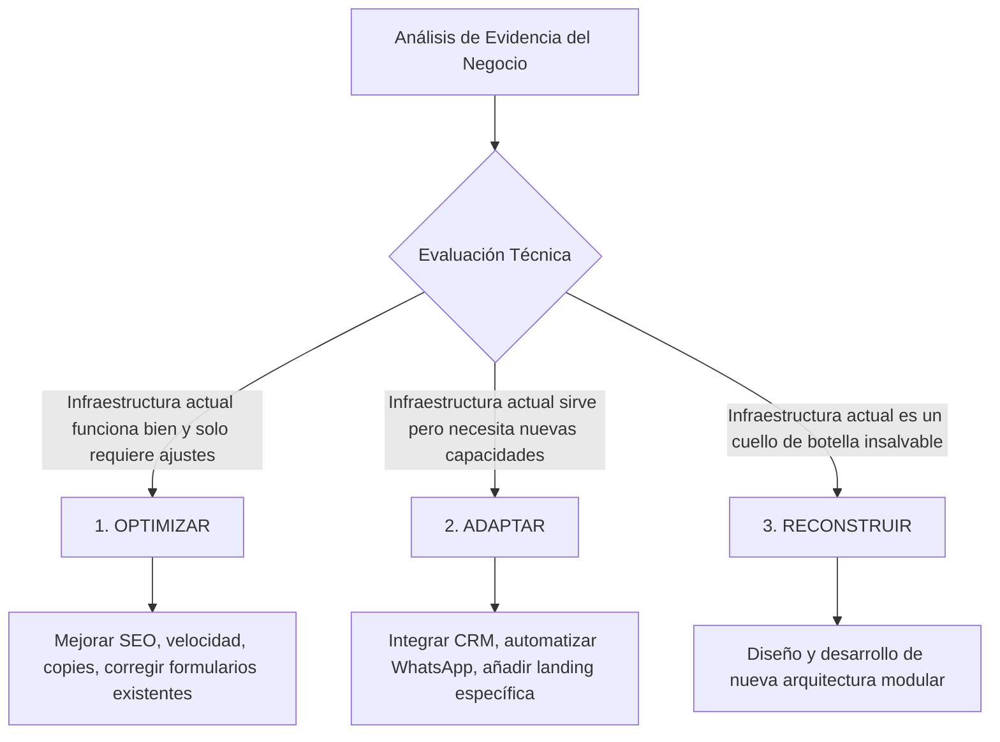
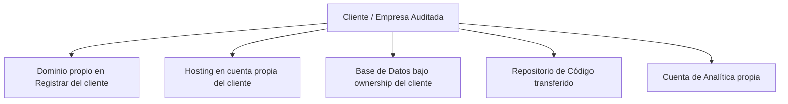

# LAGOSOLUTIONS — DOCUMENTO MAESTRO DE ESPECIFICACIÓN TÉCNICA Y ESTRATÉGICA (V2)

> **ESTADO DEL DOCUMENTO:** Memoria Maestra del Proyecto — Especificación Técnica, Diagnóstico Estratégico y Arquitectura de Producto.  
> **FECHA DE REVISIÓN Y AUDITORÍA V2:** 12 de Agosto de 2026  
> **MARCA Y CONCEPTO:** `LAGOSOLUTIONS` | Concepto conceptual en exploración: `Strategic Expansion™` `[VISIÓN]`  
> **ESTADO REAL DEL REPOSITORIO:** `[REAL / FASE DE VALIDACIÓN ESTRUCTURAL]`  
> **REGLA DE ORO:** Este documento constituye la fuente única de verdad del proyecto. Separa estrictamente la realidad del código comprobable de las hipótesis comerciales y propuestas futuras.

---

## ÍNDICE

1. [AUDITORÍA DEL DOCUMENTO ANTERIOR (V1 vs REALIDAD)](#1-auditoria-del-documento-anterior-v1-vs-realidad)
2. [INVENTARIO REAL Y EXHAUSTIVO DEL PROYECTO `[REAL]`](#2-inventario-real-y-exhaustivo-del-proyecto-real)
3. [TRANSCRIPCIÓN Y REGISTRO LITERAL DE LA WEB ACTUAL `[REAL]`](#3-transcripcion-y-registro-literal-de-la-web-actual-real)
4. [IDENTIDAD ACTUAL Y MARCA `[VISIÓN]`](#4-identidad-actual-y-marca-vision)
5. [FILOSOFÍA OPERATIVA DE LAGOSOLUTIONS](#5-filosofia-operativa-de-lagosolutions)
6. [PRINCIPIO FUNDAMENTAL: NO PARTIR DE LA SOLUCIÓN](#6-principio-fundamental-no-partir-de-la-solucion)
7. [MAPA DEL NEGOCIO: MODELO DE INVESTIGACIÓN (10 DIMENSIONES)](#7-mapa-del-negocio-modelo-de-investigacion-10-dimensiones)
8. [MAPEO DEL FLUJO EMPRESARIAL Y FRICCIONES `[PROPUESTA]`](#8-mapeo-del-flujo-empresarial-y-fricciones-propuesta)
9. [SISTEMA DE DIAGNÓSTICO ADAPTATIVO POR SECTOR `[PROPUESTA]`](#9-sistema-de-diagnostico-adaptativo-por-sector-propuesta)
10. [VEREDICTO TRIPARTITO DE DIAGNÓSTICO](#10-veredicto-tripartito-de-diagnostico)
11. [SISTEMA MODULAR CONCEPTUAL `[HIPÓTESIS]`](#11-sistema-modular-conceptual-hipotesis)
12. [EDUCACIÓN DENTRO DEL CATÁLOGO (JUSTIFICACIÓN MODULAR)](#12-educacion-dentro-del-catalogo-justificacion-modular)
13. [SISTEMA Y CRITERIOS DE RECOMENDACIÓN](#13-sistema-y-criterios-de-recomendacion)
14. [MATRIZ DE VÍNCULO: PROBLEMA → SOLUCIÓN → MÉTRICA](#14-matriz-de-vinculo-problema--solucion--metrica)
15. [MATRIZ METODOLÓGICA DE PRIORIZACIÓN DE IDEAS](#15-matriz-metodologica-de-priorizacion-de-ideas)
16. [PRINCIPIO DE DESTRUCCIÓN DE HIPÓTESIS (FALSACIÓN)](#16-principio-de-destruccion-de-hipotesis-falsacion)
17. [REGLA DE SEPARACIÓN: OPORTUNIDAD ≠ ACCIÓN INMEDIATA](#17-regla-de-separacion-oportunidad--accion-inmediata)
18. [MODELO DE PAGO Y ESTRUCTURA FINANCIERA `[HIPÓTESIS]`](#18-modelo-de-pago-y-estructura-financiera-hipotesis)
19. [INFRAESTRUCTURA Y ARQUITECTURA DEL CLIENTE `[PROPUESTA]`](#19-infraestructura-y-arquitectura-del-cliente-propuesta)
20. [PORTAL DE CUENTA DEL CLIENTE `[VISIÓN]`](#20-portal-de-cuenta-del-cliente-vision)
21. [DIFERENCIACIÓN: MANTENIMIENTO VS STRATEGIC PARTNERSHIP](#21-diferenciacion-mantenimiento-vs-strategic-partnership)
22. [PRINCIPIO ANTI-HUMO Y CONSTRUCCIÓN DE CREDIBILIDAD](#22-principio-anti-humo-y-construccion-de-credibilidad)
23. [ROADMAP DE POSICIONAMIENTO DE MARCA](#23-roadmap-de-posicionamiento-de-marca)
24. [DECISIONES PENDIENTES `[PENDIENTE]`](#24-decisiones-pendientes-pendiente)
25. [SECCIÓN ESPECIAL: WHAT WE DON'T KNOW YET `[HIPÓTESIS POR VALIDAR]`](#25-seccion-especial-what-we-dont-know-yet-hipotesis-por-validar)
26. [SECCIÓN ESPECIAL: PRÓXIMOS EXPERIMENTOS DE VALIDACIÓN](#26-seccion-especial-proximos-experimentos-de-validacion)
27. [RESUMEN EJECUTIVO Y PRUEBA DE CRITERIO FINAL](#27-resumen-ejecutivo-y-prueba-de-criterio-final)

---

## TAXONOMÍA Y CONVENCIONES DE ETIQUETADO

Para evitar la contaminación entre la realidad empírica de la codebase y las proyecciones estratégicas, cada afirmación de este documento sigue strictly este código de marcado:

* **`[REAL]`**: Elemento comprobable existente en el código del repositorio actual.
* **`[INCOMPLETO]`**: Código o componente presente en el repositorio pero sin funcionalización total.
* **`[DEFICIENTE]`**: Elemento existente con fallos técnicos, de SEO, accesibilidad o responsive.
* **`[HIPÓTESIS]`**: Modelo de negocio, financiero o funcional en fase de exploración y estudio.
* **`[PROPUESTA]`**: Recomendación metodológica o de arquitectura lista para ser evaluada.
* **`[VISIÓN]`**: Aspiración o dirección estratégica a largo plazo para la marca.
* **`[PENDIENTE]`**: Decisión estratégica, comercial o técnica que requiere definición humana explícita.
* **`[NO IMPLEMENTAR AÚN]`**: Idea o concepto documentado pero cuya programación está explícitamente prohibida en esta etapa.

---

## 1. AUDITORÍA DEL DOCUMENTO ANTERIOR (V1 vs REALIDAD)

Se ha realizado una auditoría exhaustiva comparando cada sección de `LAGOSOLUTIONS_MASTER_STATE.md` (V1) contra la estructura física del código del repositorio en `/Users/teomusicrecords/Documents/WEB/LAGOSOLUTIONS`.

| Afirmación / Sección en V1 | Estado Real en Codebase | Evaluación V1 | Corrección / Diagnóstico Riguroso |
| :--- | :--- | :--- | :--- |
| **"Estructura de archivos: index.html, style.css, script.js, deploy.yml, imágenes"** | Existen en la raíz del proyecto y en `.github/workflows/`. | `Correcta` | Confirmado por inspección de sistema de archivos. |
| **"Rama activa Git: vista-alternativa"** | El repositorio local está efectivamente sobre la rama `vista-alternativa`. | `Correcta` | Confirmado mediante inspección Git. |
| **"Navbar accesible con Glassmorphism"** | Existe en `style.css` e `index.html`. | `Parcialmente Correcta` | Funciona en Desktop, pero en pantallas `<992px` la clase `.nav-menu` tiene `display: none` y no existe menú hamburguesa responsive. |
| **"Modal nativo `<dialog>` accesible"** | Implementado en `index.html#L287` y `script.js#L22`. | `Correcta` | Utiliza `<dialog>` nativo, `showModal()` y polyfill visual para backdrop. |
| **"Formulario B2B con sanitización XSS"** | Función `sanitizeInput` implementada en `script.js#L8`. | `Correcta` | Sanitiza caracteres como `<`, `>`, `&`, `"`, `'`, `/`. |
| **"Envío de formulario B2B operativo"** | En `script.js#L127-L161` hay un `setTimeout` con mensajes falsos. | `Parcialmente Correcta` | **CRÍTICO:** El envío es 100% simulado en frontend. Los datos introducidos por el usuario se descartan sin enviarse a ningún backend, webhook o correo real. |
| **"Botón `#how-we-work-btn` ('CÓMO TRABAJAMOS') operativo"** | Clickeable en `index.html#L92`. | `Incorrecta` | **ERROR EN V1:** En `script.js` NO existe ningún event listener asociado a `#how-we-work-btn`. Al hacer click en la web no ocurre absolutamente nada. |
| **"Schema.org implementado"** | Bloque JSON-LD en `index.html#L26`. | `Parcialmente Correcta` | La propiedad `"url"` apunta a `https://github.com/israelandreslagosrocha-jpg/LAGOSOLUTIONS` (el repositorio Git) en lugar de la URL del dominio de producción. |
| **"Coordenadas NYC en Footer (`40.7128° N, 74.0060° W`)"** | Presente como texto plano en `index.html#L271`. | `Correcta` | Es un recurso estético desconectado de la ubicación operativa real. |
| **"Despliegue GitHub Actions activo"** | `.github/workflows/deploy.yml` configurado para `push` a `main`. | `Correcta` | Configuración válida para GitHub Pages. |
| **"Assets gráficos adicionales (ChatGPT images)"** | Existen dos archivos PNG de ~1.8 MB y ~1.6 MB en la raíz. | `Correcta` | Archivos huérfanos sin rastreo en Git ni vinculación en el código HTML. |

---

## 2. INVENTARIO REAL Y EXHAUSTIVO DEL PROYECTO `[REAL]`

### 2.1 Estructura Físicamente Comprobable de Carpetas y Archivos

```
/Users/teomusicrecords/Documents/WEB/LAGOSOLUTIONS/
├── .git/                                    # Control de versiones local (Rama: vista-alternativa)
├── .github/
│   └── workflows/
│       └── deploy.yml                       # Integration CI/CD GitHub Actions -> GitHub Pages (32 líneas)
├── index.html                               # Landing page principal HTML5 (330 líneas)
├── style.css                                # Sistema de diseño y estilos Vanilla CSS (876 líneas)
├── script.js                                # Lógica interactiva en Vanilla JS ES6+ (165 líneas)
├── businessman_city_sunrise.png             # Asset gráfico principal en Hero (680 KB, PNG)
├── dashboard_conversion_mockup.png          # Asset gráfico mockup (449 KB, PNG, sin uso activo)
├── ChatGPT Image 26 may 2026, 12_35_20 p.m..png  # Asset visual borrador (1.8 MB, sin uso)
└── ChatGPT Image 31 may 2026, 01_02_58 p.m..png  # Asset visual borrador (1.6 MB, sin uso)
```

### 2.2 Ficha Técnica por Componente y Recurso

#### A. Archivo `index.html` `[REAL]`
* **Ubicación:** `file:///Users/teomusicrecords/Documents/WEB/LAGOSOLUTIONS/index.html`
* **Qué es:** Documento semántico HTML5 de 330 líneas. Estructura una SPA (Single Page Application) estática.
* **Para qué sirve:** Define el contenido visual, jerarquía de encabezados, secciones comerciales, SVG inline y estructura modal.
* **Estado:** Completo en estructura base.
* **Dependencias:** Carga `style.css` en `<head>` y `script.js` al final de `<body>`. Carga Google Fonts vía CSS.
* **Riesgos:** Falta envolvente semántica `<main>`. Carece de tags `robots.txt`, `sitemap.xml`, canonical y favicons.

#### B. Archivo `style.css` `[REAL]`
* **Ubicación:** `file:///Users/teomusicrecords/Documents/WEB/LAGOSOLUTIONS/style.css`
* **Qué es:** Hoja de estilos Vanilla CSS3 de 876 líneas.
* **Para qué sirve:** Define el Design System completo: tokens CSS en `:root`, tipografía, layouts Flexbox/Grid, animaciones `@keyframes`, microinteracciones y reglas de modales nativos (`@starting-style`).
* **Estado:** Completo y bien estructurado.
* **Dependencias:** `@import` externo de Google Fonts (`Lora` Serif y `Outfit` Sans-serif).
* **Riesgos:** La consulta de medios `@media (max-width: 991px)` oculta `.nav-menu` (`display: none`) sin ofrecer alternativa de menú móvil.

#### C. Archivo `script.js` `[REAL]` `[INCOMPLETO]`
* **Ubicación:** `file:///Users/teomusicrecords/Documents/WEB/LAGOSOLUTIONS/script.js`
* **Qué es:** Script de interacción JavaScript ES6+ de 165 líneas.
* **Para qué sirve:** 
  1. Sanitización XSS (`sanitizeInput`).
  2. Gestión de apertura y cierre de modal nativo (`<dialog>`).
  3. Transiciones al hacer scroll mediante `IntersectionObserver`.
  4. Simulación visual de procesamiento del formulario B2B.
* **Estado:** `[INCOMPLETO]`. El envío de datos no tiene destino real. Carece de eventos para `#how-we-work-btn`.
* **Dependencias:** API nativa del DOM, `HTMLDialogElement` y `IntersectionObserver`.
* **Riesgos:** Fricción con el usuario real al simular una auditoría cuyo resultado no se envía a ninguna parte.

#### D. Workflow `.github/workflows/deploy.yml` `[REAL]`
* **Ubicación:** `.github/workflows/deploy.yml`
* **Qué es:** Configuración YAML para GitHub Actions.
* **Para qué sirve:** Automatiza la compilación y despliegue del directorio raíz a GitHub Pages cada vez que se realiza un `push` a la rama `main`.
* **Estado:** Completo y funcional.

#### E. Assets Gráficos e Imágenes `[REAL]`
* **`businessman_city_sunrise.png`**: Imagen de 680 KB cargada en el Hero. Formato PNG sin comprimir a WebP/AVIF. Carece de atributos `width` y `height` explícitos.
* **`dashboard_conversion_mockup.png`**: Asset PNG de 449 KB en la raíz. No está referenciado en `index.html`.
* **Archivos ChatGPT**: Archivos PNG pesados (1.8 MB y 1.6 MB) no rastreados en Git ni vinculados en el HTML.

---

## 3. TRANSCRIPCIÓN Y REGISTRO LITERAL DE LA WEB ACTUAL `[REAL]`

Esta sección contiene el registro textual exacto de lo que se visualiza actualmente en la interfaz web de LAGOSOLUTIONS.

```
================================================================================
1. BARRA DE NAVEGACIÓN (.navbar)
================================================================================
[Icono SVG: Marco cuadrado navy (#060f22) con flecha verde esmeralda (#137752)]
LAGOSOLUTIONS
STRATEGIC EXPANSION™

Menú Enlaces:
- ENFOQUE (apunta a #enfoque)
- RECURSOS (apunta a #recursos)
- NOSOTROS (apunta a #nosotros)

Botón CTA Navbar:
[ SOLICITAR EVALUACIÓN ]

================================================================================
2. SECCIÓN HERO (.hero-section)
================================================================================
Titular Principal (H1):
"Su empresa ya logró algo que la mayoría nunca consigue.
Construyó una posición en el mercado." (Texto en verde esmeralda)

Separador visual (Línea verde)

Subtítulo:
"La pregunta es:
¿Está aprovechando todo su potencial?"

Botones de Acción Hero:
- [ SOLICITAR EVALUACIÓN ESTRATÉGICA -> ] (Abre modal #diagnostic-modal)
- [ (►) CÓMO TRABAJAMOS ] (Botón sin listener JS asociado)

Imagen Hero:
Ejecutivo de espaldas observando rascacielos al amanecer.

================================================================================
3. SECCIÓN OPORTUNIDADES (#enfoque)
================================================================================
Pre-título:
"LAS EMPRESAS CONSOLIDADAS NO SUELEN TENER PROBLEMAS VISIBLES."

Titular (H2):
"Tienen oportunidades invisibles."

Grid de 4 Tarjetas (.opportunity-card):
1. Expansión digital
   "Canales y audiencias que podrían generar más negocio del que hoy alcanza."
2. Nuevos mercados
   "Segmentos y ubicaciones con demanda activa que aún no está aprovechando."
3. Optimización comercial
   "Procesos, recursos y mensajes que podrían ser más eficientes y rentables."
4. Ventajas competitivas
   "Diferenciadores que puede comunicar mejor para liderar su categoría."

================================================================================
4. SECCIÓN IMPACTO (#recursos)
================================================================================
Columna Izquierda:
H2: "¿Cuánto cuesta no hacer nada?"
[Línea separadora verde]
Párrafo: "Cada mes que pasa, la brecha entre su posición actual y su potencial se hace más grande."

Columna Derecha:
Párrafo: "La diferencia entre mantener su posición o expandirla puede definir el futuro de su empresa."
Botón CTA: [ SOLICITAR EVALUACIÓN ESTRATÉGICA -> ] (Abre modal)

================================================================================
5. FOOTER (#nosotros)
================================================================================
Bloque Superior Izquierda:
"No somos una agencia."
H2: "Somos su aliado estratégico para expandir su potencial."

Bloque Superior Derecha (Valores):
- Visión estratégica: "Detectamos lo que otros no ven."
- Enfoque en resultados: "Cada acción está alineada con crecimiento real."
- Confidencialidad total: "Su información, su estrategia, nuestro compromiso."
- Equipo senior: "Experiencia empresarial y visión multidisciplinaria."

Bloque Inferior Meta:
Logo: [SVG] LAGOSOLUTIONS
Coordenadas: [ COORDS: 40.7128° N, 74.0060° W ]
Enlaces Footer: Inicio | Enfoque | Recursos | Nosotros
Copyright: © 2026 Lagosolutions Strategic Expansion. Todos los derechos reservados.

================================================================================
6. DIÁLOGO MODAL NATIVO (#diagnostic-modal)
================================================================================
Badge: [ PROTOCOLO DE EXPANSIÓN ]
Título (H2): "Solicitar Evaluación"
Descripción: "Estructura tu diagnóstico estratégico. Evaluaremos las oportunidades invisibles y canales de expansión digital de tu empresa."

Campos del Formulario:
- Input Texto: "Nombre completo" (Requerido)
- Input Email: "Correo electrónico corporativo" (Requerido)
- Input URL: "URL de tu sitio web (opcional)"
- Select Sector: "Selecciona tu sector" (Requerido)
  Opciones:
  * Estudio Jurídico / Legal
  * Clínica / Salud / Medicina
  * Constructora / Inmobiliaria
  * Consultoría / Servicios B2B
  * Industrial / Proveedor Técnico
  * Comercio / Empresa Consolidada
- Botón Submit: [ INICIAR ANÁLISIS ESTRATÉGICO ]
Nota al pie: "✓ Análisis de expansión externo e inofensivo."
```

---

## 4. IDENTIDAD ACTUAL Y MARCA `[VISIÓN]`

```
MARCA REGISTRABLE:       LAGOSOLUTIONS
CONCEPTO ESTRATÉGICO:    Strategic Expansion™
ESTADO CLASIFICATORIO:   [VISIÓN / CONCEPTO EN EXPLORACIÓN]
```

> **DIRECTRIZ DE HONESTIDAD:** La denominación **LAGOSOLUTIONS Strategic Expansion™** representa una dirección estratégica de producto y marca. **NO debe ser presentada ante clientes o usuarios como una trayectoria histórica consolidada de décadas ni como una multinacional de consultoría con infraestructura masiva.** Actualmente es un marco metodológico en fase de definición y prueba de concepto.

---

## 5. FILOSOFÍA OPERATIVA DE LAGOSOLUTIONS

La filosofía estratégica de LAGOSOLUTIONS se rige por un ciclo continuo e iterativo de 6 fases:



### Explicación Metodológica de las 6 Fases

1. **ENTENDER**: Comprender cómo funciona realmente el negocio, su modelo financiero, su flujo de caja, la psicología de sus clientes y la operativa diaria de su equipo.
2. **OPTIMIZAR**: Analizar los activos e infraestructura existentes. Detectar dónde hay ineficiencias y corregir los canales o herramientas que actualmente fallan antes de gastar recursos en cosas nuevas.
3. **ADAPTAR**: Modificar los procesos e infraestructura actual para que respondan a los cambios del mercado y a las nuevas exigencias de los clientes.
4. **CONSTRUIR**: Desarrollar e implementar **única y exclusivamente las capacidades digitales que el negocio realmente necesita** para capturar valor.
5. **MEDIR**: Auditar el impacto de cada intervención mediante indicadores de negocio concretos (conversión, tiempo ahorrado, margen, retención).
6. **EVOLUCIONAR**: Iterar y expandir el sistema únicamente cuando exista evidencia empírica de una nueva oportunidad rentable.

---

## 6. PRINCIPIO FUNDAMENTAL: NO PARTIR DE LA SOLUCIÓN

LAGOSOLUTIONS establece como regla inviolable de consultoría **NUNCA** iniciar una relación con la pregunta:

$$\text{INCORRECTO:} \quad \text{"¿Qué servicio o software le podemos vender a este cliente?"} \quad \mathbf{\times}$$

En su lugar, el proceso de descubrimiento arranca obligatoriamente con la secuencia de indagación funcional:

$$\text{CORRECTO:} \quad \text{"¿Cómo funciona realmente este negocio hoy?"} \quad \mathbf{\checkmark}$$

$$\Downarrow$$

1. *"¿Qué procesos y canales están generando ingresos en este momento?"*
2. *"¿Qué limitaciones operativas o tecnológicas están frenando el crecimiento?"*
3. *"¿Dónde existen oportunidades invisibles o demanda no atendida?"*
4. *"¿Qué elementos de la operación actual pueden mejorarse sin rehacer todo?"*
5. *"¿Qué solución específica tiene sentido implementar considerando el coste y el riesgo?"*

---

## 7. MAPA DEL NEGOCIO: MODELO DE INVESTIGACIÓN (10 DIMENSIONES)

Para evitar diagnósticos superficiales, LAGOSOLUTIONS audita 10 dimensiones críticas en cada empresa evaluada `[PROPUESTA]`:

| Dimensión | Pregunta Clave de Investigación | Qué se Busca Descubrir |
| :--- | :--- | :--- |
| **1. Captación** | ¿Cómo llegan los clientes hoy? | Canales actuales, dependencia del boca a boca, costo de adquisición, fuentes de tráfico. |
| **2. Conversión** | ¿Qué ocurre desde el interés hasta la compra? | Fricciones en el proceso comercial, velocidad de respuesta, efectividad del discurso. |
| **3. Operación** | ¿Cómo se entrega el servicio o producto? | Tiempos de ejecución, cuellos de botella manuales, capacidad de entrega del equipo. |
| **4. Gestión** | ¿Cómo se registran y administran los clientes? | Uso de CRM, hojas de cálculo sueltas, pérdida de datos de prospectos en chats. |
| **5. Retención** | ¿Qué ocurre después de la primera venta? | Recurrencia de compra, venta cruzada, programas de seguimiento post-venta. |
| **6. Datos** | ¿Qué información recoge la empresa? | Métricas rastreadas vs datos ignorados, registro de motivos de rechazo comercial. |
| **7. Análisis** | ¿Cómo se toman las decisiones estratégicas? | Uso de intuición vs uso de reportes consolidados para decisiones de inversión. |
| **8. Tecnología** | ¿Qué sistemas y herramientas utilizan? | Estado de la web, integraciones, WhatsApp Business API, correo corporativo, ERPs. |
| **9. Recursos** | ¿Con qué equipo, tiempo y presupuesto cuentan? | Capacidad interna para gestionar herramientas digitales sin saturarse. |
| **10. Dependencias** | ¿De qué o quién depende críticamente el negocio? | Riesgos de concentración en un solo vendedor, canal, proveedor o plataforma. |

---

## 8. MAPEO DEL FLUJO EMPRESARIAL Y FRICCIONES `[PROPUESTA]`

Toda intervención debe fundamentarse en el mapeo conceptual del pipeline del cliente:



### Puntos de Fuga y Oportunidades Identificables en el Flujo

El objetivo del mapeo es localizar exactamente en qué eslabón del diagrama ocurren los problemas:
* **Fricción en CONTACTA → RESPUESTA**: Demoras de horas en responder solicitudes en WhatsApp o formulario web (Pérdida de prospectos calificados).
* **Trabajo Manual en RESPUESTA → COTIZACIÓN**: Envío manual de PDFs repetitivos sin seguimiento automatizado.
* **Información Duplicada en PAGO → ENTREGA**: Re-tipeo manual de datos de facturación entre el canal de ventas y el sistema contable.
* **Falta de Seguimiento en ENTREGA → RECOMPRA**: Ausencia total de contacto tras la entrega, perdiendo oportunidades de venta cruzada.

---

## 9. SISTEMA DE DIAGNÓSTICO ADAPTATIVO POR SECTOR `[PROPUESTA]`

LAGOSOLUTIONS **rechaza la utilización de un formulario de diagnóstico único e idéntico para todos los sectores**. El diagnóstico debe adaptarse según la naturaleza operativa de la industria.

### Ejemplos Conceptuales de Diagnóstico Adaptativo

```
┌─────────────────────────────────────────────────────────────────────────────┐
│ 1. CLÍNICA / SALUD / MEDICINA                                              │
├─────────────────────────────────────────────────────────────────────────────┤
│ • Investigar: Especialidades más rentables, sistema de reserva de citas,   │
│   tasa de ausentismo (no-show), gestión de pacientes recurrentes,           │
│   captación por patología específica, recordatorios automáticos.            │
└─────────────────────────────────────────────────────────────────────────────┘

┌─────────────────────────────────────────────────────────────────────────────┐
│ 2. CONSTRUCTORA / INMOBILIARIA                                             │
├─────────────────────────────────────────────────────────────────────────────┤
│ • Investigar: Prototipo de proyectos, canales de licitación/referidos,       │
│   relación con arquitectos y corredores, ciclo de venta prolongado (meses), │
│   gestión de cartera de clientes e inversores.                              │
└─────────────────────────────────────────────────────────────────────────────┘

┌─────────────────────────────────────────────────────────────────────────────┐
│ 3. ECOMMERCE / RETAIL                                                       │
├─────────────────────────────────────────────────────────────────────────────┤
│ • Investigar: Catálogo de productos, margen por categoría, tasa de          │
│   recompra, ticket promedio, costo de adquisición (CAC), abandono de        │
│   carrito, estacionalidad de inventarios.                                  │
└─────────────────────────────────────────────────────────────────────────────┘
```

> **NOTA:** Estos diagnósticos sectoriales son modelos conceptuales (`[PROPUESTA]`). No deben ser programados en el frontend actual sin requerimiento explícito.

---

## 10. VEREDICTO TRIPARTITO DE DIAGNÓSTICO

Tras analizar la infraestructura y el flujo de una empresa, la recomendación de LAGOSOLUTIONS se clasifica obligatoriamente en uno de estos tres veredictos basados en evidencia:



> **CRITERIO INVIOLABLE:** No asumir que *"web antigua = hacer web nueva de inmediato"*. Si la web actual convierte bien y el problema está en el seguimiento de ventas por WhatsApp, la recomendación debe ser integrar un CRM y no rehacer el sitio web.

---

## 11. SISTEMA MODULAR CONCEPTUAL `[HIPÓTESIS]` `[NO IMPLEMENTAR AÚN]`

LAGOSOLUTIONS conceptualiza la infraestructura digital como un **Sistema Modular Interconectable**. Los módulos no se venden en paquete cerrado, sino que se integran según la necesidad del cliente:

```
┌─────────────────────────────────────────────────────────────────────────────┐
│                         ARQUITECTURA MODULAR CONCEPTUAL                     │
├───────────────────┬───────────────────┬───────────────────┬─────────────────┤
│    MÓDULO WEB     │ MÓDULO CAPTACIÓN  │ MÓDULO OPERACIÓN  │   MÓDULO SEO    │
├───────────────────┼───────────────────┼───────────────────┼─────────────────┤
│ • Landings        │ • WhatsApp API    │ • CRM Adaptado    │ • KW Research   │
│ • Institucional   │ • Form Inteligente│ • Dashboards      │ • Contenidos    │
│ • Blog / Casos    │ • Reservas Citas  │ • Automatización  │ • Arquitectura  │
├───────────────────┴───────────────────┴───────────────────┴─────────────────┤
│                    MÓDULO INTEGRACIONES & ANALÍTICA                         │
├─────────────────────────────────────────────────────────────────────────────┤
│ • Stripe/PayU | Mailing | GA4/Plausible | APIs Propietarias | Meta Pixel    │
└─────────────────────────────────────────────────────────────────────────────┘
```

---

## 12. EDUCACIÓN DENTRO DEL CATÁLOGO (JUSTIFICACIÓN MODULAR)

Para evitar la venta de funcionalidades innecesarias, todo módulo propuesto en un plan estratégico debe justificar los siguientes 9 factores:

1. **Qué hace**: Definición técnica clara de la capacidad.
2. **Para quién sirve**: Perfil de empresa o proceso que realmente lo aprovecha.
3. **Qué problema resuelve**: La ineficiencia concreta que elimina.
4. **Cómo influye en el sistema**: Qué otros módulos o procesos conecta.
5. **Qué necesita para funcionar**: Requisitos técnicos (ej. APIs, licencias, datos).
6. **Cuánto cuesta**: Inversión requerida de desarrollo y mantenimiento.
7. **Qué impacto puede tener**: Beneficio estimado en la operación.
8. **Cómo se medirá**: La métrica objetiva con la que se evaluará su éxito.
9. **Cuándo NO se recomienda**: Escenarios donde implementarlo sería un desperdicio de dinero.

---

## 13. SISTEMA Y CRITERIOS DE RECOMENDACIÓN

Cada módulo propuesto en un informe de diagnóstico se clasifica bajo uno de los siguientes 4 estados:

* **`RECOMENDADO`**: Existe evidencia clara de que resolverá un cuello de botella crítico con alto retorno.
* **`OPCIONAL`**: Aportaría valor secundario, pero no es indispensable para la fase actual del negocio.
* **`EXPERIMENTAL`**: Es una innovación de alto potencial pero con nivel de incertidumbre que requiere prueba piloto.
* **`NO RECOMENDADO ACTUALMENTE`**: La empresa no está lista operativamente para aprovecharlo o el coste supera el beneficio.

> **DEMOSTRACIÓN ANTI-HUMO:** Recomendar explícitamente a un cliente *"NO implementar este módulo en este momento"* es una piedra angular de la credibilidad estratégica de LAGOSOLUTIONS.

---

## 14. MATRIZ DE VÍNCULO: PROBLEMA → SOLUCIÓN → MÉTRICA

Toda recomendación técnica debe estar encadenada mediante la tripleta de validación:

$$\text{Problema Concreto} \longrightarrow \text{Solución Propuesta} \longrightarrow \text{Métrica de Evaluación}$$

### Ejemplos Conceptuales de Vinculación

| Problema Identificado | Solución Propuesta (`[PROPUESTA]`) | Métrica de Evaluación Objetivo |
| :--- | :--- | :--- |
| El equipo de ventas tarda 4 horas en responder solicitudes web. | Automatización de respuesta inmediata vía WhatsApp API + Notificación interna. | Tiempo promedio de primera respuesta (Minutos). |
| Alto tráfico en la web pero cero solicitudes de cotización. | Rediseño de propuesta de valor en Hero y simplificación de formulario. | Tasa de conversión de visita a lead (%). |
| Pérdida de prospectos por falta de seguimiento comercial. | CRM ligero con pipeline visual y recordatorios automáticos de seguimiento. | % de leads contactados en más de 2 ocasiones. |
| Altas consultas repetitivas de precios y servicios por chat. | Bot conversacional de filtrado inicial y cualificación. | Horas hombre/semana ahorradas en atención básica. |

---

## 15. MATRIZ METODOLÓGICA DE PRIORIZACIÓN DE IDEAS

Para evitar implementar funciones simplemente porque "parecen innovadoras", LAGOSOLUTIONS evalúa las iniciativas mediante el **Score de Priorización de 9 Criterios**:

$$\text{Prioridad} = f\left( \text{Impacto}, \text{Evidencia}, \text{Coste}, \text{Tiempo}, \text{Riesgo}, \text{Complejidad}, \text{Sinergia}, \text{Consecuencia} \right)$$

### Criterios de Evaluación

1. **Impacto en Negocio:** Magnitud de la mejora en ingresos o eficiencia.
2. **Evidencia:** Grado de certeza de que el problema realmente existe.
3. **Coste Financiero:** Requerimiento de presupuesto de implementación y licencias.
4. **Tiempo de Implementación:** Semanas necesarias para estar operativo.
5. **Riesgo Operativo:** Severidad de los problemas si la solución falla.
6. **Complejidad Técnica:** Dificultad de mantenimiento posterior.
7. **Sinergia con el Sistema:** Potenciación de otros activos del cliente.
8. **Facilidad de Adopción:** Resistencia esperada del equipo del cliente.
9. **Consecuencia de No Actuar:** Coste de oportunidad de mantener el statu quo.

---

## 16. PRINCIPIO DE DESTRUCCIÓN DE HIPÓTESIS (FALSACIÓN)

Toda solución propuesta debe someterse a un "juicio de falsación" antes de ser recomendada al cliente. Debe responder positivamente a este check-list de auditoría:

- [ ] *¿Existe evidencia real y comprobable de este problema o es una suposición?*
- [ ] *¿Quién en la empresa sufre directamente esta ineficiencia?*
- [ ] *¿Cuál es el costo real de no solucionar este problema hoy?*
- [ ] *¿Existe una alternativa analógica o más sencilla que resuelva el 80% del problema?*
- [ ] *¿Qué podría salir mal durante o después de la implementación?*
- [ ] *¿El cliente tiene los recursos operativos para mantener este sistema?*
- [ ] *¿Recomendaríamos esta solución si el dinero saliera de nuestro propio bolsillo?*

Si una propuesta no supera esta auditoría, **debe ser descartada o archivada de inmediato**.

---

## 17. REGLA DE SEPARACIÓN: OPORTUNIDAD ≠ ACCIÓN INMEDIATA

LAGOSOLUTIONS establece una distinción clara en sus informes:

$$\text{Oportunidad Detectada} \neq \text{Acción de Ejecución Inmediata}$$

Una oportunidad puede ser:
* Altamente atractiva.
* Técnicamente viable.
* Comercialmente rentable.

...pero si la empresa cliente no ha consolidado su infraestructura base o su equipo está saturado, la oportunidad **debe ser pausada y secuenciada para una fase posterior**.

---

## 18. MODELO DE PAGO Y ESTRUCTURA FINANCIERA `[HIPÓTESIS]`

Se está explorando un modelo financiero comercial para reducir la barrera de entrada a servicios de arquitectura digital `[HIPÓTESIS]`:

### 18.1 Reglas del Modelo de Pago

1. **Costes Externos Directos (NO Financiables):** Los gastos que representan salidas inmediatas de dinero a terceros **NUNCA** se financian ni difieren. El cliente los paga directamente o por adelantado:
   * Compra de dominios web.
   * Hosting / Servidores (Vercel, Netlify, AWS, Render).
   * Bases de datos en la nube (Supabase, Firebase).
   * Consumos de APIs (OpenAI, WhatsApp Business API, Twilio, Resend).
2. **Desarrollo Propietario Financiativo:** Únicamente el trabajo de arquitectura, diseño y desarrollo propio de LAGOSOLUTIONS se somete a esquema de cuota mínima y pago diferido.
3. **Mecanismo de Saldo Progresivo:** Agregar nuevos módulos incrementa el saldo pendiente y puede extender el plazo sin penalizaciones.

---

## 19. INFRAESTRUCTURA Y ARQUITECTURA DEL CLIENTE `[PROPUESTA]`

Para garantizar la máxima ética profesional, LAGOSOLUTIONS promueve una arquitectura de **Independencia del Cliente**:



> **PRINCIPIO DE PROPIEDAD:** Evitar secuestrar al cliente reteniendo sus dominios, cuentas de servidor o bases de datos en cuentas centralizadas de LAGOSOLUTIONS. El cliente debe ser dueño absoluto de su propiedad intelectual e infraestructura.

---

## 20. PORTAL DE CUENTA DEL CLIENTE `[VISIÓN]` `[NO IMPLEMENTAR AÚN]`

Se conceptualiza la creación futura de una plataforma privada donde el cliente pueda `[VISIÓN]`:
* Consultar la topología activa de su infraestructura digital.
* Ver el estado de los módulos instalados vs recomendados.
* Visualizar métricas de rendimiento y diagnósticos periódicos.
* Gestionar estados de cuenta, saldo restante y cuotas de servicio.

---

## 21. DIFERENCIACIÓN: MANTENIMIENTO VS STRATEGIC PARTNERSHIP

Es imperativo separar conceptualmente la gestión reactiva del acompañamiento estratégico `[PROPUESTA]`:

| Dimensión | MANTENIMIENTO TÉCNICO (Maintenance) | ASOCIACIÓN ESTRATÉGICA (Strategic Partnership) |
| :--- | :--- | :--- |
| **Enfoque** | Reactivo y preventivo sobre la infraestructura actual. | Proactivo orientado a crecimiento y nuevos mercados. |
| **Alcance** | Backups, actualizaciones de seguridad, parches, uptime. | Optimización de conversiones, nuevos canales, SEO, CRM. |
| **Frecuencia** | Rutinaria / Monitoreo 24/7. | Sesiones periódicas de análisis de datos e innovación. |
| **Métrica de Éxito** | 99.9% Disponibilidad y 0 vulnerabilidades. | Incremento en ventas, eficiencia y margen del negocio. |

---

## 22. PRINCIPIO ANTI-HUMO Y CONSTRUCCIÓN DE CREDIBILIDAD

> **REGLA INVIOLABLE DE COMUNICACIÓN:** LAGOSOLUTIONS **NO** utilizará bajo ningún concepto:
> * Logotipos de empresas con las que no se ha trabajado.
> * Testimonios ficticios o redactados por IA.
> * Porcentajes de crecimiento inventados (ej. "Aumentamos 300% tus ventas").
> * Métricas de proyectos que no pertenezcan al historial real comprobable.
> * Declaraciones de autoridad multinacional no fundamentadas.

La credibilidad de LAGOSOLUTIONS se construirá sobre 4 pilares reales:
1. **Calidad y rigor del análisis diagnóstico.**
2. **Transparencia absoluta sobre la fase actual del proyecto.**
3. **Excelencia técnica en el código y diseño entregado.**
4. **Resultados empíricos obtenidos en proyectos validados.**

---

## 23. ROADMAP DE POSICIONAMIENTO DE MARCA

El posicionamiento institucional de LAGOSOLUTIONS evolucionará progresivamente a medida que se acumulen datos y casos de éxito reales:

$$\text{Fase 1: Construcción y Optimización Digital} \longrightarrow \text{Fase 2: Sistemas Digitales Adaptativos} \longrightarrow \text{Fase 3: Strategic Expansion™}$$

---

## 24. DECISIONES PENDIENTES `[PENDIENTE]`

Las siguientes preguntas abiertas representan decisiones estratégicas y técnicas que **requieren definición por parte del fundador antes de proceder a futuras fases de desarrollo**:

1. ¿El nombre comercial definitivo será `LAGOSOLUTIONS` o `LAGOSOLUTIONS Strategic Expansion™`?
2. ¿Cuál será el canal definitivo para la recepción de leads del formulario modal (Email vía Resend, Formspree, o Webhook a Make/Zapier)?
3. ¿Se conservarán las coordenadas de Nueva York (`40.7128° N, 74.0060° W`) en el footer como elemento estético o se sustituirán por datos de ubicación real?
4. ¿Cuál será el monto de la cuota mínima mensual para el modelo de desarrollo diferido?
5. ¿Qué tres sectores serán los primeros en contar con plantillas de diagnóstico adaptativo?
6. ¿Se mantendrá la arquitectura plana de Vanilla HTML/CSS/JS o se migrará a un framework tipo Next.js / Vite cuando se requiera el portal de cliente?
7. ¿Cuál será la acción definitiva asignada al botón `#how-we-work-btn` ("CÓMO TRABAJAMOS") en la landing actual?

---

## 25. SECCIÓN ESPECIAL: WHAT WE DON'T KNOW YET `[HIPÓTESIS POR VALIDAR]`

Esta sección recopila todas las hipótesis del proyecto que **aún carecen de validación empírica y requieren pruebas de mercado**:

* **Hipótesis de Conversión Landing:** No conocemos la tasa de conversión real de la landing actual ante tráfico calificado B2B.
* **Disposición al Modelo de Pago:** No sabemos si los clientes B2B prefieren un pago único tradicional o valoran el modelo de cuota mínima flexible.
* **Distribución de Veredictos:** Desconocemos la proporción real de empresas que requerirán `OPTIMIZAR`, `ADAPTAR` o `RECONSTRUIR`.
* **Fricción del Formulario Modal:** No se ha probado si solicitar el "Sector del Negocio" e "URL del sitio web" reduce la tasa de completitud del formulario.
* **Costo de Adquisición de Prospectos (CAC):** No existe medición del costo por lead calificado para los servicios de LAGOSOLUTIONS.

---

## 26. SECCIÓN ESPECIAL: PRÓXIMOS EXPERIMENTOS DE VALIDACIÓN

Para validar el modelo de negocio **sin escribir código de producto adicional**, se proponen los siguientes 3 experimentos tácticos:

### Experimento 1: Validación de Captura de Leads B2B
* **Objetivo:** Comprobar si el copy del modal genera interés en empresas consolidadas.
* **Método:** Conectar el formulario modal a un endpoint real (ej. Formspree / Resend) y llevar 100 visitas cualificadas de directores o dueños de empresa.
* **Métrica de Éxito:** Lograr una tasa de conversión de formulario $\ge 3\%$.
* **Criterio de Descarte:** Si con 200 visitas no hay formularios completados, el copy del Hero/Modal debe ser reescrito.

### Experimento 2: Entrevistas de Diagnóstico Manual
* **Objetivo:** Probar la matriz de 10 dimensiones de investigación con 3 empresas reales.
* **Método:** Ejecutar sesiones de diagnóstico de 30 minutos vía videoconferencia sin cobrar, utilizando la matriz en documento de trabajo.
* **Métrica de Éxito:** Identificar al menos 2 oportunidades invisibles de alto valor por empresa.

### Experimento 3: Test de Aceptación del Modelo Financiero
* **Objetivo:** Validar si la propuesta de desarrollo diferido por cuota resulta atractiva frente al pago por hito tradicional.
* **Método:** Presentar la estructura comercial a 3 prospectos cualificados y evaluar su feedback.

---

## 27. RESUMEN EJECUTIVO Y PRUEBA DE CRITERIO FINAL

### Resumen del Estado Real `[REAL]`
* La codebase actual de LAGOSOLUTIONS es un prototipo frontend estático de alta calidad estética en Vanilla HTML5, CSS3 y JS ES6+.
* Es liviano, elegante y con una voz comercial seria orientada al segmento B2B.
* El formulario de captura actual funciona visualmente pero **requiere integración de backend real para no perder prospectos**.
* No se han realizado modificaciones de código en la web durante esta fase de auditoría.

### Criterio Final de Utilidad Operativa
> **EVALUACIÓN DE UTILIDAD:** *"Si mañana entra una empresa real a solicitar un análisis, este documento permite saber con precisión exacta qué dimensiones investigar, qué preguntas realizar, cómo mapear sus fricciones, cómo clasificar el veredicto (Optimizar/Adaptar/Reconstruir) y cómo evitar inventar una solución innecesaria."*

**ESTADO FINAL:** `LAGOSOLUTIONS_MASTER_STATE_V2.md` Guardado y consolidado como la especificación maestra del proyecto.
